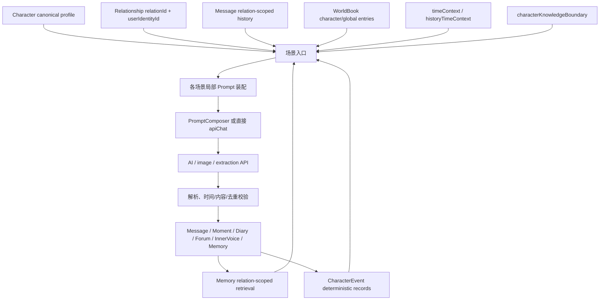

# Character Cognitive Context Audit

审计范围：当前 `agent/relationship-isolation` 分支的角色智能链路。

审计方式：只读检查 `src/components`、`src/features`、`src/domain`、`src/core/storage`、`src/utils` 中的 AI 调用、Prompt 装配、关系筛选和结果落库路径。本轮没有修改源码、没有修改 Prompt、没有修改 CharacterEvent 或 UI。

## 结论摘要

当前系统已经具备不少局部的“认知材料”：角色人设、关系摘要、关系隔离的消息和 Memory、WorldBook、时间格式化、朋友圈时间校验、OfflineStory handoff、论坛公开内容安全规则，以及 CharacterEvent 基础层。但这些材料不是由一个统一的认知上下文层按同一套证据和边界策略装配出来的。

主要结论如下：

1. 直接聊天的上下文最完整，但主要装配仍集中在 `src/components/AppChat.tsx`，PromptComposer 只负责场景封装，不负责认知上下文的收集、排序和边界校验。
2. 朋友圈已有去重、时间冲突检测和一次性生成锁，但去重主要依赖文本相似度和身份 feed 历史；它没有统一的已验证事件来源，也没有角色作息或关系事件快照。
3. 主动消息有关系消息、WorldBook、时间窗和对话分析，但没有通过 MemoryService 检索关系 Memory，也没有 CharacterEvent 或可验证的“正在发生什么”来源；默认任务本身允许角色分享“当前状态、生活或正在做的事”，因此容易产生不存在的经历。
4. Diary、InnerVoice、Forum DM 和部分 Moment 评论/回复使用的上下文比直接聊天窄，且没有统一接入 Memory、CharacterEvent、knowledge boundary 和时间策略。
5. 群聊能够读取群历史、成员人设和群级知识边界，但成员级关系、成员级 Memory、成员级事件没有以统一结构进入每个成员的回复上下文，所以角色声音容易趋同或互相借用经历。
6. `CharacterEvent` 已经要求 `relationId`、`characterId`、`userIdentityId` 并支持幂等，但目前只是基础事件设施和确定性来源采集；它尚未成为生成前的事实门槛，也尚未进入 Chat、Moments、Proactive、Diary 或 Forum Prompt。
7. 需要新增 Character Cognitive Context Layer，但第一步应是统一 scope、证据来源和时间语义；不应先把更多字段塞进 `Character`，也不应把所有生成文本直接升级为长期事实。

## 一、当前角色智能链路



这里有两个重要的结构事实：

- `Character` 是角色的规范身份和长期人设来源；`Relationship` 才是同一个角色与某个 `userIdentityId` 之间的关系边界。两者目前并不是同一个层级。
- 现有 `PromptComposer` 的职责是根据 `scenario` 选择消息、历史和系统说明的包装方式。`PromptContext` 的注释明确要求调用方预先解析 Memory、WorldBook、时间和 UI 状态。因此它不是一个统一的 Cognitive Context Builder。

## 二、身份、关系和数据边界

| 数据 | 当前主 ID | 关系边界 | 当前作用 | 主要风险 |
|---|---|---|---|---|
| `Character` | `character.id` | 无 `relationId` | 规范人设、背景、主动消息设置、部分持久化角色状态 | 同一个角色面对多个身份时，人设相同是合理的，但关系事实不能放在这里；遗留的 `lastActiveTime` 等字段容易与关系状态混用 |
| `CharacterRelationship` | `relationship.id` 即 `relationId` | `userIdentityId + characterId` | 关系阶段、会话 ID、关系摘要、主动联系时间 | 只有调用方正确携带 `relationId` 时才安全；有些场景仍按 canonical character 选择关系 |
| `Message` | `message.id` | 直接消息使用 `relationId + conversationId`；群聊使用群容器语义 | Chat 和部分跨应用 handoff 的事实来源 | 群聊成员没有天然的成员级 direct relation；错误回退到 `characterId` 会丢失关系边界 |
| `MemoryItem` | `memory.id` | 新数据使用 `relationId`；Retriever 已 exact-match | 关系内长期摘要和检索事实 | 算法已隔离，但内容仍可能是模型抽取的模糊总结；未有统一可信等级/证据链接 |
| `OfflineStory` | `story.id` | 单角色故事使用 `relationId`；群故事可只有 `characterIds` | 线下剧情及线上 handoff | 线下虚构时空与现实关系上下文需要明确隔离；群故事没有 `participantRelationIds` |
| `InnerVoiceRecord` | `record.id` | 可带 `relationId`、`conversationId` 或 `groupId` | 私密心声记录 | 当前生成 Prompt 只取近期消息和关系，人设以外的长期事实不足 |
| `Moment` | `moment.id` | 角色动态通常带 `relationId`；feed 另带 `ownerIdentityId` | 朋友圈展示、评论、动态 Memory | 部分上下文按 owner feed 和 `characterId` 读取，而不是按 `relationId`；同角色多身份时可能混用历史 |
| `DiaryEntry` | `entry.id` | 字段包含 `ownerIdentityId`、`characterId`、`relationId`、`conversationId` | 角色私密日记及分享 | Prompt 仅取当前关系最近消息和关系阶段，未取 Memory/Event/WorldBook |
| `WorldBookEntry` | `entry.id` | 当前主要是 `characterId` 或 `global` | 设定、触发词、固定知识 | 没有 relation scope；若内容实际是某个身份的私密事实，按角色全局注入会越界 |
| `CharacterEvent` | `event.id` | 强制 `relationId + characterId + userIdentityId` | 确定性关系/线下完成事件基础层 | 目前尚未参与生成前事实筛选或 Prompt 注入 |

### 身份流转

```text
userIdentityId
  + characterId
      -> CharacterRelationship.id (relationId)
          -> conversationId = direct:{relationId}
              -> direct Message / Memory / Diary / Moment / InnerVoice

Character.id
  -> canonical persona / WorldBook selection / group member identity

CharacterEvent
  -> relationId + characterId + userIdentityId
  -> 当前只写入事件库，尚未反向成为所有生成入口的事实来源
```

## 三、Chat 审计

### 3.1 直接聊天

主要入口仍在 `src/components/AppChat.tsx`，实际请求经过 `PromptComposer`、`requestAiReply` 和 `directChatService` 等服务。`directChatService`、`proactiveMessageService`、`groupChatService` 主要负责请求执行、候选解析和消息工厂；最复杂的上下文装配仍在 AppChat。

正常单聊已经注入的内容包括：

- 当前 `Character` 的 name、age、gender、MBTI、personality、backstory。
- 当前 `CharacterRelationship` 的 relationship、compressedMemory 和 `relationId` 对应的会话范围。
- `MemoryService.retrieveRelevantMemories` 的关系内检索结果；当前 `MemoryRetriever` 在有 `relationId` 时 exact-match，不再把其他关系当作通配结果。
- 关系内近期消息、较长的历史/摘要回退、历史消息时间记录。
- 关系内最新 Offline handoff；handoff 会检查 story、relation 和消息时间，并要求不要把缺失细节补成事实。
- 当前身份的用户资料。
- 当前角色匹配的 WorldBook blocks。
- 朋友圈已知动态摘要、部分音乐/论坛/日记分享上下文。
- `formatLocalTimeContext`、`historyTimeContext`、在线空间边界、媒体规则和 `characterKnowledgeBoundary`。
- 普通回复、重新生成、群聊、红包后续等场景的不同系统规则。

因此，直接聊天不是“完全没有上下文”，而是“上下文已经很多，但缺少统一证据优先级和统一快照”。主要问题是：

- AppChat 以局部字符串拼接上下文，来源的可信度、时间有效期和 scope 由各段代码自行决定。
- `CharacterEvent` 不在事实链中；发生过的关系创建、线下故事完成等确定事件不能以结构化方式约束后续生成。
- Memory、compressedMemory、WorldBook 和近期聊天可能表达相互冲突的事实，但没有统一的冲突解决结果对象。
- 关系隔离依赖调用方正确取得 `activeRelationship`。一旦某个社交入口从 `characterId` 或显示名反查关系，Chat 以外的事实就可能被错误带入。

### 3.2 群聊

群聊 Prompt 在 AppChat 中组装成员定义、群历史、群级 WorldBook、当前时间和群知识边界，再由 `groupChatService` 解析一个或多个成员的回复。

已存在：

- 群历史和成员集合。
- 每个成员的 canonical Character 资料。
- 群级时间、WorldBook 和 `formatCharacterKnowledgeBoundary`。
- 群回复解析和消息创建，不改变原有特殊消息结构。

缺失或风险：

- 每个成员没有一个统一的 `ChatRuntimeContext` + Cognitive Context 快照。
- 每个成员与当前用户的关系阶段、关系 Memory、CharacterEvent 未明确按成员投影到回复 Prompt。
- 群消息属于群容器，不能自动等价为每个成员的私聊事实；如果把群内一句话直接当成成员私下经历，会造成关系和知识污染。
- 成员回复通常共享一份群 Prompt，容易产生同质化语气，或让一个成员借用另一个成员的经历。

### 3.3 特殊 Chat AI 入口

- 红包后的短消息：只注入“刚发送红包”的动作、问候和短历史，符合短消息需求，但没有经过完整 Character Cognitive Context；它不应产生长期认知事实。
- 通话、位置、文件、图片、语音等消息：主要由 AppChat 的特殊消息分支和消息工厂处理；语音/图片相关生成存在角色配置和当前历史约束，但这些消息本身不应被当作角色已完成的现实事件，除非有确定的业务事件记录。
- 图片生成：`characterImageService` 和 `characterImagePrompt` 读取角色、关系、近期消息和用户请求，输出图片请求/消息记录；它不是文本认知来源，但生成的图片描述不能反向当作事实。
- Memory extraction：Chat 的 `MemoryService.extractMemories` 使用关系内消息和 `relationId`。这是认知材料的产生入口，而非角色回复入口；必须继续把模型抽取结果视为候选事实，而不是无条件真相。

## 四、Moments / 朋友圈审计

### 4.1 角色发动态

生成主路径是 AppChat 组装 Prompt，交给 `requestCharacterMomentOnce` / `momentGenerator`。当前输入主要包括：

- 角色 personality、backstory。
- 当前关系的近期聊天、archived memories 和历史消息回退。
- 当前角色的 active WorldBook。
- 当前身份 feed 中最近的角色动态，要求不要复用主题、角度、句式、图片想法或情绪结论。
- `MomentTemporalContext`，包含动态的 occurrence date/time、季节、节气、生日规则。
- 用户资料和当前关系的聊天历史。

生成后还有：

- `SKIP` 允许不发动态。
- `momentUniqueness` 对文本做标准化、包含匹配和 n-gram 相似度检查。
- 一次生成 guard，按角色、日期和可选 `relationId` 防重复任务。
- `findMomentTemporalConflicts` 检查“今晚/下午/中午”、季节、节气、节日和生日等明显冲突。
- 角色动态会创建同一 `relationId` 的 Moment Memory。

### 4.2 为什么仍可能重复或相似

已有机制能降低重复，但不是认知级去重：

1. 最近动态被作为字符串注入，去重依赖模型遵守规则；没有持久化的主题、事件、角度和已使用素材分类。
2. `momentUniqueness` 的比较集合主要按当前身份 feed 取最近记录，选项中的关系/角色参数不能替代一个清晰的“同角色、同关系、同来源”事实范围。feed 级比较可能过宽，关系级事实又可能过窄。
3. Prompt 明确允许角色写“自己的生活、感受、兴趣”或“关系/最近聊天”，但没有要求所有生活内容必须绑定到已验证 Event、明确 Chat 事实或 WorldBook 事实。
4. `CharacterEvent` 没有进入动态生成，所以“今天发生过什么”只能由近期聊天、Memory 或模型自行补全。
5. `SKIP` 是模型输出约束而不是生成前的候选资格判断；如果模型坚持输出通用天气、疲惫、咖啡、工作等内容，文本相似度未必超过阈值。

### 4.3 朋友圈评论和回复

自动评论和评论回复使用：角色人设、目标动态、近期 direct chat、WorldBook、当前时间上下文和评论文本。它们有时间冲突校验，但通常没有关系 Memory、CharacterEvent 或统一的“可引用事实”列表。

评论回复还存在一个边界风险：当目标动态缺少 `characterId` 时，会用作者显示名反查 Character；随后又按 canonical character 在 `activeRelationships` 中选择关系，而不是始终以 Moment 自身的 `relationId` 作为首要关系边界。多身份情况下，这可能选择错误的关系。

## 五、主动消息审计

主动消息由 AppChat 触发，`proactiveMessageService` 负责候选消息生成和消息创建。

当前注入：

- 关系内近期消息和 `analyzeRecentConversation` / `formatProactiveConversationGuidance`。
- Character profile、backstory、compressedMemory。
- 用户 profile。
- 当前角色 WorldBook。
- 角色允许主动联系的时间窗、冷却、随机触发、已约定时间和离线 catch-up。
- `formatLocalTimeContext`（角色开启时间感知时）和 knowledge boundary。

当前缺失：

- 没有通过 `MemoryService.retrieveRelevantMemories` 读取关系 Memory 的统一步骤。
- 没有 CharacterEvent 的最近事件或未完成意图。
- 没有结构化 Relationship state snapshot，而是主要读取关系摘要和近期对话分析。
- 没有“当前可安全声称的活动/地点/身体状态”列表。

问题最明显的来源是默认任务文案要求角色分享“current state, life, or what you are doing right now”。这给了模型一个需要填充的空白，但系统没有要求它只能从 Event、当前聊天或明确 WorldBook 中选择。因此角色可能凭空说自己刚吃饭、在某处、正在做某事。主动时间窗只限制“什么时候可以发”，不限制“内容在这个时间是否有证据”。catch-up 还会把消息时间回填到过去，但生成时上下文仍可能以当前系统时刻为主，存在行为时间和内容时间不一致的可能。

## 六、Diary、Forum、Music 及其他 AI 入口

| 入口 | 生成目的 | 当前注入上下文 | 当前缺失/风险 |
|---|---|---|---|
| `src/features/diary/services/diaryGenerationService.ts` + `src/domain/prompt/diaryPrompt.ts` | 角色第一人称私密日记 | `Character` profile、`relation.relationship`、当前 `relationId` 的最近消息、显式 `occurredAt` | 没有 Memory、WorldBook、CharacterEvent、作息/地点证据；Prompt 要求有角色自己的生活和想法，证据不足时仍可能扩写不存在生活 |
| Forum thread/reply | 生成公开论坛帖子、回复、楼主更新 | `ForumRelationContext` 中有角色资料、关系 compressedMemory、关系最近消息、关系 Memory、角色/global WorldBook；论坛公开安全规则、保护名校验、相关性校验 | 公开关系上下文与私密关系事实的边界依赖 `buildForumPublicSafeContext`；没有 CharacterEvent/统一时间语义。虚拟作者没有角色认知材料，属于展示型模拟作者 |
| Forum activity | 让白名单作者在帖子下生成活动候选 | 公开帖子/回复、公开 actor slot、安全风格、冷却和连载状态 | 主要是公开文本续写，不读取角色长期认知；楼主续写对私密背景的禁止是 Prompt 规则，不是统一事实边界 |
| Forum DM | 论坛私信回复 | participant Character personality、来源帖子标题/正文、当前 DM 历史 | 没有 Relationship Memory、CharacterEvent、局部时间/knowledge boundary；论坛关系参与者通过 `relationId` 找 Character，但上下文内容没有同样的关系事实层 |
| Music recommendation | 从本地曲库选择角色当前推荐音乐 | 角色人设、关系阶段和 compressedMemory、关系消息、关系 Memory、当前/最近 track IDs、本地候选库 | 没有 CharacterEvent 和时间作息；它只能安全生成“选择哪首歌”，reason 不应升级为发生过的经历 |
| InnerVoice | 生成角色私密心声 | Character personality/backstory、关系阶段、关系内近期消息、用户称呼；`innerVoiceService` 支持 `ChatRuntimeContext` | 没有 Memory、WorldBook、CharacterEvent、timeContext、knowledge boundary；容易把心声写成未经验证的关系结论 |
| OfflineStory | 线下剧情续写 | 故事角色资料、关系 compressedMemory、冻结的 imported messages/memories/worldbook、故事消息、线下时间/线上 handoff | 线下世界是虚构场景；除明确 continuation handoff 外，不应进入现实关系认知。当前 handoff 有 deterministic filter，但生成 Prompt 没有统一 Cognitive Context |
| Chat Memory extraction | 把消息/线下 handoff 提取为长期 Memory | 关系内消息、Character、scenario、existingMemories、`relationId`；Offline 同步有 handoff marker 和事实过滤 | 模型抽取仍可能把推测当事实；没有 Event provenance 和人工/确定性证据层 |
| Translation / display transforms | 展示翻译或文本转换 | 原文本和翻译服务参数 | 不属于角色认知，不应进入 Memory、Event 或关系成长 |

### 其他展示应用

- 日历、设置、备忘录、桌面、主题等目前主要是展示或用户配置，不是角色认知来源。
- 用户发布的 Moment、论坛帖子、音乐分享只有在明确通过聊天分享/业务事件进入角色上下文时，才可作为角色知道的内容；“存在于应用里”不等于角色知道。
- Moment/Forum/Diary 的分享消息可以进入 direct Chat history，但各入口的“分享对象、是否已读、是否已被角色看到”应和原始内容分开，不能只靠正文字符串推断。

## 七、Prompt、时间和知识边界审计

### 7.1 Prompt 输入来源

当前有四类 Prompt 输入方式：

1. AppChat 中直接构造长 `systemInstruction`，再交给 `PromptComposer`。
2. `src/domain/prompt/*` 的局部 Prompt builder，例如 Diary、Forum DM、InnerVoice、knowledge boundary、timeContext、moment temporal context。
3. Feature service 内部构造请求，例如 Music、Forum 和 Moments service。
4. OfflineStory 直接在组件中构造线下 system instruction，再调用 `apiChat`。

这四种方式没有共同的 `CharacterCognitiveContext` 输入类型，导致同一个角色在不同场景获得不同版本的“自己”。

### 7.2 已存在但未全面进入 Prompt 的信息

| 信息 | 已存在位置 | 已进入的场景 | 尚未全面进入的场景 |
|---|---|---|---|
| `CharacterRelationship` | `domain/relationship` | Chat、Forum、Diary、Music、部分 InnerVoice/Moments | InnerVoice 的长期事实、Moment 评论/回复、Forum DM 等 |
| relation-scoped Memory | `domain/memory` | Chat、Forum relation context、Music、Offline handoff、部分 Moment post | Proactive、InnerVoice、Moment comments/replies、Diary、Forum DM |
| CharacterEvent | `domain/characterLife` | 基础 Repository、关系创建/Offline 完成 capture | 所有生成 Prompt 和生成前验证 |
| knowledge boundary | `characterKnowledgeBoundary` | Direct/Group Chat、Proactive 的部分路径、Forum public safety 的相邻规则 | Diary、InnerVoice、Moment comments/replies、Forum DM、Music |
| timeContext | `timeContext`/`historyTimeContext` | Direct/Group Chat、Proactive、Moments、Offline、Diary 的 occurredAt | InnerVoice、Forum DM、Forum public generation、Music |
| characterState vocabulary | `domain/character/characterState.ts` | 作为类型/边界工具存在 | 没有统一 state snapshot，也没有普遍参与 Prompt |
| recent social history | Moment/Forum/Diary repositories and App components | Moments post、Chat 中部分分享上下文、Forum | Proactive、InnerVoice、Diary、Forum DM 的长期视角 |

### 7.3 Knowledge boundary 的实际边界

`characterKnowledgeBoundary` 已明确区分：

- 角色不能因为知道一个名字就自动知道关系、私密经历或另一身份的信息。
- 群成员只因在群里而知道群消息，不自动知道私聊经历。
- 在线聊天不能默认把用户和角色放在同一个物理场景，除非当前聊天明确建立；OfflineStory 是例外场景。

这是正确方向，但目前它被各入口选择性使用。没有统一层确保每个场景都能得到相同的“知道/不知道”判定。尤其是朋友圈、日记、心声和论坛私信需要同一套 boundary projection，而不是各自写一小段禁止语句。

## 八、五类现象的根因判断

### 1. 聊天 OOC

不是单一的 Prompt 缺失，而是四个因素叠加：

- Direct Chat 的上下文较完整，但 AppChat 内局部拼接，来源冲突时没有结构化优先级。
- `Character` 人设、WorldBook 规则、compressedMemory 和 Memory 可能重复或冲突；当前主要靠 Prompt 文案解决。
- Memory 是模型抽取的摘要，不一定保留证据、时间和置信度；没有 Event 事实层作为上限。
- Group、InnerVoice、Proactive 等入口的上下文明显比 Direct Chat 少，用户感受到的是同一角色跨场景不一致。

### 2. 朋友圈重复

已有文本去重和生成锁，但缺少：

- 关系/角色范围内的结构化主题与事件历史。
- 可比较的“同一件事、同一角度、同一情绪结论”记录。
- 对通用 filler 的生成前拒绝或可选 `SKIP` 决策。
- 统一的最近内容投影；当前 feed 历史和关系历史的语义边界不完全一致。

所以当前系统能拒绝明显重复文本，却不能保证长期语义不重复。

### 3. 朋友圈制造不存在经历

主要原因是生成资格和证据资格没有分离。Prompt 允许写角色自己的生活，但没有要求每一条生活事实来自：

- 当前关系消息中明确发生的内容；
- relation-scoped Memory 中有来源的内容；
- CharacterEvent 中已确定发生的内容；
- 不涉及用户私密关系的 Character/WorldBook 设定。

WorldBook 只按 Character/global 管理，因此如果某条 WorldBook 内容实际上是某个身份的私密事实，也存在被错误作为全角色知识注入的可能。

### 4. 时间行为异常

系统已有局部时间保护：current time、history time、Moment occurrence time 和 Offline handoff。但它们解决的是“文字与时间戳冲突”，不是“角色是否按自己的作息可做这件事”。

当前 `Character` 有主动联系时间窗和时间感知开关，但没有可用于所有场景的作息模型、占用时间、睡眠/工作/通勤约束。主动消息 catch-up 还可能同时存在“生成时现在”和“消息发生时过去”两套时间。

### 5. 群聊不像自己

群历史和成员人设存在，但回复候选是在共享群上下文中生成和解析的。成员没有统一的成员级认知快照，缺少：

- 每个成员对当前用户的 relation scope；
- 每个成员自己的 Memory/Event 片段；
- 成员独有的禁止知道项和关系阶段；
- 成员级风格/事实选择，而不是只共享群级规则。

因此模型更容易生成“群体平均人格”，或者让一个角色回应另一个角色的事实。

## 九、Character Cognitive Context Layer 设计依据

### 9.1 目标

为每一次 AI 生成构造一个只读、带 scope、带证据来源和时间语义的 `CharacterCognitiveContext` 快照。它解决“这一轮角色以什么身份、在什么场景、基于哪些事实、允许知道什么、不能声称什么”这一问题。

### 9.2 推荐目录

```text
src/domain/characterCognition/
  cognitiveContextTypes.ts       # 纯类型：scope、evidence、time、projection
  cognitiveEvidencePolicy.ts     # 事实来源、可信度、过期和冲突规则
  cognitiveKnowledgeBoundary.ts  # 场景化知道/不知道规则
  cognitiveTimePolicy.ts         # real time / occurred time / story time 规则
  cognitiveDedupPolicy.ts        # 社交内容主题、事件和表达的去重策略
  cognitiveContextProjection.ts  # 从领域数据投影为只读上下文，不调用 AI

src/features/characterCognition/
  services/buildCharacterCognitiveContext.ts
  services/characterBehaviorEligibility.ts
  services/cognitiveContextAdapters.ts
  selectors/selectRelevantEvidence.ts
  selectors/selectRecentSocialHistory.ts
  validators/validateGeneratedClaim.ts

src/core/storage/repositories/
  characterCognitiveFactRepository.ts   # 未来只存有明确 schema 的事实索引/去重记录
  characterBehaviorLedgerRepository.ts  # 未来存作息/占用/生成资格记录；不要存 Prompt 文本
```

`CharacterEvent` Repository 继续留在现有 `src/core/storage/repositories/characterEventRepository.ts`。Cognitive Context 应读取它，而不是复制一套事件表。

### 9.3 建议的只读上下文结构

第一版不修改 `Character`、`Message`、`Memory` 等既有结构，可以新增一个运行时投影类型：

```ts
type CharacterCognitiveContext = {
  scope: {
    characterId: string;
    relationId?: string;
    userIdentityId: string;
    conversationId?: string;
    scene: "direct-chat" | "group-chat" | "proactive" | "moment" | "diary" | "offline-story" | "forum" | "inner-voice";
    groupId?: string;
  };
  persona: {
    character: Character;
    styleConstraints: readonly string[];
  };
  relationship?: {
    relationship: CharacterRelationship;
    recentSummary?: string;
  };
  evidence: readonly {
    kind: "character" | "worldbook" | "message" | "memory" | "event" | "social" | "offline-handoff";
    sourceId?: string;
    content: string;
    occurredAt?: number;
    confidence?: number;
    relationId?: string;
    allowedInPrompt: boolean;
  }[];
  knowledgeBoundary: {
    known: readonly string[];
    forbidden: readonly string[];
  };
  time: {
    now: number;
    occurredAt?: number;
    mode: "real" | "historical" | "offline-story";
    dayPart?: string;
  };
  generationConstraints: {
    mayCreateNewEvent: boolean;
    mayClaimCurrentActivity: boolean;
    mayUsePrivateRelationshipFacts: boolean;
    shouldSkipIfUnsupported: boolean;
  };
};
```

字段只是设计方向，不代表本轮要落地。核心原则是：上下文包含 evidence/provenance 和 scope，而不是只把多段字符串拼起来。

### 9.4 负责和不负责

负责：

- 统一解析 `relationId`、`characterId`、`userIdentityId`、`conversationId`、group scope。
- 读取对应关系、消息、Memory、WorldBook、CharacterEvent 和社会内容的最小集合。
- 按场景过滤可见事实、过期事实、线下事实和其他身份事实。
- 明确 real time、历史发生时间、Moment occurrence time 和 OfflineStory time 的优先级。
- 输出事实来源、可信度、允许引用范围和生成前资格约束。
- 为 Chat、Moments、Proactive、Diary、InnerVoice、Forum 提供同一套投影，再由场景适配器决定长度和格式。

不负责：

- 不改变 `Character`、`Relationship`、`Message`、`Memory` 或 `CharacterEvent` 的业务结构。
- 不调用 AI、不决定具体文案、不替代 PromptComposer。
- 不把每一次模型输出直接写成事实。
- 不把 UI 展示内容自动视为角色知道的内容。
- 不产生游戏化等级、经验、金币等数值。
- 不把一段 OfflineStory 的虚构剧情自动注入现实 Chat，除非明确通过 handoff 规则转化。

## 十、实施优先级

### P0：必须先做

1. **统一生成 scope**：所有生成入口首先得到 `ChatRuntimeContext` 等价的统一 scope；禁止用显示名反查关系，Moment/Diary/Forum/DM 优先使用记录自身的 `relationId`。
2. **证据分层**：区分 Character 设定、WorldBook 设定、relation Message、Memory、CharacterEvent、社会展示和 Offline handoff；每类记录进入 Prompt 的条件不同。
3. **CharacterEvent 接入读取端**：先在 Context 读取层接入关系创建、Offline 完成等确定事件，但不改变现有 Prompt 文案；由场景适配器决定是否投影。
4. **现实/线下/历史时间统一**：生成时钟、内容发生时间、消息发送时间和 OfflineStory 时间必须显式分开。
5. **关系隔离回归**：同角色多身份、同角色多 Moment、同角色多 Diary、论坛私信和群聊分别做 cross-relation tests。

### P1：建议后做

1. Direct Chat 使用完整 Cognitive Context，先解决主聊天事实冲突和 OOC。
2. Proactive 只允许引用有来源的当前状态；没有可验证事件时允许不发或发无事实承诺的问候。
3. Moments 增加事件/主题索引和结构化去重；把 `SKIP` 从 Prompt 约束提升为生成前/生成后双重资格判断。
4. Diary、InnerVoice 复用同一关系事实投影，避免它们成为新的“自由编造通道”。
5. Group Chat 为每个成员建立 member-level projection，明确群消息和私聊事实的区别。
6. Forum/DM 使用 public-safe projection，不允许把关系 Memory 和私密 Event直接暴露在公共内容中。

### P2：可以延后

1. 角色作息、地点占用和长期行为计划的完整模型。
2. 复杂情感状态和关系成长推断；在没有事实/事件边界前不应先做自动推断。
3. 全部社交应用的 CharacterEvent 自动抽取。
4. 跨应用的统一社会事件时间线、用户可见的认知解释界面。
5. 更复杂的语义主题聚类和长期写作风格统计。

## 十一、最终风险排序

| 等级 | 风险 | 影响 |
|---|---|---|
| P0 | 多入口没有统一 Cognitive Context | 同一角色在 Chat、Moment、Diary、Proactive 中像不同的人 |
| P0 | 生成内容缺少 CharacterEvent/证据资格 | 虚构用户经历、虚构共同场景、朋友圈虚构生活 |
| P0 | 社交入口存在按名字或 canonical character 选择关系的路径 | 多身份关系污染，尤其是 Moment 评论/回复和公共分享 |
| P1 | Group reply 缺少成员级关系/事实投影 | 角色声音趋同、事实互借、群聊 OOC |
| P1 | Moment 去重是文本级/feed 级而非事件级 | 重复或相似动态长期复现 |
| P1 | 主动消息只有时间窗，没有状态证据 | 角色在不合适的时间说自己正在做不存在的事 |
| P1 | Diary/InnerVoice 上下文过窄 | 私密文本比 Chat 更容易生成关系或生活细节 |
| P2 | WorldBook 没有 relation scope | 设定本身可能携带跨身份私密知识，需要未来分层 |
| P2 | 没有作息/占用模型 | 只能避免明显时间词冲突，不能保证行为符合日程 |

## 十二、审计结论

当前系统的核心问题不是缺少某一条 Prompt 规则，而是“角色认知材料已分散存在，但没有统一的 scope、证据、时间和可见性投影”。

因此，Character Cognitive Context Layer 是必要的。它应该作为一个只读的领域投影层，位于现有 Character/Relationship/Memory/CharacterEvent/WorldBook 和各 Feature Prompt 之间：

```text
领域数据
  -> scope resolver
  -> evidence / time / knowledge-boundary policy
  -> CharacterCognitiveContext snapshot
  -> 场景适配器
  -> 现有 PromptComposer 或 feature prompt
```

第一阶段不需要改变 Character 结构、Memory 算法或 AI 协议。先把“当前角色是谁、与谁的关系、知道什么、哪些事实可引用、事实发生在什么时候、没有证据时是否应该跳过”变成统一且可测试的输入，才能继续做角色成长、主动行为、事件系统和更可靠的朋友圈生成。
