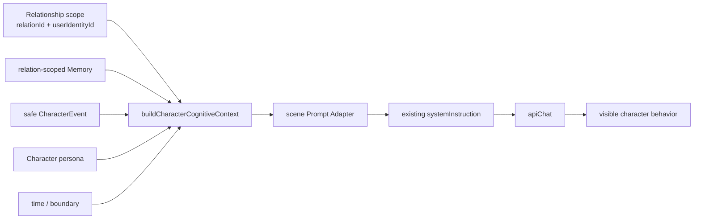

# Character Cognitive Context 全入口接入审计

日期：2026-08-01
范围：当前 `agent/relationship-isolation` 分支的所有会产生 AI 文本或角色行为的入口。本文只审计现状与后续接入边界，不修改任何运行时代码、提示词或数据模型。

## 结论摘要

`CharacterCognitiveContext`（下文简称 CCC）并不是所有 AI 调用都应携带的“万能上下文包”。它表达的是：**一个特定角色在一条特定用户关系中，对外生成行为时可安全使用的认知快照**。

目前以下三条单关系对外行为链路已经完成安全投影接入：

- 直接聊天：`CharacterCognitiveContext → ChatPromptAdapter → 现有聊天提示词`
- 朋友圈动态、评论、回复：`CharacterCognitiveContext → MomentPromptAdapter → 现有朋友圈提示词`
- 主动消息：`CharacterCognitiveContext → ProactivePromptAdapter → 现有主动消息提示词`

下一批最值得接入的是“角色写日记”和“论坛私信”。线下剧情、群聊、内心独白、公共论坛及特殊消息不能直接复用通用 CCC；它们需要各自的边界模型，或不应接入。



关键原则：CCC 只能从同一 `relationId` 读取 Memory、事件与关系信息；`relationId`、`userIdentityId`、`conversationId` 本身不得进入 AI 文本。

## 入口总表

| 入口 | 当前调用链 | 当前 CCC 状态 | 建议 | 风险级别 |
| --- | --- | --- | --- | --- |
| 单聊回复/重生成 | `AppChat → chatReplyController → directChatService → PromptComposer/apiChat` | 已接入 ChatPromptAdapter | 已完成；保持回归测试 | 低 |
| 朋友圈动态、评论、评论回复 | `AppChat → momentGenerator/momentCommentService/momentReplyService → apiChat` | 已接入 MomentPromptAdapter | 已完成；后续只优化内容策略 | 低 |
| 主动消息（手动、后台） | `AppChat → proactiveMessageService → apiChat` | 已接入 ProactivePromptAdapter | 已完成；不改变调度/冷却 | 低 |
| 线下剧情 | `AppOffline → 手工 sysPrompt → apiChat` | 未接入 | 可以接入专用 Offline Context，不能直接接入通用 Adapter | 高 |
| 日记 | `AppDiary → diaryGenerationService → buildDiaryPrompt → apiChat` | 未接入 | 必须接入专用 Diary 安全投影 | 高 |
| 论坛公开帖子/回复/活动 | `AppForum → forumGenerationService/forumActivityService → apiChat` | 未接入 | 不应该接入通用 CCC | 中 |
| 论坛私信 | `AppForum → forumDmService → buildForumDmPrompt → apiChat` | 未接入 | 必须接入 Forum-DM 专用投影 | 高 |
| 内心独白 | `AppChat → innerVoiceService → innerVoicePrompt → apiChat` | 未接入 | 不应该接入普通 CCC；仅可未来建设专用主观上下文 | 高 |
| 群聊 | `AppChat → generateResponseForGroupChat → groupChatService/apiChat` | 未接入 | 不应该接入单关系 CCC；需未来 Group Cognitive Context | 高 |
| 红包发送后的角色文案 | `AppChat → sendPartnerRedPacket → apiChat` | 未接入 | 可以接入 ChatPromptAdapter（仅直聊） | 中 |
| 转账、通话、位置、文件、图片、语音 | UI/消息工厂 → 常规聊天回复或确定性消息 | 无独立生成链路（红包例外） | 不单独接入；由后续常规直聊/群聊链路决定 | 低-中 |

## 已接入入口

### 1. 单聊

调用链：

```text
AppChat.executeDirectReplyPipeline
  → useChatController / chatReplyController
  → buildCharacterCognitiveContext
  → buildChatPromptContext / formatChatPromptContext
  → 既有 PromptComposer 组装
  → directChatService / apiChat
```

当前数据：角色资料、当前 `CharacterRelationship`、同 `relationId` 消息历史、关系范围 Memory 检索、世界书、线下交接上下文、当前本地时间、知识边界，以及仅限安全可见的 CharacterEvent。`chatReplyController` 对群聊分流，单聊才建立此上下文。

审计结论：这是 CCC 的标准目标场景。双身份同角色由运行时上下文和 `relationId` 共同隔离；Chat Adapter 不暴露内部 identity/relation/conversation ID，也会滤除 private event。

剩余风险：既有聊天提示词仍含大量直接拼装的资料（例如世界书、线下交接、音乐/论坛/日记关联内容）。这些不是本次 adapter 造成的问题，但新增上下文与它们必须继续保持相同关系范围。

### 2. 朋友圈

调用链：

```text
AppChat
  → getMomentCognitiveContext
  → momentGenerator / momentCommentService / momentReplyService
  → buildMomentPromptContext / formatMomentPromptContext
  → 既有 Moment systemInstruction
  → apiChat
```

当前数据：精简角色人设、关系范围内的安全事件、时间、行为约束；原业务链路还会提供角色、关系、世界书、当前时间、动态历史和有限的既有上下文。Moment Adapter 将 Memory 视为私密信息，默认不投影为朋友圈事实。

审计结论：这是公共对外行为，必须严于聊天。当前投影避免把私聊记忆、内部 ID、InnerVoice、private event 直接写入动态。后续“去重、真实经历、发布时间合理性”应在生成策略/事件事实校验层处理，不应把更多私密 Memory 塞入 Prompt。

### 3. 主动消息

调用链：

```text
AppChat.handleTriggerProactiveMessage / triggerProactiveFor
  → buildProactiveCognitiveContext
  → proactiveMessageService
  → buildProactivePromptContext / formatProactivePromptContext
  → 原主动消息 systemInstruction
  → apiChat
```

当前数据：角色、当前关系、同关系消息、关系范围事件、时间、知识边界、世界书及既有主动消息指导。手动触发与后台触发均排除群聊，并按 `relationId` 工作。

审计结论：已适当接入。它只影响生成素材，未改变主动消息频率、调度、冷却或发送成功后既有记录流程。未来若加入角色作息或关系状态，应作为新的受审计字段进入 Proactive Adapter，不能从聊天记录猜测未确认关系升级。

## 未接入入口与建议

### 4. OfflineStory（可以接入，但必须先有专用边界）

调用链：

```text
AppOffline
  → 选定 story / relationId / importedContext
  → 手工组装剧情 system prompt 与 historyContext
  → apiChat
  → OfflineStory 消息与同步入口
```

当前会读：故事自身的 `relationId`、相关角色、剧情历史、冻结的线上导入交接、当前关系摘要、部分 Memory/世界书、可选时间意识。它明确使用导入时冻结的上下文，不应在剧情生成期间读取实时线上聊天。

风险：

- 线下剧情是虚构/场景化叙事。若把普通 CCC 的“已知事实”直接放入剧情，会把线上聊天或私密事实误作线下既成事实。
- 现有多角色故事尚无 `participantRelationIds` 模型。对多个角色使用一条 `story.relationId` 时，无法严谨表达每位参与者与当前身份的关系边界。
- 旧数据与导入快照可能只有角色/文本线索；不应因此反查到其他身份的同角色关系。

建议：在多角色关系模型明确前，**不接入通用 Adapter**。后续可引入 `OfflineNarrativeContext`：只投影故事参与者、当前故事事实、显式冻结的导入交接、该故事许可的世界书和时间跳转规则；不得把 InnerVoice 或其他关系的 Memory 当剧情事实。单角色故事可以先试点，但仍应使用 Offline 专用 Adapter。

### 5. 日记（必须接入）

调用链：

```text
AppDiary
  → diaryGenerationService.generateDiaryEntry
  → 同 relationId 最近 12 条消息
  → buildDiaryPrompt
  → apiChat
  → DiaryEntry（ownerIdentityId + relationId + conversationId）
```

当前会读：角色的人设/背景、关系文本、同关系最近消息、生成时间；不会读取 CharacterEvent、关系范围 Memory、世界书或统一知识边界。

风险：日记是角色对当前关系的长期可见表达，缺少安全事件/边界时容易重复、编造共同经历，或将角色的另一个身份关系混入文案（当前消息筛选已按 `relationId`，但可用认知来源不足）。

建议：**必须接入** `DiaryPromptAdapter`。它应使用精简 persona、该关系安全事件、时间和知识边界；日记可使用该关系的私密聊天事实，但仅限当前 relation，并应明确“角色主观记录”与“已确认共同事实”的区别。不要直接复用 Moment Adapter（过度公开）或把所有 Memory 全量注入。

### 6. Forum（公开帖子、回复、楼主更新、自动活动：不应该接入通用 CCC）

调用链：

```text
AppForum
  → forumGenerationService（帖子/回复/楼主更新）
  → forumActivityService（公开活动计划）
  → 虚拟论坛身份或公开作者资料
  → apiChat
```

当前会读：公开虚拟账号的 `publicStyle`、公共帖子/回复、公共作者快照、时间/频控；部分生成路径可用关系作者作为公开身份，但输出前有 public-safe 检查。它不应读取私聊 Memory、InnerVoice、私密关系摘要或 CharacterEvent 私有内容。

建议：**不应该接入通用 CCC**。公开论坛角色不是“与当前用户在私聊里的角色自我”。若未来需要让关系角色以论坛公开身份出现，应建立 `ForumPublicContext`，只允许公开 persona、公开帖子历史、公开可见事件与时间；禁止任何 relation-scoped Memory/事件透出。

### 7. Forum 私信（必须接入专用投影）

调用链：

```text
AppForum
  → forumDmService.requestForumDmReply
  → 验证 participant.relationId + ownerIdentityId + characterId
  → buildForumDmPrompt
  → apiChat
```

当前已经严格解析参与者关系，只有 `relationId`、`ownerIdentityId`、`characterId` 三者一致才把关系角色用于回复。当前 Prompt 主要使用论坛私信历史、起源帖子、角色和设置，未接入 CCC。

建议：**必须接入**，但不要直接拿 Chat Adapter 的完整私密投影。应新增 `ForumDmPromptAdapter`：允许该角色人设、该关系安全事件、时间、知识边界、论坛私信内已发生内容；是否允许私聊 Memory 必须显式政策化，默认不把与论坛无关的私聊细节带入。这能同时保持私信角色一致性与论坛来源边界。

### 8. InnerVoice（不应该接入普通 CCC）

调用链：

```text
AppChat.handleInnerVoice
  → relationId 或 groupId 范围的近期消息
  → innerVoiceService.generateInnerVoice
  → innerVoicePrompt
  → apiChat
  → InnerVoiceRecord
```

InnerVoice 的职责是产生角色未说出口的、主观的想法。它可以使用触发消息、同范围近期聊天、角色和关系资料，并将记录按 relation/group 范围保存。

建议：**不应该接入普通 CCC 或普通 Prompt Adapter**。CCC 的 safe event/fact 语义是“可用于对外行为的认知素材”；InnerVoice 是私密、可能矛盾、未确认的主观内容。更重要的是：InnerVoice 不得回流成为 Memory、CharacterEvent、Moment、主动消息或线下剧情的事实来源。若未来需要统一治理，应建立单独的 `InnerVoiceSubjectiveContext`，并保留显式 `subjective / non-factual` 标记。

### 9. 群聊（不应该接入单关系 CCC）

调用链：

```text
AppChat.generateResponseForGroupChat
  → 群成员定义、群消息历史、群世界书/当前场景连续性
  → PromptComposer
  → groupChatService / apiChat
```

当前群聊由 `chatReplyController` 分流，跳过单聊 CCC。它以群成员、当前群历史、世界书、场景连续性规则为主；角色可以在群内互动，不对应单一 `CharacterRelationship`。

风险：若把当前 CCC 塞入群聊，会默认选择某一成员的单关系 Memory/Event，导致泄露给群体、把私聊经历写成群共同事实，或让同角色在不同身份下串线。

建议：**不应该接入单关系 CCC**。未来若要治理 OOC，应设计 `GroupCognitiveContext`：每位参与者独立身份范围、群可见事实、群世界书、群时间线和明确的可见性矩阵。它不能以 `characterId` 聚合私人关系数据。

### 10. 特殊消息

#### 红包

角色主动发送红包后，`AppChat.sendPartnerRedPacket` 会额外调用 `apiChat` 生成随附文案，并使用当前直聊/群聊历史过滤。它是当前唯一有独立 AI 调用的特殊消息。

建议：**可以接入** ChatPromptAdapter，但仅在 `activeRelationship` 存在的直聊中构建 CCC；群聊继续走群逻辑，不能借用某位成员的直聊 CCC。红包金额、状态与领取/过期属于确定性业务状态，不应作为认知事实写入其他关系。

#### 转账、通话、位置、文件、图片、语音

这些目前主要是消息标记、附件/通话 UI、消息工厂和后续普通回复的输入，而非各自独立的 AI 人格生成入口。通话期间文本会进入该通话的字幕历史，结束后保存为通话记录；文件、位置、转账也以确定性结构化消息展示。

建议：**不单独接入**。后续角色对它们作出文字回应时，已经由直聊 Chat Adapter 或群聊路径决定上下文。必须保持：通话字幕不混入普通线上时间线；文件/位置的结构化数据只能在当前会话关系中读取；不能因为红包、转账或位置而臆造线下共同场景。

#### 图片生成与音乐等非角色对话 AI

角色图片生成、音乐选择/推荐、Memory 提取等属于媒体、工具或抽取任务，不是角色对外行为生成。

建议：**不应该接入 CCC**。向这些任务注入关系 Memory/Event 会增加隐私泄露和循环污染风险；它们应各自采用最小业务输入与已有权限边界。

## 数据使用与隔离矩阵

| 场景 | Character | Relationship | relation-scoped Memory | CharacterEvent | OfflineStory | WorldBook | 时间 | 关系隔离观察 |
| --- | --- | --- | --- | --- | --- | --- | --- | --- |
| 单聊 | 是 | 是 | 是 | safe only | 交接/相关摘要 | 是 | 是 | 已按 runtime relation scope |
| Moment | 是（精简） | 是（安全投影） | Adapter 不公开 | safe only | 间接/既有链路 | 是 | 是 | 已按 relation 构建 |
| Proactive | 是（精简） | 是（安全投影） | 既有链路可用 | safe only | 不应强制 | 是 | 是 | 已按 relation 构建 |
| OfflineStory | 是 | 故事 relation | 部分/导入快照 | 否 | 故事自身 | 是 | 可选 | 多角色模型仍有缺口 |
| Diary | 是 | 是 | 否 | 否 | 否 | 否 | 是 | 消息已按 relation，认知来源不足 |
| Forum 公开 | 公开 persona | 可能公开作者 | 否 | 否 | 否 | 否 | 是/频控 | 必须保持公开域 |
| Forum DM | 是 | 是 | 否 | 否 | 否 | 起源帖 | 未明确 | participant 三元校验存在 |
| InnerVoice | 是 | direct/group | 近期消息 | 否 | 否 | 否 | 间接 | 独立 relation/group scope |
| Group | 多角色 | 非单一 | 不应使用私聊 | 否 | 可选场景 | 是 | 部分 | 单关系 CCC 不适用 |

## 跨入口风险

### 高风险：虚假经历与事实污染

1. **线下剧情 → 线上事实**：线下生成只能以显式导入的冻结交接为连续性依据，不能把任意故事文本提升为线上共同经历。
2. **InnerVoice → 外部事实**：独白只能是主观记录，不能作为 Moment、Diary、Proactive 或 Memory 的自动事实来源。
3. **公共论坛 ← 私密关系信息**：公开帖子、回复和自动活动绝不能读取关系 Memory、私密事件或私聊上下文。
4. **日记编造**：日记若只靠少量最近消息和人设，容易补写没有确认的共同场景；应加入“已确认事件”和知识边界，而不是扩大聊天历史。

### 高风险：关系隔离

1. 任何以 `characterId` 作为唯一检索边界的认知读取，都可能让同角色在 identity A 与 identity B 的事实相互可见。
2. 论坛私信已有 participant 的三元关系校验，应在 CCC 接入时保留；不能仅按名称或 Character ID 反查关系。
3. 多角色 OfflineStory 尚不能表达每个参与者的 relation scope，不能在此之前把单关系事件/Memory 扩展到群故事。

### 中风险：时间线

1. 单聊、Moment、主动消息已有当前时间输入，但没有统一作息/事件时间一致性策略；上下文只能提供时间事实，不能自动解决行为合理性。
2. OfflineStory 的时间跳转必须由故事规则显式建立，不能被当前真实时间或主动消息时间直接覆盖。
3. Diary 应使用其 `occurredAt`，而非请求完成时间，避免回填时把旧经历写成当前发生。

### 中风险：OOC

人物 OOC 往往不是 Character 结构缺失，而是生成入口未同时获得精简人设、当前关系边界、可验证事实、时间和禁止知道什么的约束。对外行为应由场景 Adapter 选择字段；不能把全量资料当成“更聪明”。

## 推荐实施顺序

### P0：先完成单关系私密对外入口

1. `DiaryPromptAdapter`：为角色日记构建 relation-safe context；明确主观文本与确认事实边界。
2. `ForumDmPromptAdapter`：在已存在的 participant 三元校验后，接入受限的关系安全投影。
3. 红包随附文案：复用 ChatPromptAdapter，但只限 direct relation。

这三项共享“一个角色 × 一条关系”的模型，能在不改变 Prompt 主结构和数据模型的前提下安全推进。

### P1：先补模型，再接入

4. 定义 OfflineStory 的多参与者关系边界（例如未来的 participant relation scope），再设计 `OfflineNarrativeContext`。
5. 对 Offline Memory/导入快照建立“线上事实、线下叙事、显式导入交接”三类来源标签，避免跨域升级为事实。
6. 设计 `GroupCognitiveContext` 和成员可见性矩阵后，再治理群聊 OOC。

### P2：保持隔离，按需建设专用模型

7. `InnerVoiceSubjectiveContext`：只用于独白，严格禁止事实回流。
8. `ForumPublicContext`：只在确有需求让关系角色作为公开作者时引入。
9. 作息、时间线一致性和事件验证策略：作为认知上下文的输入治理能力，而不是把大量文本加入每个 Prompt。

## 不应做的接入

- 不把 `relationId`、`userIdentityId`、`conversationId` 序列化到任何 AI 提示词。
- 不把全量 Memory、全量 CharacterEvent 或 InnerVoice 当通用 Prompt 内容。
- 不让公共论坛、群聊或媒体生成读取单聊私密事实。
- 不以角色名称、备注或 `characterId` 单独反查某个身份的关系。
- 不让 Cognitive Context 写入 Memory、CharacterEvent 或关系状态；它始终是只读、一次性快照。

## 审计结论

当前架构已经为单关系聊天、朋友圈和主动消息建立正确的“构建—投影—保留既有 Prompt”接入方式。下一阶段应优先覆盖日记与论坛私信，并把线下剧情、群聊、内心独白、公共论坛视为不同认知边界的问题，而非把通用 CCC 扩散到所有 AI 调用。这样才能降低 OOC、虚构共同经历与跨身份污染，而不牺牲各应用本来的叙事语义。
