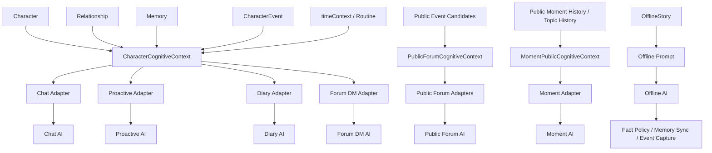

# Character Cognitive 全链路最终审计

审计日期：2026-08-01
审计分支：`agent/relationship-isolation`
审计基线：`2bf6e61`

## 1. 审计结论

当前项目已经形成两套认知边界：

- 私域链路：`CharacterCognitiveContext` → 场景 Prompt Adapter。
- 公域链路：`PublicForumCognitiveContext` 或 `MomentPublicCognitiveContext` → 公域 Prompt Adapter。

但这两套边界目前主要通过调用约定接入，并非所有 AI 入口都在 service 层强制经过 Adapter。尤其是 `AppChat.tsx` 仍然直接组装了多条 Prompt，导致“有 Adapter”不等于“所有实际请求都经过 Adapter”。

总体判断：

| 入口 | 当前边界 | Adapter 状态 | 关系/角色隔离 | 风险 |
| --- | --- | --- | --- | --- |
| 单聊普通回复 | 私域 | 已接入 Chat Adapter，但仍有大量旧 Prompt 输入 | 直接关系基本正确 | 中 |
| 单聊重生成 | 私域 | 与 AppChat 分支耦合，需保持同一上下文 | 依赖调用方 | 中 |
| 群聊 | 群域 | 未建立独立 Group Cognitive Context | 不应按单一 relation 聚合 | 高 |
| 主动消息 | 私域 | 已接入 Proactive Adapter、Routine、Topic History | `characterId + relationId` | 低—中 |
| Moments | 公域 | Adapter 存在，但 AppChat 的自动评论、回复、发帖路径仍直接传现成 Prompt | 写入按 relation，公开输入未由 service 强制 | 高 |
| Diary | 私域自我记录 | Diary Adapter 可选接入 | 关系消息按 relation 过滤 | 中 |
| Forum DM | 私域 | 已接入 Forum Direct Message Adapter | 校验 relation、character、identity | 低—中 |
| Public Forum | 公域 | Post/Reply/Activity Adapter 已接入 | 公共上下文默认拒绝私域数据 | 低—中 |
| OfflineStory | 独立剧情域 | 未接入 Cognitive Adapter | 同步阶段有 Fact/Event Policy | 高 |
| InnerVoice | 私域内部记录 | 独立 Prompt，未接入 Adapter | 有 direct/group 边界，但存在内部字段风险 | 高 |
| 记忆提取/总结 | 认知写入管线 | 不属于回复 Adapter | 依赖调用方传入 relation | 高 |
| 翻译、图片、音乐推荐、人格总结 | 辅助 AI | 不应统一当作角色回复 | 各自独立 | 低—中 |

当前最重要的问题不是缺少更多字段，而是以下三个入口仍可绕过边界：

1. `AppChat.tsx` 的群聊、特殊消息和 Moments 相关直接 AI 调用。
2. OfflineStory 的剧情生成直接使用完整剧情 Prompt，没有独立的离线事实边界投影。
3. Moments 的 Adapter 不是生成 service 的强制前置条件，调用方可以直接传入包含旧上下文的 `request`。

## 2. 当前角色认知链路

`CharacterCognitiveContext` 已经能够组合角色精简人设、关系 scope、relation-scoped Memory、safe Event、时间、Routine、RelationshipState 和 RelationshipTimeline。Adapter 负责把这些内容投影成场景可见字段，并隐藏内部 ID。

问题在于：上述结构目前不是所有入口的唯一调用路径。部分入口仍把 `Character`、`Relationship`、`Memory`、`WorldBook` 或历史消息直接拼进 `systemInstruction`，因此边界既有“中心投影”，也有“旧式直连”。

## 3. 各 AI 入口审计

### 3.1 Chat：单聊普通回复

主要链路：

`AppChat.tsx` → `PromptComposer.compose({ scenario: "direct-chat" })` → `requestAiReply` → `apiChat`。

当前输入包括：

- Character 人设、背景和角色边界。
- 当前关系摘要以及当前用户身份的 direct relationship。
- relation-scoped 最近消息。
- relation-scoped Memory 检索结果。
- WorldBook 触发结果。
- 当前时间和历史消息时间。
- 已有音乐、论坛、Diary 等关系上下文。
- Chat Adapter 生成的关系阶段、氛围、safe event、openLoop、boundary 等安全投影。

这是当前最完整的私域入口。`AppChat.tsx` 已调用 `buildCharacterCognitiveContext` 和 `buildChatPromptContext`，并由 `formatChatPromptContext` 生成可选补充块；Adapter 本身不输出 relationId、userIdentityId 等内部字段。

风险：

- `AppChat.tsx` 同时保留大量旧 Prompt 拼装逻辑，Memory、WorldBook、关系摘要、聊天历史并未全部收敛为 Context 输入。
- Context 和 Adapter 是可选的，调用方可以走旧兼容路径。
- 关系隔离依赖调用方先正确找到 `activeRelationship`；一旦进入 character-only fallback，就可能把角色下多个关系合并到同一 Prompt。

判断：私域泄露风险中等，主要问题是“上下文入口过多”，不是当前 Chat Adapter 本身越权。

建议：将单聊正常回复、重生成、重新请求统一为一个必需 `ChatRuntimeContext` 的 controller 入口；保留旧参数兼容，但在 service 层完成 scope 校验。

### 3.2 Chat：群聊

主要链路：

`AppChat.tsx` → 群聊 Prompt 组装 → `PromptComposer(scenario: "group-chat")` → `generateGroupReplyCandidates` → `apiChat`。

当前直接注入：

- 全部群成员的 Character 人设和背景。
- 群级及成员级 WorldBook。
- 群聊最近历史。
- 成员的 `compressedMemory`。
- 当前时间和 Knowledge Boundary。

当前没有一个独立的 `GroupCognitiveContext`，也没有对每个成员分别构建 `CharacterCognitiveContext` 后再做群内安全投影。群聊没有单一 relationId，不能把所有成员当作当前用户的一段 direct relationship。

风险等级：高。

- `compressedMemory` 的来源和 scope 在群 Prompt 入口不如单聊清晰。
- 群成员之间可能被 Prompt 误认为彼此共享私密经历。
- 群聊历史和 WorldBook 直接进入大 Prompt，缺少成员级可见性投影。

建议：后续新增 Group Cognitive Context；每个角色只能看到群内公开事实、群消息以及自身允许的关系信息，禁止通过 characterId 聚合所有 direct relation。

### 3.3 Chat：特殊消息

红包、转账、通话、位置、文件、图片等消息主要在 `AppChat.tsx` 中通过专用 Prompt 或消息协议生成。红包后续短消息明确使用短文本 Prompt；图片生成使用 `characterImageService` 和独立图片 Prompt；翻译使用 `apiTranslate`。

这些入口不是普通的“角色长期认知回复”，但部分特殊消息在 AppChat 内直接调用 `apiChat`，没有统一 Chat Adapter。风险在于它们可能绕过普通回复的关系、时间和行为边界，尤其是需要附带上下文或自动补写文本时。

建议：特殊消息继续保持独立场景，但应统一复用最小化的私域 scope 校验；不要把红包、位置或图片生成结果自动当作 CharacterEvent 或 Memory。

### 3.4 Proactive Message

主要链路：

`AppChat.tsx` / 主动消息触发点 → `proactiveMessageService` → `buildProactivePromptContext` → `formatProactivePromptContext` → 原主动消息 Prompt → `apiChat`。

当前 Context 来源：

- 当前 Character。
- 当前 `characterId + relationId` 的 Memory 和 CharacterEvent。
- RelationshipState / Timeline 的安全投影。
- Routine 当前时间状态。
- Proactive Topic History。
- 最近会话信息和时间。

当前 Adapter 已过滤内部 ID，`openLoops` 只作为候选话题，不能自动关闭；Routine 只影响表达参考，不修改 scheduler、cooldown 或发送时间。

判断：这是目前接入最完整的入口之一。主要剩余风险是 cognitiveContext 仍可缺省，旧 Prompt 仍可运行；后台主动消息和手动主动消息也应保持同一 builder/adaptor 入口。

### 3.5 Moments：自动发帖、自动评论、评论回复

主要链路：

- `AppChat.tsx` → `PromptComposer(scenario: "moment-post")` → `requestCharacterMomentOnce` → `momentGenerator` → `apiChat`。
- `AppChat.tsx` → `PromptComposer(scenario: "moment-comment")` → `requestAutomaticMomentComment` → `apiChat`。
- `AppChat.tsx` → `PromptComposer(scenario: "moment-reply")` → `requestMomentCommentReply` → `apiChat`。

当前 AppChat 的这些路径直接传入：

- Character 的公开人设和背景。
- 公开动态、公开评论和当前公开目标内容。
- Moment 时间上下文。
- 公开生成规则和去重提示。

`MomentPublicCognitiveContext`、Moment Public Visibility Policy、Topic History 和 `MomentPromptAdapter` 已存在，但 Moment 三个 service 当前接收调用方已经组装好的 `request`，自身只负责请求、清洗、时间冲突校验和结果返回。也就是说，Adapter 在架构上存在，但不是 service 层的硬性门槛。

风险等级：高。

- 旧调用方可以在没有 `MomentPublicCognitiveContext` 的情况下继续调用 service。
- 目前 AppChat 中自动评论、回复和自动发帖的实际代码仍直接组装公开 Prompt，未在该调用点强制执行 Moment Adapter。
- `momentGenerator` 会为公开动态生成 relation-scoped Memory；这不是 Prompt 泄露，但可能把公开表达不恰当地变成角色私域长期事实。
- 自动发帖历史按当前 identity feed 取公开动态，不完全等于当前角色自己的 Topic History；需要明确“跨角色公开去重”和“单角色主题记忆”的边界。

判断：公开 Prompt 内容本身已经有较好的禁止规则，但入口强制性不足。应把 Adapter 投影或已验证的 public request 作为 Moment service 的必需输入，旧流程只保留明确标记的兼容路径。

### 3.6 Diary

主要链路：

`AppDiary.tsx` → `buildCharacterCognitiveContext` → `generateDiaryEntry` → `buildDiaryPrompt` + Diary Adapter 补充 → `apiChat`。

当前输入包括：

- 当前 Character 的精简资料。
- 当前 relation 的 Relationship 摘要。
- 当前 relation 最近消息，服务层限制为有限条数。
- safe CharacterEvent、时间和 Routine 的安全投影。
- Diary 生成触发类型和日期。

AppDiary 当前构建 Context 时没有直接提供 Memory，Diary 服务也没有把用户私密 Memory 原文直接塞进日记 Prompt。关系消息按 `message.relationId === input.relation.id` 过滤，因此同角色多身份隔离基本正确。

风险：

- Diary Adapter 是补充块，`buildDiaryPrompt` 仍直接接收 relationship 和 relation 消息。
- 日记是角色自我记录，仍需防止把未完成计划、IF/导演剧情、InnerVoice 或 AI 推测写成已发生事实。
- Diary 生成结果后续若进入 Memory，必须继续使用 OfflineStory/Diary 的事实政策，不能仅因文本来自日记就视为事实。

风险等级：中。建议保持私域，但将事实来源和“计划/回忆/想象”状态显式化。

### 3.7 Forum DM

主要链路：

`forumDmService.requestForumDmReply` → 精确解析 participant relation → `buildCharacterCognitiveContext` → `ForumDirectMessagePromptAdapter` → `buildForumDmPrompt` → `apiChat`。

当前安全措施：

- 同时校验 `relationId`、`characterId` 和会话所属 `ownerIdentityId`。
- CharacterEvent 通过 `listByRelation` 读取。
- 明确不读取私聊 Chat Memory。
- Adapter 只输出关系安全摘要、safe event、时间和边界，不输出内部 ID。
- 虚拟论坛用户走无角色私域上下文的旧路径。

判断：真实关系论坛私信的 scope 较完整，风险低—中。剩余风险是虚拟用户和 legacy fallback 不经过同一 Context；未来应把“虚拟用户”和“真实关系角色”在类型上分成两个不可混用分支。

### 3.8 Public Forum

主要链路：

- 发帖：`forumGenerationService` → `PublicForumCognitiveContext` → `PublicForumPostPromptAdapter` → public post Prompt → `apiChat`。
- 评论/回复：同一 service → `PublicForumReplyPromptAdapter` → public reply Prompt → `apiChat`。
- 活动：`forumActivityService` → public activity context → `PublicForumActivityPromptAdapter` → 活动 Prompt → `apiChat`。

当前允许输入：

- public character profile。
- 明确标记为 public 的 CharacterEvent。
- public world settings。
- 公开帖子、公开楼层和公开评论。
- 当前时间和 public behavior constraints。

当前禁止输入：

- relationId、userIdentityId、conversationId。
- RelationshipState、RelationshipTimeline、openLoops、boundaries。
- 私人 Memory、Forum DM、InnerVoice、OfflineStory 私密内容。

当前 public builder 是 deny-by-default，且 `safe` 不等于 `public`。关系角色的选择仍使用 owner identity 和 relation 作为内部路由，但这些值不应进入 public Prompt。

风险等级：低—中。

主要剩余风险：public context 仍是可选参数；虚拟论坛用户使用 legacy public style；公共活动为了回写事件使用 actor slot，但 actor slot 只能是受控的运营映射，不应被当作角色事实。建议把 public Adapter 变成 `forumGenerationService` 的统一强制入口，并继续保留虚拟用户的完全 public 分支。

### 3.9 OfflineStory

主要链路：

- 生成：`AppOffline.tsx` → 离线剧情 system prompt → `apiChat`。
- 同步：`AppOffline.tsx` → `MemoryService.extractMemories` / `apiExtractMemories` → OfflineStory Fact Policy → 持久化 Memory。
- 完成事件：用户确认同步且 Memory 持久化成功 → OfflineStory Event Policy → `offlineStoryEventCaptureService` → CharacterEvent Repository。

离线生成 Prompt 当前直接使用：

- 一个或多个 Character 的人设和背景。
- 故事模式、视角、剧情历史和当前消息。
- 导入故事的冻结 WorldBook、消息和 Memory snapshot。
- 关系摘要、线上交接时间和时间连续性要求。

OfflineStory 没有接入 Character Cognitive Context 或 Prompt Adapter，这是合理的独立剧情空间，但它也意味着剧情生成本身没有统一的“虚构内容不可直接成为线上事实”投影。

当前 Fact Policy、Event Policy 和 Capture 已经把“同步到 Memory”和“未来生成事件”限制到用户确认、当前 relation、已完成、非 IF/导演/纯 AI 续写等条件。需要注意：生成阶段仍然可以写出丰富的虚构细节；这些细节只有在同步时才应被筛选，不能因为生成成功就成为线上 CharacterEvent。

风险等级：高。

建议：后续建立 `OfflineStoryCognitiveContext` 或至少建立离线 Prompt 输入白名单，明确区分“场景事实”“导演指令”“角色内心”“用户确认事实”；完成故事和同步事实必须继续是两个独立动作。

### 3.10 InnerVoice

主要链路：

`AppChat.tsx` / `innerVoiceService` → `buildInnerVoicePrompt` → `apiChat` → `InnerVoiceRecord` Repository。

当前输入包括：

- Character。
- 当前 direct relationship 或 group scope。
- 触发消息和有限的最近消息。
- 用户名称。
- 对应 conversationId、relationId 或 groupId 的边界。

InnerVoice 是私域内部记录，不应进入 Chat、Moment、Diary、Forum 或 Memory 事实链路。当前它没有使用 Cognitive Prompt Adapter，且 Prompt builder 接收 relationId 等内部 scope 字段，存在把内部路由信息带入模型文本的风险。

风险等级：高（隐私边界），但不是 public 泄露的直接证据。

建议：保留独立场景，不把 InnerVoice 接入公共 Context；新增最小化的 private introspection projection，禁止内部 ID、未确认事实和 InnerVoice 原文向任何其他生成入口传播。

## 4. 其他 AI 入口

### 4.1 Memory 提取、即时总结和 Offline Handoff

`apiExtractMemories` 以及 `MemoryService.summarizeConversation` 是认知写入入口，不是普通回复入口，但它们直接决定角色以后“知道什么”。

当前已有：

- 通过 relationId 过滤聊天消息。
- OfflineStory 使用 Fact Policy、过滤器和可替换的 story summary。
- Event Capture 仅在确认同步成功后执行。

仍需重点防范：

- `App.tsx` 的即时总结在缺少 relationId 时仍存在按 characterId 取消息的兼容 fallback。
- AI 抽取文本必须继续经过结构化事实过滤，不能把叙述语气、InnerVoice、未确认计划或 IF 剧情写入 Memory。
- Memory 写入成功不等于事实已经获得 public visibility。

风险等级：高。它是长期认知污染的主入口，应优先于更多 Prompt 优化进行审计。

### 4.2 人格总结

`AppArchives.tsx` → `apiSummarizePersonality`。输入是用户明确选择的参考卡片，输出在确认后写回 Character.personality。

这是编辑工具，不是某个关系中的角色行为生成。当前没有 relationId 需求，且写回有用户确认，因此不应接入关系 Context。但它会改变 Character 的全局人设，后续所有关系都会看到结果；应保留明确确认和来源可追溯性。

### 4.3 翻译

论坛、Diary 和 Chat 的翻译调用 `apiTranslate`。它是文本变换，不是角色生成，不应读取 CharacterCognitiveContext，也不应产生 Memory、Event 或 Relationship 更新。风险主要是翻译 Prompt 复制原文中的私密内容到外部模型，属于数据传输策略而非角色认知边界。

### 4.4 音乐推荐

`dualMusicRecommendationService` 的 AI 推荐 Prompt 读取 Character、人际关系摘要、当前 relation 的消息和 Memory，并从本地曲库中选择曲目。代码层面按 relation 过滤，且结果只更新 `RelationshipMusicState`，不直接生成角色话语。

它不需要完整 Prompt Adapter，但应被视为私域关系工具：不能把推荐理由当 CharacterEvent 或 Memory，也不能跨 relation 复用消息和记忆。风险等级：中。

### 4.5 图片生成

`characterImageService` 使用 Character Image Prompt 和用户明确请求，通过图片 API 生成图片。它不读取 Memory、RelationshipTimeline 或 CharacterEvent，不属于长期角色认知入口。应继续保持独立，不把图片描述自动写入角色事实。

## 5. Context、Adapter 与直接输入矩阵

| 数据 | 单聊 | 群聊 | Proactive | Moment | Diary | Forum DM | Public Forum | OfflineStory | InnerVoice |
| --- | --- | --- | --- | --- | --- | --- | --- | --- | --- |
| Character | 私域 Context + 旧 Prompt | 直接成员定义 | Adapter | 公开资料 | Diary Prompt + Adapter | Prompt + Context | public profile | 直接剧情 Prompt | 直接 Prompt |
| Relationship | 当前关系 | 未建立成员级投影 | 安全摘要 | 禁止进入 public Prompt | 当前关系摘要 | 精确关系校验 | 仅内部路由 | 直接剧情摘要 | 直接 Prompt |
| Memory | relation-scoped | compressedMemory，需审计 | relation-scoped | 禁止 | 当前入口不直接提供 | 明确不读 Chat Memory | 禁止 | imported snapshot / sync source | 禁止作为事实外传 |
| CharacterEvent | safe relation event | 未统一 | safe relation event | 仅明确 public event | safe event | 过滤后 safe event | 仅 public event | 只在确认完成后 capture | 不应跨场景传播 |
| WorldBook | direct relation/world blocks | 群级和成员级 direct | 可作关系上下文 | 只允许 public settings | 非核心输入 | public/thread 规则 | public settings | imported/frozen settings | 不应自动共享 |
| InnerVoice | 不应进入普通 Prompt | 不应进入 | 禁止 | 禁止 | 禁止 | 禁止 | 禁止 | 禁止 | 仅自身记录 |
| Adapter | 已有但部分旧输入直连 | 无 Group Adapter | 已接入 | 未强制 | 可选补充 | 已接入 | 已接入 | 无 | 无 |

## 6. 发现的问题与风险排序

### P0：必须先修复

1. **Moments 生成 service 不强制 public Adapter。** AppChat 的三个 Moment AI 分支可以直接构造请求，service 只接受已组装的 request。应在 service 或专用入口验证 public-only request，避免未来调用方重新带入私域输入。
2. **群聊没有独立认知边界。** 当前直接注入成员 `compressedMemory`、WorldBook 和群历史，缺少成员级可见性规则，不能用单聊 relation 逻辑替代。
3. **OfflineStory 生成和事实同步仍是两套边界。** Fact Policy 已保护同步，但剧情 Prompt 本身仍能产生虚构经历；必须防止后续入口把线下文本、InnerVoice 或导演指令直接当线上事实。
4. **Memory 写入入口仍存在 characterId-only 兼容 fallback。** 只要 relationId 缺失，就无法证明是哪个 userIdentity 的认知，默认应进入隔离的待确认区，而不是进入角色长期 Memory。

### P1：建议随后修复

1. 统一 Chat 普通、重生成和特殊消息的 private context 输入，减少 `AppChat.tsx` 内直接 Prompt 拼装。
2. 给 Diary 的“已发生/计划/想象/引用”增加事实状态，避免日记文本反向污染 Memory。
3. 为 InnerVoice 建立独立的最小私域投影，禁止内部 ID 和原文跨入口传播。
4. 将 Forum DM、Public Forum、Moment 的 public/private 与 virtual/relationship 分支用类型区分，减少 optional Context 兼容路径。
5. 明确公开 Moment 生成结果是否可以进入 relation-scoped Memory；若可以，需要“公开表达 ≠ 私人事实”的写入政策。

### P2：可以延后

1. 将翻译、图片生成、音乐推荐统一包装成 Cognitive Context。它们不是角色回复主链路，先保持功能边界即可。
2. 为所有历史内容建立统一摘要格式。当前各场景已经有长度限制和去重策略，先解决入口强制性。
3. 增加 CharacterEvent 自动抽取。当前确定性事件与安全公域候选已经有基础，自动推断应在边界稳定后再做。

## 7. 推荐修复顺序

1. **先收紧写入边界**：Memory、OfflineStory handoff、CharacterEvent capture；没有可靠 relation scope 的数据不进入长期认知。
2. **补 Group Cognitive Context**：明确群消息、成员公开资料、群级 WorldBook 和 direct relationship 的可见范围。
3. **让 Moment service 强制 public 输入**：调用方只能提交 MomentPublicCognitiveContext 或已验证的 public request。
4. **统一 Chat private pipeline**：普通、重生成、主动、特殊消息使用明确的 private context，避免 AppChat 继续成为第二套 Prompt 系统。
5. **隔离 InnerVoice 与 OfflineStory**：二者都可以生成内容，但生成内容默认不是线上事实，且不能进入 public context。
6. **最后扩展事件与成长能力**：只有前述边界稳定后，才考虑更多自动 CharacterEvent 或 RelationshipState 投影。

## 8. 最终判断

当前架构已经具备可用的认知基础设施，但尚未达到“所有 AI 入口必经正确认知边界”的最终状态。

已经较可靠的链路是：

- relation-scoped Proactive Message；
- 真实关系 Forum DM；
- Public Forum post/reply/activity；
- 单聊普通回复的主要 Cognitive Context 路径。

仍需重点治理的链路是：

- Moments 的 AppChat 直连生成；
- 群聊；
- OfflineStory；
- InnerVoice；
- Memory 提取和 characterId-only fallback。

因此下一阶段不建议继续为每个新场景增加字段，而应优先把现有 Adapter 从“可选能力”提升为“入口契约”，并让生成、事实写入、公开投影三个层次保持严格分离。
