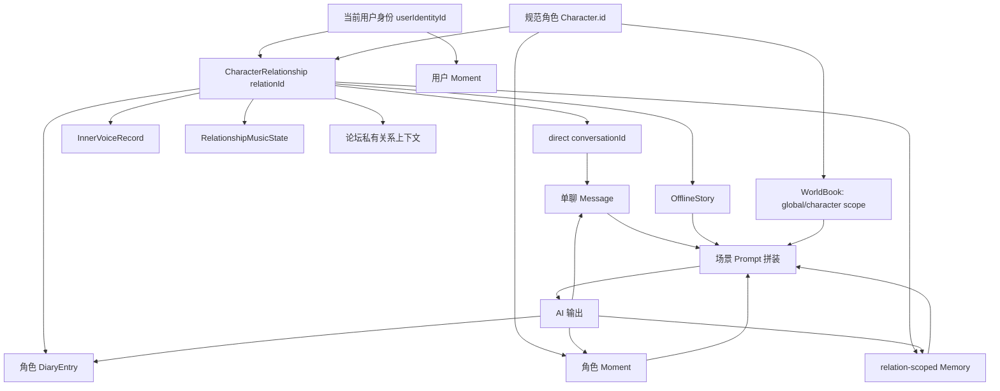
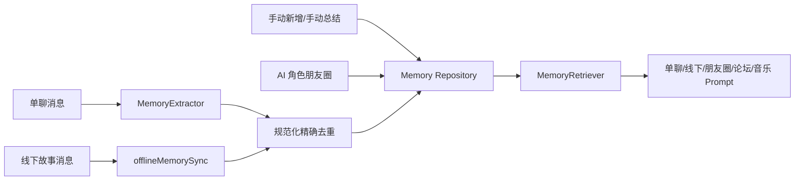
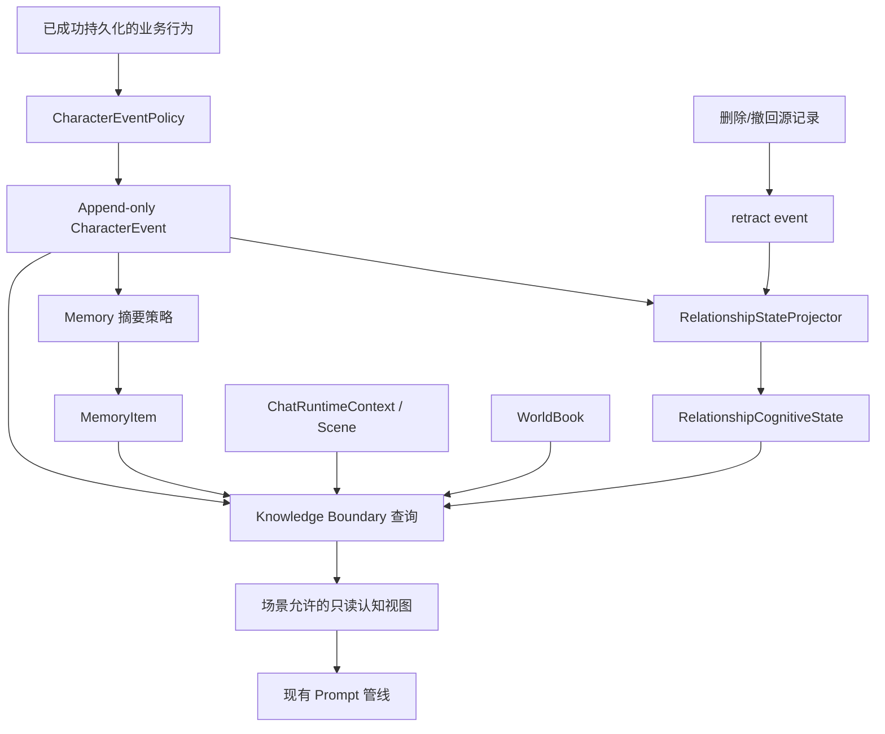

# 角色智能系统全链路审计

> 审计基线：`agent/relationship-isolation` 分支，HEAD `6d2487a`（`refactor: extract chat controllers and runtime context`）
>
> 审计范围：角色身份、Relationship、聊天、记忆、线下剧情、心声、朋友圈、世界书、论坛、日记、音乐及其他 AI 调用。
>
> 本文描述当前实现，并给出 Character Life System 的接入边界；不代表本轮已经实现新的数据模型。

## 0. 结论摘要

当前角色认知不是一个常驻的“角色大脑”，而是在每次 AI 调用前，由具体业务页面临时拼装出来：

1. `Character` 提供跨身份共享的角色设定。
2. `CharacterRelationship` 以 `relationId` 绑定一个用户身份和一个角色，是单聊长期状态的主要隔离边界。
3. `Message`、`MemoryItem`、`OfflineStory`、`InnerVoiceRecord` 等分别独立持久化。
4. 各场景在调用模型前自行读取其中一部分数据，形成场景 Prompt。
5. AI 输出落回消息、记忆、朋友圈、日记等各自仓库；目前没有统一事件日志、状态投影器或认知更新总线。

Relationship Isolation 已覆盖单聊、单聊记忆、主要线下剧情、心声和多数删除链路，但仍不是全应用统一边界。最需要优先处理的真实缺口是：

- OOC 纠正记忆未携带 `relationId`，当前关系检索不到，未来宽松检索还可能造成跨身份污染。
- 多角色线下剧情只有一个主 `relationId`，生成 Prompt 会把主关系摘要用于其他角色，记忆同步也只写给主角色。
- WorldBook 只有全局或 `characterId` 作用域，没有 `relationId` / `userIdentityId` 作用域。
- 朋友圈自动回复通过名字/备注反查关系，在同名或多身份场景存在选错关系的风险。
- 部分服务 API 仍允许只传 `characterId`；`MemoryRetriever` 在不传 `relationId` 时会读取该角色全部关系的记忆。

因此，Character Life System 不应继续向 `Character` 塞动态字段，也不应把所有长期状态都写成自然语言 Memory。建议新增领域层 `CharacterEvent` 与关系认知状态投影，并在存储层分别提供 Repository。

## 1. 角色身份体系

### 1.1 核心身份对象

| 对象 | 唯一标识 | 当前职责 | 隔离属性 |
| --- | --- | --- | --- |
| `Character` | `Character.id` | 角色的规范档案：姓名、头像、性格、背景、外观、模型/主动消息配置等 | 本质上是跨用户身份共享的角色模板；不是关系边界 |
| `CharacterRelationship` | `CharacterRelationship.id`，即 `relationId` | 一个用户身份与一个规范角色之间的直接关系实例 | 同时包含 `characterId`、`userIdentityId`、`conversationId`，是单聊主要隔离边界 |
| 用户身份 | `UserIdentity.id` / `userIdentityId` | 当前扮演的用户身份、资料和所属关系 | 切换身份时必须切换可见关系集合 |
| 消息 | `Message.id` | 聊天事实记录 | 单聊应同时带 `characterId`、`relationId`、`conversationId` |
| 会话 | 没有独立持久化实体 | 通过字符串 `conversationId` 分组消息和关系 | 单聊会话由 `relationId` 派生；群聊由群组上下文确定 |

单聊会话 ID 当前按 `direct:${relationId}` 生成。代码中存在 `ConversationThread`，但它只是聊天列表视图模型，不是独立 Repository 中的 `Conversation` 记录。因此目前会话完整性依靠 `Relationship` 和消息字段之间的约定，而非数据库式外键。

`Character` 仍保留少量历史动态字段，例如 `compressedMemory`、`lastActiveTime`、`scheduledProactiveTime`、`lastImmediateSummaryMsgId`。新路径已经把对应关系态放到 `CharacterRelationship`，但这些字段仍构成兼容债务。

### 1.2 身份流转图



### 1.3 规范角色与联系人实例

`src/domain/character/characterIdentity.ts` 负责识别旧联系人副本并还原到规范角色：

- `profileSourceId` 指向规范角色时，优先使用规范 `characterId`。
- 新建聊天和线下剧情的选择器只应暴露规范角色，而不是联系人副本。
- 迁移会更新 Memory、Moment 等已知引用；Relationship 迁移还会更新故事和消息。
- 姓名和头像不会作为普通情况下的合并主键，仅用于可验证的旧数据恢复，避免同名角色误合并。

### 1.4 Relationship 创建、切换与迁移

- 添加联系人时，`AppChat.tsx` 为当前 `activeIdentityId` 和规范 `characterId` 创建独立 Relationship。
- Relationship 查找以 `userIdentityId + characterId` 为主，不允许另一身份的关系直接出现在当前单聊中。
- 切换身份时，设置页会把身份资料同步到顶层 `settings.name/avatar/signature/bio`，因此旧代码读取顶层设置时通常获得当前身份资料。
- `relationshipMigration.ts` 会把历史未分域数据归入默认身份 `identity-1`，并合并同一用户身份与规范角色的重复关系。
- 迁移策略是“归入主身份”，不是“归入当前激活身份”；这是可预测的兼容策略，但迁移完成前仍可能存在没有 `relationId` 的旧记录。

### 1.5 各功能中的身份使用

| 场景 | `characterId` | `relationId` | `userIdentityId` / `ownerIdentityId` | 当前结论 |
| --- | --- | --- | --- | --- |
| 单聊 | 必需 | 必需 | 由 Relationship 得到 | 已完整关系化，消息按精确关系读取 |
| 群聊 | 群组和成员均使用 Character ID | 不使用单一直接关系 | 群组 `ownerIdentityId` | 身份隔离存在，但不是直接 Relationship 模型 |
| Memory | 必需 | 新数据原则上必需 | 通过 Relation 间接隔离 | 主路径完整；OOC 纠正和旧数据有缺口 |
| OfflineStory | 主角色必需，可带 `characterIds` | 单一主关系 | 由 Relation 间接隔离 | 单角色完整，多角色不完整 |
| InnerVoice | 必需 | 单聊必需；群聊用 groupId | 通过 Relation/Group 间接隔离 | 调用方正确传参时隔离完整 |
| Moment | 角色动态带 character/relation；用户动态带 owner identity | 角色动态可带 | `ownerIdentityId` | 主生成路径关系化；名字反查回复有歧义 |
| WorldBook | 可选，空表示全局 | 不支持 | 不支持 | 有意共享的角色知识层，不能承载关系私密知识 |
| Forum | 私有作者映射可带 character/relation | 私有上下文可带 | `ownerIdentityId` | 论坛容器身份隔离；公开内容与私有映射已分离 |
| Diary | 角色日记带 character/relation/conversation | 角色日记必需 | `ownerIdentityId` | 私有日记不进入角色认知；分享后成为聊天快照 |
| Music | 角色关系音乐带 character/relation/conversation | 必需 | 用户当前音乐单独按身份 | 已分为身份态与关系态 |
| Calendar | 不支持 | 不支持 | 不支持 | 当前为全局工具数据 |
| Notes | 不支持 | 不支持 | 不支持 | 当前为全局本地数据；只有显式分享到聊天后才被角色看见 |

## 2. 记忆系统审计

### 2.1 数据结构与职责

`MemoryItem` 的关键字段为：

- `id`：记忆唯一 ID。
- `characterId`：记忆属于哪个规范角色。
- `relationId?`：记忆属于哪个直接关系；新关系化数据应填写。
- `sourceMomentId?`：朋友圈生成记忆时的来源关联。
- `content`、`timestamp`、`importance`、`isManual`：自然语言回忆及其检索属性。

Memory 是“可供召回的叙事摘要”，不是事件事实表，也不是当前关系状态的唯一真相。

### 2.2 当前记忆链路



`MemoryExtractor` 将传入消息转换成 role/content 后交给模型，让模型返回记忆文本列表，再合并为一个 `MemoryItem`。消息 ID、原始时间、叙事标记等来源信息没有结构化写入该记忆。线下记忆的重要度默认为 4，其他提取路径通常为 5。

### 2.3 什么行为会产生 Memory

当前确认的创建入口：

1. 单聊 AI 回复成功后，在达到自动总结阈值时触发提取。
2. 聊天页手动归档或立即总结。
3. 线下剧情执行同步/归档时，通过 `offlineMemorySync` 提取或生成 fallback 摘要。
4. 记忆库手动新增、编辑。
5. AI 角色生成朋友圈成功后，创建带 `sourceMomentId` 的 Memory。
6. OOC 纠正路径会创建 Memory，但当前漏写 `relationId`。

声明的场景类型还包含 `group-chat`、`proactive-message`、`moment` 等，但类型中出现不等于所有场景都会自动写记忆。实际写入仍取决于调用路径。

### 2.4 什么内容不会自动进入 Memory

- `InnerVoiceRecord`：明确保持私密反思，不自动成为聊天或记忆事实。
- 论坛帖子、回复、私信：不会自动写 Memory。
- 私有 Diary：不会自动写 Memory；只有显式分享后作为聊天快照进入对话上下文。
- 用户朋友圈：不会直接成为角色 Memory。
- 音乐推荐结果和当前播放状态：不会自动写 Memory。
- Calendar、Notes：不会自动写 Memory；显式分享到聊天后，分享消息才可能参与后续总结。
- WorldBook：是预设知识，不是通过经历形成的 Memory。
- 翻译、图片生成等工具输出：默认不进入长期认知。

### 2.5 不同应用如何共享 Memory

Memory Repository 是全应用共享存储，但读取范围由每个调用点决定：

- 单聊：按当前 `characterId + relationId` 精确读取。
- 重新生成：按当前关系精确读取。
- 线下剧情：创建时冻结当前关系的 Memory 快照；后续 Prompt 读冻结快照，而非不断读线上最新值。
- 朋友圈角色生成：按该角色当前 Relationship 读取。
- 论坛关系化发帖上下文：按当前 Relationship 读取；公开回复和论坛私信不读私有 Memory。
- 音乐推荐：按当前 Relationship 读取。
- 群聊：当前群聊 Prompt 主要依赖群聊消息和角色压缩摘要，并未统一读取每个成员的 Relationship MemoryVault。

`MemoryRetriever` 的过滤条件允许省略 `relationId`。省略时会读取该 `characterId` 的全部记忆，这对迁移和工具场景有兼容价值，但对新业务是危险默认值。所有面向直接关系的新增调用都应强制传 `relationId`。

### 2.6 重复保存风险

当前去重仅对同一 `characterId + relationId` 下的标准化文本做精确比较：

- 完全相同或仅空白/格式差异的内容可被拦截。
- 意义相同但换一种说法的摘要不能被识别。
- Memory 缺少统一 `sourceType + sourceId + range` 唯一键，重复触发同一消息区间时主要依赖调用方的总结标记。
- 线下同步有 story/range 标记，并会替换同一故事的旧 handoff，重复风险相对可控。
- 朋友圈使用 `sourceMomentId`，删除朋友圈时可联动删除对应记忆，这是现有来源追踪中较完整的一条。

未来 CharacterEvent 应使用稳定 `sourceKey` 做幂等，Memory 则保留语义去重和摘要更新职责。

### 2.7 记忆污染风险

#### 已确认缺陷

1. OOC 纠正创建的 Memory 没有 `relationId`。结果是当前精确关系检索读不到它，而未来若使用宽松检索又可能跨身份读取。
2. 多角色线下剧情只把长期记忆写给主角色，且只有一个主 `relationId`，无法表达每个参与角色分别观察到什么。

#### 架构风险

1. 调用 `MemoryRetriever` 时省略 `relationId` 会跨同一角色的多个用户身份/关系读取。
2. AI 角色朋友圈一生成就直接写长期 Memory，模型创作内容会被视作角色经历；如果生成失真，会自我强化。
3. Memory 内容缺少结构化来源和撤销状态，删除原始消息后不一定能定位相关摘要。
4. 语义近似记忆可重复保存，导致检索权重被重复内容放大。
5. `mergeMemories` 主要负责合并顺序，并不承担全局语义去重。

#### 有意边界

- 私有心声不进入 Memory 是正确隔离，不应因为“角色成长”而自动取消。
- WorldBook 不写成 Memory 是正确分层：它是设定知识，不是经历。
- 私人日记、未分享的便签和日程不应被角色自动知道。

## 3. Prompt 系统审计

### 3.1 PromptComposer 的真实职责

`PromptComposer` 当前更接近参数透传和拼接入口，不负责：

- 自动按 Relationship 过滤数据；
- 验证 Knowledge Boundary；
- 统一查询 Memory/WorldBook/Offline；
- 约束所有 AI 调用都经过同一管线；
- 记录某段知识来自哪个仓库。

换言之，身份安全主要依赖每个调用方在传入 PromptComposer 之前正确筛选。未来不宜把 Character Life 数据无条件塞进 PromptComposer；应先经过场景策略和知识边界，再注入已经裁剪的只读视图。

### 3.2 Prompt 入口总表

| 场景 | 构建/调用入口 | 主要输入 | 注入的长期/跨应用内容 | 输出及落库 |
| --- | --- | --- | --- | --- |
| 单聊 AI 回复 | `AppChat.tsx` direct pipeline，经 `chatReplyController` 调度 | 当前 Relationship、最近单聊消息、用户输入 | 精确关系 Memory、关系压缩摘要、WorldBook、最新线下 handoff、朋友圈上下文；音乐话题时注入关系音乐 | assistant `Message`；随后触发副作用/自动记忆 |
| 单聊重新生成 | `AppChat.tsx` regenerate path | 同一关系历史，排除被重生成回复 | 与普通单聊相同的关系化上下文 | 替换/追加 assistant Message，行为保持原流程 |
| 群聊回复 | `AppChat.tsx` group pipeline | 群组消息、成员列表、成员人格 | 群组/成员 WorldBook、成员 `Character.compressedMemory` | 群组 Message；没有统一读取各成员关系 Memory |
| 主动消息 | `AppChat.tsx` proactive path | 当前关系、时间、最近消息 | Relation 压缩摘要、WorldBook、在线空间边界 | 关系化 Message；调度状态更新 |
| 心声 | `innerVoicePrompt` / `innerVoiceService` | 角色人格、关系状态、触发消息、调用方筛选的近期聊天 | 不读 Memory、WorldBook、Offline | `InnerVoiceRecord`；不写 Message/Memory |
| 线下剧情 | Offline Prompt / `apiChat` | 故事模式、角色设定、故事消息、冻结导入上下文 | 创建故事时冻结的线上消息、Memory、WorldBook；场景边界 | OfflineStory Message；同步时才可能写 Memory |
| 朋友圈角色发帖 | Moment generation | 角色人格、当前关系、近期动态 | 精确关系消息/Memory、Character/Global WorldBook、近期朋友圈防重复 | `Moment`，并立即写 `MemoryItem` |
| 朋友圈评论/回复 | Moment comment/reply | 动态正文、评论、角色人格 | 自动评论可读精确关系消息和 WorldBook；自动回复关系解析存在名字歧义 | `MomentComment`，不单独写 Memory |
| 论坛关系化主帖 | `buildForumRelationGenerationContext` | 当前 Relation、角色人格、论坛约束 | 精确关系消息/Memory、角色/全局 WorldBook；输出前做公开安全处理 | `ForumThread`；私有 author 映射与公开 DTO 分离 |
| 论坛公开回复/活动 | Forum public prompt | 公开帖子、公开回复、公开人物风格 | 明确不注入私聊 Relation/Memory | Forum reply/activity |
| 论坛私信 | Forum DM prompt | 公开角色人格、起源帖子、该 DM 历史 | 不读 Relationship 状态、Memory、WorldBook、私聊 | Forum DM message |
| 角色日记 | Diary service | 角色人格、当前 Relation、最近关系消息、当前用户身份 | 关系状态；不读 Memory/WorldBook | `DiaryEntry`，不自动写 Memory |
| 日记分享 | 聊天分享流程 | 冻结日记公开快照 | 只有用户显式分享后才进入单聊 | 带 `diaryShareId` 的 Message |
| 音乐推荐 | Music recommendation service | 当前关系、角色人格、用户音乐库 | 精确关系消息/Memory、关系状态/压缩摘要 | 推荐/播放状态；不写 Memory |
| 音乐分享后的聊天 | 单聊消息流程 | 显式音乐分享消息 | 仅在音乐相关话题下注入关系音乐上下文；在线空间边界禁止补写共同场景 | Message，可参与后续正常总结 |
| 角色图片 | Character image prompt | 角色外观、关系/群组状态、调用方筛选的消息、用户请求 | 不自动读全局认知 | Image record；不写 Memory |
| Memory 提取 | `MemoryExtractor` 专用 API | 被选中的聊天/线下消息文本 | 不使用普通 PromptComposer | `MemoryItem` |
| 翻译 | Translation API | 待翻译文本 | 无角色长期上下文 | 展示/翻译字段，不形成认知 |

### 3.3 单聊 Prompt 的认知组成

当前直接聊天是关系化最完整的场景，组合顺序概念上包括：

1. 规范 Character 人设与外观资料。
2. 当前用户身份资料与 Relationship 状态。
3. 当前 `relationId` 的压缩摘要；只有旧兼容关系才回退到 `Character.compressedMemory`。
4. 当前 `relationId` 的相关 Memory 检索结果。
5. 当前关系最近且有效的 OfflineStory handoff。
6. 全局和当前 Character 的 WorldBook 条目。
7. 当前身份的用户朋友圈、当前 Character 的角色朋友圈等可见社交上下文。
8. 音乐话题触发时的关系音乐状态。
9. 时间、媒体、引用等当前消息上下文。
10. `characterKnowledgeBoundary` 与线上空间边界。
11. 当前关系消息历史。

旧的“原始线下全文直接注入线上聊天”辅助函数目前固定返回空字符串，因此它是死代码/注释债务，不是正在发生的跨关系泄漏。实际使用的是经过同步、清洗和关系过滤的 handoff。

### 3.4 群聊 Prompt 的边界

群聊以群组 Character 和成员 ID 为组织中心，不存在一个能代表所有成员的 `relationId`：

- 群组本身通过 `ownerIdentityId` 与当前用户身份隔离。
- Prompt 注入群聊历史、成员人格、成员/群组 WorldBook。
- 旧的成员 `Character.compressedMemory` 仍可能进入群聊。
- 当前不会自动读取每个成员与当前身份的 Relationship MemoryVault。

这避免了直接把私聊记忆灌入群聊，但也意味着群聊中的角色长期认知与单聊可能不一致。Character Life System 需要明确群聊观察事件是写入成员各自的关系状态、群组共享状态，还是只保留为群组事件；不能简单复用一个 relationId。

### 3.5 线下 Prompt 的边界

- 从线上进入线下时，会冻结当前关系的消息、Memory 与 WorldBook 快照。
- 故事运行中读取冻结快照，避免线上后续变化让既有线下故事突然改写上下文。
- 生成消息带故事的 `relationId` / `conversationId`。
- continuation 模式可以把结果同步回线上认知；导演模式和部分独立故事不会自动回传。
- 多角色故事目前仍只有主关系：其他参与角色的人设会进入 Prompt，但关系摘要错误地复用主关系，长期同步也只面向主角色。

### 3.6 心声 Prompt 的边界

心声 Prompt 使用角色人格、关系状态、触发消息和近期聊天，输出独立 `InnerVoiceRecord`：

- 单聊记录必须带 `relationId` 和 `conversationId`。
- 群聊记录使用 `groupId + conversationId + characterId`。
- Builder 本身不查询或过滤消息，正确隔离依赖调用方。
- Prompt 当前会把内部 `relationId` 文本交给模型；这没有业务价值，属于可清理的信息暴露，但不是跨关系读取。
- 心声不自动进入聊天和 Memory，这一边界应保留。

## 4. 应用之间的数据同步

| 应用/模块 | 是否影响长期认知 | 是否产生 Memory | 未来是否适合产生 CharacterEvent | 当前性质 |
| --- | --- | --- | --- | --- |
| 单聊 | 是，消息与摘要是核心来源 | 是 | 是，持久化后的重要消息/互动 | 主要认知入口 |
| 群聊 | 部分；消息保存在群组会话 | 当前未统一写入各成员关系 Memory | 是，但需明确每个观察者和群组作用域 | 独立群组边界 |
| 主动消息 | 是，消息落入当前关系 | 可通过后续总结间接进入 | 是，只在消息真正发送并持久化后 | 关系行为入口 |
| OfflineStory | 是，冻结线上上下文并可回传摘要 | 是，主要针对主关系 | 是，优先 continuation 且同步成功的内容 | 第二核心认知入口 |
| Memory | 是，直接用于后续召回 | 本身就是记忆 | 通常不是事件源，而是事件的摘要投影 | 长期叙事召回层 |
| InnerVoice | 仅供心声展示/生成 | 否 | 默认否；它是解释和感受，不是事实 | 角色私密反思层 |
| Moment | 角色发帖会影响后续 Prompt | AI 角色发帖会生成 Memory | 是，已发布/评论/撤回等 | 社交公开行为层 |
| WorldBook | 是，广泛注入 Prompt | 否 | 否；应作为知识配置，不是经历 | 规范知识层 |
| Forum | 关系化发帖可读取私域，但结果是公开内容 | 否 | 可选，仅记录公开参与，不记录私有 author 映射 | 公共社交层 |
| Diary | 私有日记不影响其他应用；分享后进入聊天 | 否 | 仅显式分享时适合 | 私密创作层 |
| Music | 关系音乐可在相关聊天中注入 | 否 | 显式分享或有关系意义的共同操作可选 | 关系上下文层 |
| Calendar | 否 | 否 | 默认否，除非用户显式分享 | 全局工具数据 |
| Notes | 否；分享后成为聊天消息 | 否 | 仅分享行为可选 | 全局工具数据 |
| 图片生成 | 主要是展示/消息附件 | 否 | 通常否；显式发送图片可由聊天事件覆盖 | 工具输出 |
| 设置/桌面/主题 | 否 | 否 | 否 | 纯 UI 与配置 |

### 4.1 删除同步

现有删除逻辑由多个页面和顶层聚合处理：

- 核心 Relationship cleanup 覆盖 Relationship、Message、Memory、OfflineStory。
- App/AppChat 的完整删除还会清理 Moment、音乐关系态、心声、论坛私有映射、日记、图片等关联数据。
- 删除朋友圈时，会通过 `sourceMomentId` 删除对应 Memory，这条链路具有明确来源关联。
- 其他自然语言 Memory 缺少稳定来源 ID，删除原消息或故事时不一定能精确撤销已经形成的摘要。

Character Life System 如果采用事件日志，必须支持 `retracted` / `superseded`，并让删除操作产生撤销或重建投影，而不是直接留下不可追踪的认知残影。

## 5. 角色知识边界

### 5.1 角色当前可以知道什么

在直接聊天中，角色可以知道：

- 自己的规范人设和 WorldBook 设定。
- 当前用户身份主动提供的资料。
- 当前 `relationId` 下的消息、Memory 和关系摘要。
- 当前关系已同步的线下剧情 handoff。
- 当前身份的用户朋友圈以及该角色自己的可见动态。
- 用户显式分享的日记、音乐、文件、位置等消息内容。
- 当前时间、引用、媒体等即时上下文。

在论坛等公开场景，角色只能知道公开帖子和公开回复，除非走受控的关系化发帖生成入口；即使后者读取了私域，也必须在公开输出前遵守隐私过滤。

### 5.2 角色不应自动知道什么

- 另一 `userIdentityId` 与同一 Character 的聊天、Memory、线下故事和关系状态。
- 当前身份下该角色另一个 Relationship 的私聊内容。
- 其他角色的私聊、心声、私有日记和关系状态。
- 用户未分享的日记、便签、日程、API 设置或本地文件。
- 论坛内部匿名作者真实映射。
- 仅仅因为用户和角色曾在线下互动，就推断当前在线聊天处于共同地点。
- 仅仅因为系统保存了某项数据，就推断角色已经观察或理解它。
- 模型生成但尚未成功持久化的草稿、主动消息尝试或失败请求。

### 5.3 `characterKnowledgeBoundary` 的现状

当前边界规则已经表达几个关键原则：

- 单聊只使用当前关系数据。
- 群聊成员身份不等于私下熟悉关系。
- 线上聊天默认是远程空间，不得凭空补写用户和角色共同地点、动作或场景。
- 过去的线下记录、Memory、Moment 不能自动证明现在共处一地。

但它主要通过 Prompt 指令和调用方筛选生效，不是强类型访问控制。新增 Character Life 读取服务应把边界前移到查询层：调用方只能拿到“该场景允许观察的事件/状态视图”，而不是先读全量再依靠 Prompt 不泄漏。

### 5.4 可以进入 Prompt 的数据

只有同时满足以下条件的数据才应进入角色 Prompt：

1. 作用域匹配当前 `userIdentityId`。
2. 单聊数据精确匹配当前 `relationId` 和 `conversationId`。
3. 角色是事件的实际观察者、参与者，或用户已显式分享。
4. 数据状态不是已删除、撤销或被更新版本取代。
5. 场景允许该类知识，例如公开论坛不能读取私密心声。
6. 内容经过该场景的隐私和空间边界裁剪。

### 5.5 禁止进入 Prompt 的数据

- 全量 Relationship/Memory 列表。
- 仅按 `characterId` 查询得到的跨身份私域数据。
- 私密 `InnerVoiceRecord` 作为对用户已知的事实。
- 未分享 Diary、Notes、Calendar。
- 匿名论坛真实映射。
- 删除或撤销的事件。
- 未来计划被当作已经发生的事实。
- AI 推测被无条件升级为真实经历。

## 6. Character Life System 接入建议

### 6.1 数据应该放在哪里

领域类型和规则应放在 `src/domain/character-life/`，持久化实现放在 `src/core/storage/repositories/`：

```text
src/domain/character-life/
  characterEvent.ts
  relationshipCognitiveState.ts
  characterEventPolicy.ts
  relationshipStateProjector.ts

src/core/storage/repositories/
  characterEventRepository.ts
  relationshipCognitiveStateRepository.ts

src/features/character-life/services/
  characterEventService.ts
  relationshipStateService.ts
  characterLifePromptContext.ts
```

原因：

- `CharacterEvent`、认知状态及其转移规则属于业务语义，不能由 localStorage 结构定义。
- Repository 只负责序列化、查询、版本迁移和事务式替换，不应决定什么事件有效。
- Service 负责接收各功能的已持久化行为、执行幂等、投影状态，并输出受知识边界约束的 Prompt 视图。

现有 `src/domain/character/characterState.ts` 只有纯类型词汇，没有持久化状态，可作为命名和场景语义参考，但不等同于 Character Life System。

### 6.2 建议的类型结构

为避免与现有 Relationship 的 `relationshipState` 枚举混淆，建议将新状态命名为 `RelationshipCognitiveState`：

```ts
type CharacterEventSource =
  | "chat"
  | "group-chat"
  | "offline"
  | "moment"
  | "proactive"
  | "forum"
  | "diary-share"
  | "music-share";

type CharacterKnowledgeScope =
  | "relationship"
  | "group"
  | "public"
  | "character-private";

interface CharacterEvent {
  id: string;
  sourceKey: string;
  characterId: string;
  userIdentityId: string;
  relationId?: string;
  conversationId?: string;
  groupId?: string;
  source: CharacterEventSource;
  sourceRecordId: string;
  kind: string;
  occurredAt: number;
  observedAt: number;
  knowledgeScope: CharacterKnowledgeScope;
  payload: Record<string, unknown>;
  confidence?: number;
  status: "observed" | "confirmed" | "superseded" | "retracted";
  schemaVersion: number;
}

interface RelationshipCognitiveState {
  relationId: string;
  characterId: string;
  userIdentityId: string;
  summary: string;
  currentTone?: string;
  activeTopics: string[];
  unresolvedTensions: string[];
  commitments: string[];
  knownPreferences: string[];
  lastMeaningfulInteractionAt?: number;
  derivedFromEventIds: string[];
  version: number;
  updatedAt: number;
}
```

这不是游戏数值系统：不引入等级、经验、金币、好感数值条。状态字段表达可解释的关系认知、未完成事项和已知偏好，并保留来源事件以便审计和撤销。

### 6.3 Repository 边界

`CharacterEventRepository` 应至少支持：

- `appendIfAbsent(event)`：按 `sourceKey` 幂等追加。
- `listByRelation(relationId, options)`。
- `listByGroup(groupId, characterId, options)`。
- `retractBySource(source, sourceRecordId)`。
- `replaceAllForMigration(records)`。

`RelationshipCognitiveStateRepository` 应至少支持：

- `getByRelationId(relationId)`。
- `upsertWithExpectedVersion(state, expectedVersion)`。
- `deleteByRelationId(relationId)`。
- `rebuildFromEvents(relationId)`。

Repository 不应提供“按 characterId 返回所有私域事件”的普通业务接口。确有迁移/诊断需求时，应把它标记为管理用途并禁止 Prompt 层直接调用。

### 6.4 Service 与投影职责

1. `CharacterEventService`
   - 接收已经成功持久化的业务记录。
   - 判断角色是否实际观察到该行为。
   - 生成稳定 `sourceKey`。
   - 处理删除/撤销。

2. `RelationshipStateProjector`
   - 按时间和版本将事件投影为关系认知状态。
   - 保持幂等。
   - 不直接调用 UI，不持有 React 状态。

3. `CharacterLifePromptContext`
   - 输入 `ChatRuntimeContext + scene`。
   - 只返回当前场景允许的状态摘要和近期事件。
   - 在查询阶段执行 Relationship/Group/Public/Private 边界。

4. Memory 协调
   - Event 是带来源、可撤销的结构化事实。
   - Cognitive State 是从 Event 得到的当前状态投影。
   - Memory 是对过往经历的自然语言召回摘要。
   - 三者可以相互引用，但不能互相替代。

### 6.5 事件来源候选

#### 聊天

- 用户或角色消息已经成功写入 Message Repository 后，才可产生事件。
- 不建议每个气泡都写“成长事件”；应由策略筛选承诺、冲突、偏好、关系定义、重要分享等有长期意义的行为。
- 红包、转账、通话、位置、文件等特殊消息仍以原 Message 为事实源，事件只保存结构化意义和来源 ID。
- 删除消息时撤销或重建受影响事件，不留下孤立认知。

#### 线下剧情

- 仅同步成功、允许回传的故事片段成为长期事件。
- continuation 模式优先；导演模式默认不自动升级为共同事实。
- 多角色故事必须为每个观察者解析其 `relationId`，不能复用主关系。
- 场景动作只在实际故事中发生；不能因为后来在线聊天提到音乐等话题就补写共同地点。

#### 朋友圈

- 角色动态成功发布后可记录公共行为事件。
- 评论、回复可按“角色是否参与/观察”选择性记录。
- 删除动态时事件进入 `retracted`，并重建相关投影。
- 自动生成内容的置信度应低于用户确认的事实，不能无条件成为强关系事实。

#### 主动消息

- 只有消息实际生成、成功保存并展示后才产生事件。
- “计划发送”“调度触发”“请求失败”不是已发生互动。
- 可记录主动关心、延续话题等行为，但不应给出游戏化数值奖励。

#### 论坛

- 可记录角色公开发帖/回复这一公共行为。
- 不得把匿名真实映射写进公开 payload。
- 公开参与默认不等于角色知道用户私聊身份；只有受控的关系化入口才能连接 Relation。

#### 日记

- 私有日记不产生对外认知事件。
- 用户显式分享日记时，以分享消息/快照作为事件源。
- 角色自己写日记可以是 `character-private` 事件，但不能自动视为用户已知事实。

#### 音乐

- 推荐结果、播放状态本身通常不需要长期事件。
- 用户显式分享歌曲，或双方围绕歌曲形成有意义互动时，可由聊天消息产生事件。
- 事件仍应标注线上分享，不得推断共处、动作或地点。

#### 心声

- InnerVoice 是角色对事实的解释，不是事实来源。
- v1 不建议直接把每条心声写成 CharacterEvent。
- 若未来需要保留长期内部倾向，应使用 `character-private` 且与用户可见状态严格分开。

### 6.6 接入 Prompt、Memory、Offline 与主动消息

推荐顺序：

1. 先在聊天成功持久化之后追加 CharacterEvent，不改变现有 Prompt。
2. 建立只读投影并与当前 Relation 摘要对照测试。
3. 在单聊 Prompt 中以一个独立、长度受控的 `relationshipCognitiveContext` 注入；放在 Knowledge Boundary 之后、消息历史之前。
4. Memory 提取时附上事件来源范围，但不把整个 Cognitive State 再重复保存成 Memory。
5. OfflineStory 创建冻结快照时，加入当前关系认知状态；多角色必须分别冻结。
6. 主动消息读取“未完成话题/承诺”等状态，但只能作为生成建议，不能改变调度协议。
7. 最后再扩展朋友圈、论坛、日记分享和音乐分享事件。

### 6.7 哪些数据不能放进 Character

- 对某个用户身份的关系状态、称呼、亲密表达。
- `relationId`、当前会话未读、最后互动、主动消息调度等关系运行态。
- 某段关系的承诺、冲突、共同经历和已知偏好。
- 当前线下场景、在线空间位置、临时情绪。
- 任何只对一个用户身份成立的 Memory 或 CharacterEvent。

Character 应继续只表示规范人格和可跨关系复用的设定。即使角色“成长”，也要区分规范角色层成长和特定关系中的成长；v1 应优先实现后者。

### 6.8 哪些数据不能放进 Memory

- 当前状态的唯一权威值。
- 可撤销事件的唯一记录。
- 尚未发生的计划、调度尝试和未来意图作为既成事实。
- 私密心声、未分享日记、便签、日程。
- 完整 Prompt、原始全量聊天或跨关系数据。
- AI 推测但没有来源确认的事实。
- 为了驱动 UI 而产生的未读、加载、选中等状态。

## 7. 发现的问题与优先级

### P0：进入 Character Life 开发前应先修复

1. **OOC 纠正记忆缺少 `relationId`**

   这是现存数据边界缺陷：当前关系检索不到该纠正，宽松检索时又可能跨关系污染。

2. **多角色 OfflineStory 复用主关系**

   其他角色 Prompt 可能拿到主角色的 Relationship 摘要，记忆同步也只写主角色。新增事件系统前必须先明确每个参与者的观察关系。

### P1：应在第一版设计中处理

1. **朋友圈自动回复按名字/备注反查关系**

   名称可变且不唯一，多个身份/关系下可能选错 Relation。应让生成任务从创建时就携带稳定 relationId。

2. **AI 角色朋友圈直接写长期 Memory**

   模型创作会立即成为后续认知，建议改为带来源和较低置信度的事件，再由策略决定是否生成 Memory。

3. **WorldBook 缺少 Relationship/Identity 作用域**

   如果条目是规范人设/世界观，这是有意共享；如果用户想保存只属于某段关系的秘密，目前模型无法表达。不能用 character-scoped WorldBook 代替关系私密状态。

4. **MemoryRetriever 的 relationId 是可选参数**

   新直接关系业务应使用强制关系化 API，兼容宽松 API 只保留给迁移和管理工具。

5. **删除后缺少通用认知撤销链**

   除朋友圈 `sourceMomentId` 外，多数摘要无法稳定追溯到原记录。事件层必须支持来源 ID 和 retraction。

### P2：架构债务

1. `Character` 仍有关系运行态的历史字段。
2. `PromptComposer` 不执行检索和知识边界，安全依赖调用方。
3. 多个 Prompt builder 接受调用方预筛选消息，自身不校验 Relation。
4. InnerVoice Prompt 暴露内部 `relationId` 字符串。
5. Memory 只有文本精确去重，缺少语义去重和完整来源。
6. 没有独立持久化 Conversation，字段一致性依赖约定。
7. localStorage Repository 是薄 JSON 包装，缺少逐条运行时 schema 校验。
8. 群聊长期认知仍使用 Character 压缩摘要，未形成明确的群组/成员观察模型。
9. 原始 Offline 注入辅助函数已禁用但仍作为死代码存在，增加审计噪音。
10. Calendar/Notes 没有用户身份作用域；目前不进入认知，因此是产品数据隔离问题，不是即时 Prompt 泄漏。

### 7.1 有意共享，不应误判为缺陷

- 规范 Character 人设跨关系共享。
- Global/Character WorldBook 作为角色设定共享；只有把私密关系知识放进去时才构成建模问题。
- 私密 InnerVoice 不进入 Memory。
- 未分享 Diary/Notes/Calendar 不进入角色认知。
- 论坛公开回复不读取私聊 Memory。
- 线下原始全文不会直接注入线上聊天，当前 helper 返回空字符串。
- 在线聊天的空间边界明确禁止根据过去场景补写当前共同地点和动作。

## 8. 推荐的目标认知链路



这条链路把“发生过什么”“当前如何理解关系”“能回忆起什么”“这次场景允许知道什么”分成四层：

- `CharacterEvent`：可追溯、可撤销的事实来源。
- `RelationshipCognitiveState`：当前关系认知的投影。
- `MemoryItem`：适合语言模型召回的经历摘要。
- Prompt Context View：经过身份、关系、场景和隐私边界裁剪的输入。

## 9. 建议实施顺序

1. 修复 OOC Memory relationId 和多角色 Offline 关系归属。
2. 定义 CharacterEvent / RelationshipCognitiveState 类型和 Repository，不接入 Prompt。
3. 仅从单聊持久化成功事件开始双写，并建立幂等、删除和迁移测试。
4. 建立状态投影，与现有 Relationship 摘要并行对照，不替换现有行为。
5. 增加受边界约束的只读 Prompt 适配，先接单聊和主动消息。
6. 接入 OfflineStory，补齐多角色观察者模型。
7. 再接朋友圈、显式日记分享、音乐分享和论坛公开事件。
8. 最后评估是否迁移 Character 上的旧动态字段，以及是否需要独立 Conversation 实体。

## 10. 最终回答：角色如何形成、保存、读取和更新自己的认知

**形成**：角色认知来自规范人设、用户与角色在当前 Relationship 下的消息、被总结的 Memory、同步后的线下故事、WorldBook 以及显式可见的跨应用内容。

**保存**：这些信息目前分别保存在 Character、Relationship、Message、Memory、OfflineStory、Moment、InnerVoice、Diary、Music 等 localStorage Repository 中。

**读取**：每个 AI 场景在调用前自行按 `characterId/relationId/userIdentityId` 过滤并拼装 Prompt；没有统一认知查询层。

**更新**：模型输出由各功能分别写回消息、记忆、朋友圈、日记等仓库，回复后副作用由聊天 controller 逐步承接；没有统一事件日志或关系状态投影。

当前系统已经具备 Character Life System 的关键前提——规范角色、Relationship 隔离、关系化消息/记忆和场景知识边界——但还缺少可追溯的事件层与统一、可撤销的认知状态。下一阶段应围绕这两个缺口扩展，而不是继续把动态事实堆进 Character 或 Memory。
