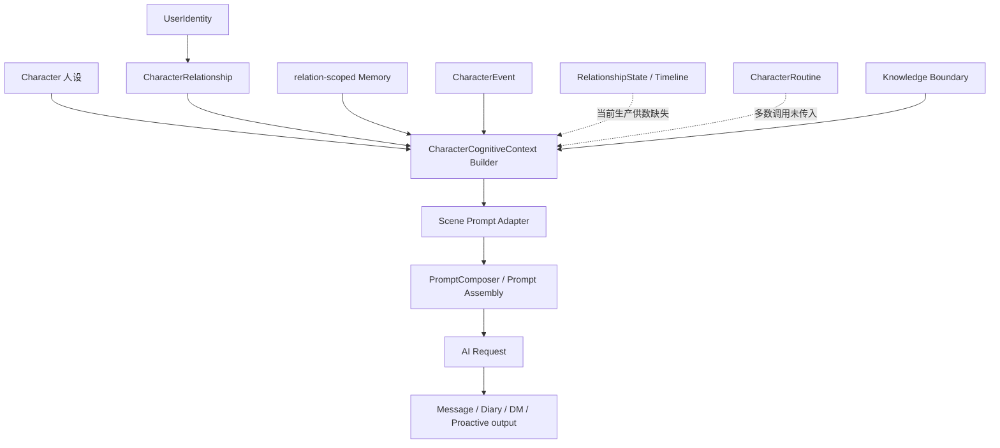
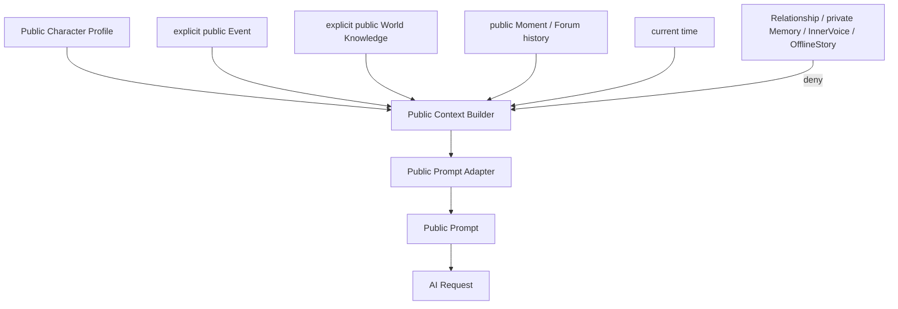
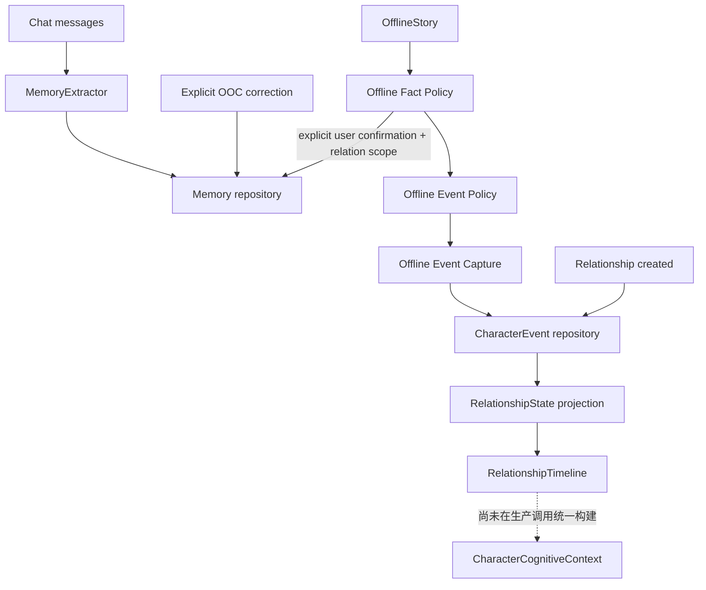

# Character System Architecture Audit

审计日期：2026-08-01
审计范围：当前 `agent/relationship-isolation` 分支源码
审计方式：只读静态审计；未修改业务代码、Prompt、数据结构或存储数据

## 1. 结论摘要

当前“小手机”已经形成了三组较清晰的认知边界：

1. 私域关系认知：`CharacterCognitiveContext` → 场景 Prompt Adapter。
2. 公开论坛认知：`PublicForumCognitiveContext` → Public Forum Adapter。
3. 朋友圈公开认知：`MomentPublicCognitiveContext` → Moment Adapter。

但整个角色系统还不是完全统一的认知体系。更准确的判断是：

- 身份与关系隔离基础已经较完整：`relationId + characterId + userIdentityId` 是私域认知的主要边界。
- Chat 主回复、Proactive、Moments、Diary、Forum DM、Public Forum 已经具备 Context/Adapter 基础设施。
- Group Chat、OfflineStory 生成、Music 推荐、InnerVoice、Chat 重新生成、角色主动发红包后的补充回复仍有独立 Prompt 路径。
- 多个已建立的基础能力尚未进入生产供数链：`RelationshipState`、`RelationshipTimeline`、`CharacterRoutine`、Moment/Proactive Topic History 主要停留在类型、纯函数或 Adapter 支持层。
- 部分已接入场景仍把 Adapter 当作“补充块”，同时保留直接拼接 Character、Memory、Relationship、WorldBook、聊天记录的旧路径，因此 Context 还不是唯一事实入口。
- 公开论坛存在最高优先级边界缺口：旧的 `promptContext` 会从关系压缩记忆、私聊消息、Memory、WorldBook 提取主题种子，并在部分公开生成路径继续使用，绕过了 public deny-by-default 设计。

因此，对“角色是否拥有统一、一致、可追溯的认知体系”的回答是：**部分具备，但尚未全链路成立**。私域单聊和专用公开场景的结构已经成形；统一入口契约、投影供数、来源元数据和遗留 Prompt 清理仍是主要缺口。

## 2. 身份与作用域基线

### 2.1 核心身份

- `Character.id`：角色定义或联系人实例 ID。角色人设本身主要是角色级数据。
- `UserIdentity.id`：机主身份 ID，当前身份由 `UserSettings.activeIdentityId` 选择。
- `CharacterRelationship.id`：私域关系 ID，即 `relationId`。直接关系由角色与机主身份共同确定。
- `CharacterRelationship.conversationId`：对应关系的会话 ID。
- `Message.id`：消息 ID；直接消息应同时携带 `relationId` 与 `conversationId`。

### 2.2 正确的私域作用域

```text
userIdentityId + characterId
              ↓
       CharacterRelationship
              ↓
 relationId + conversationId
              ↓
 Message / Memory / CharacterEvent / OfflineStory / InnerVoice / Diary / Forum DM
```

`CharacterCognitiveContext` 会验证：

- `relation.characterId === character.id`
- 传入的 `conversationId` 必须匹配关系会话
- Memory 必须匹配当前 `characterId + relationId`
- CharacterEvent 必须匹配当前 `relationId + characterId + userIdentityId`
- RelationshipTimeline 必须同时匹配三项 scope，否则被剔除

### 2.3 公开作用域

Public Forum 和 Moments 都采用 deny-by-default，但使用不同模型：

- `PublicForumCognitiveContext`：论坛公开表达。
- `MomentPublicCognitiveContext`：朋友圈公开表达，不能复用 Chat 或 Forum Context。

二者的类型都刻意不包含 `relationId`、`userIdentityId`、`conversationId`、私人 Memory、InnerVoice 和 RelationshipState。

## 3. 角色相关数据源总表

| 数据来源 | 作用 | 存储位置 | 主要读取入口 | 主要写入入口 | 是否进入 Prompt |
|---|---|---|---|---|---|
| Character | 角色姓名、人设、背景、生成偏好、联系人/群组配置 | `phone_characters_v3`；legacy `phone_characters` | App、Chat、Offline、Diary、Forum、Music、Context Builder | 角色编辑、导入、联系人创建/迁移 | 是；几乎所有角色生成场景使用，但有 Adapter 投影和直接拼接两种路径 |
| UserIdentity / UserSettings | 当前机主身份、昵称、简介、AI 配置 | `phone_settings` | App 初始化、关系选择、Chat、Forum、Diary | Settings 保存 | 是；Chat/Diary/Forum 的旧 Prompt 会直接使用机主资料，公开 Context 不应使用 |
| CharacterRelationship | 角色与某个机主身份之间的关系、会话、压缩记忆、主动消息状态 | `phone_character_relationships` | Chat、Diary、Music、Forum DM、Offline、Cognitive Builder | 关系创建/迁移/设置、聊天活动更新、删除清理 | 是；私域场景允许。公开场景原则上禁止，但 Forum 遗留 topic seed 仍间接读取 |
| Message / Conversation | 短期上下文、事实原始证据、特殊消息 | `phone_messages_v3`；legacy `phone_messages` | Chat、Memory 提取、Diary、Music、Forum DM、Offline 导入 | Chat Controller、特殊消息、群聊、分享/通话等 | 是；Chat、Diary、Music、InnerVoice、Offline、Forum DM 使用。应严格按 relation/conversation 过滤 |
| MemoryItem | 长期关系事实、摘要、OOC 纠正、Offline handoff | `phone_memory_vault_items` | Chat 检索、Cognitive Builder、Offline、Music、Memory UI | Chat/即时总结提取、手工编辑、OOC 修正、Offline 显式同步 | 是；Chat/Music/Offline 使用，Diary/Moments/Public Forum 的新边界禁止 |
| Relationship compressedMemory | 压缩后的关系摘要；旧 Character 也保留 legacy `compressedMemory` | Relationship 记录；Character 内仍有旧字段 | Chat、Proactive、Diary 旧 Prompt、Music、Forum 遗留上下文、Offline | 关系归档/迁移与聊天侧更新 | 是；这是最容易绕过 Context 的高密度私域信息之一 |
| CharacterEvent | 确定性、可追溯关系事件 | `phone_character_events` | Cognitive Builder、Diary/DM/Proactive/Chat 事件候选、Timeline 查询 | 关系创建；OfflineStory 确认同步后的事件捕获 | 条件进入；必须精确 scope 且经 visibility 策略 |
| RelationshipState | CharacterEvent 的当前纯投影；阶段、氛围、openLoops、boundaries 等 | 不持久化 | `relationshipProjection.ts`、测试、Cognitive Context 可选字段 | 纯函数投影，无生产写入 | Adapter 支持，但当前生产代码未发现实际构建并传入 |
| RelationshipTimeline | State + 最近事件的只读组装 | 不持久化 | `relationshipTimelineQuery.ts`、测试、Cognitive Context 可选字段 | 纯函数组装 | Chat/Proactive Adapter 支持，但当前生产调用未供数 |
| CharacterRoutine | 时区、活跃/睡眠/工作/休息规律的纯规则模型 | 无独立 Repository | Routine policy/builder；Cognitive Builder 可选输入 | 当前没有统一生产配置写入入口 | Adapter 支持；当前 Chat/Moment/Diary/Proactive 主要调用未传 routine，实际效果有限 |
| WorldBookEntry | 全局或角色绑定的世界设定、触发规则、Prompt 插入位置 | `phone_worldbook_entries` | Chat、Group Chat、Offline、Forum 遗留安全摘要 | WorldBook UI、导入 | 是；按 global/characterId 过滤，不按 relationId/userIdentityId 隔离 |
| OfflineStory | 线下/IF/导演/续写剧情空间与导入快照 | `phone_offline_stories`；每 relation 的 active key | AppOffline、Chat handoff、Memory sync、Event capture | 线下创建、续写、存档、显式同步 | 生成时直接进入 Offline Prompt；原始剧情禁止直接进入线上 Prompt，事实写入有 Policy 门禁 |
| OfflineStory importedContext | 创建时冻结的聊天、Memory、WorldBook 快照 | OfflineStory 内嵌 | Offline 生成 Prompt | 从当前 relation 导入线上上下文 | 是；单关系时较清晰，多角色缺少持久化 participantRelationIds |
| InnerVoiceRecord | 某条消息触发的角色内心独白 | `phone_inner_voice_records` | 心声 UI、按 relation 或 group 查询 | `innerVoiceService` AI 生成 | 只进入 InnerVoice 自己的 Prompt；未发现进入 Chat/Moment/Public/Proactive Prompt |
| Moment | 公开动态、评论、作者快照；relation/identity 用于归属和路由 | `phone_moments_v3` | Moments UI、Chat 的“已知朋友圈”上下文、Moment Public Context | 用户发布、角色自动发布、评论/回复 | 是；Moment 自身通过 Public Context；Chat 仍直接注入当前身份可知的公开动态 |
| MomentPublicCognitiveContext | 朋友圈公开人设、公开历史、授权事实、公开事件、时间、约束、topic hints | 不持久化 | Moment services / MomentPromptAdapter | 每次生成即时构建 | 是；当前 Moments 三条生产链已使用 |
| Moment Topic History | 避免朋友圈主题重复的生成辅助记录 | 当前无独立 Repository | 纯函数、MomentPublicContextBuilder 可选输入 | 纯函数追加 | Adapter 支持，但 AppChat 构建 public context 时未传 topicHistory，生产未真正启用 |
| DiaryEntry / Diary task | 用户或角色的日记、生成任务、分享、翻译、草稿 | `phone_diary_*` | Diary UI、Chat diary share context | 用户保存、AI 生成、分享、删除清理 | 日记生成使用 Chat 记录、关系、人设与 Diary Adapter；日记内容分享后可进入 Chat 上下文 |
| Forum public data | 公开帖子、回复、活动、作者状态、访问/点赞历史 | `phone_forum_*` | Forum UI、Public Forum generators、Chat 分享上下文 | 用户发帖、AI 发帖/回复/活动 | 是；新路径经 Public Context/Adapter，仍有遗留 `promptContext` 绕行 |
| Forum DM | 私信会话、消息、任务 | `phone_forum_dm_*` | Forum DM UI/service | 用户发送、AI 回复 | 是；真实关系角色经 CharacterCognitiveContext + DM Adapter；虚拟论坛用户走旧公开式流程 |
| RelationshipMusicState / IdentityMusicState | 双人音乐当前选择、最近曲目、刷新时间 | music widget repository 对应设置数据 | Music UI、Chat music context | 本地/AI 选曲后更新 | 是；Chat 可注入当前 relation 音乐状态；AI 选曲本身直接拼接私域数据，未走 Cognitive Adapter |
| Proactive Topic History | 主动消息主题去重辅助 | 当前无独立 Repository | Proactive context builder 可选输入 | 纯函数追加 | Adapter 支持，但 AppChat 调用未传 topicHistory，生产未真正启用 |
| Temporal / history time context | 当前时间、消息时间差、跨日边界 | 运行时派生；消息 timestamp | Chat、Moment、Forum、Routine policy | 无独立写入 | 是；各场景实现不统一，Routine 尚未成为统一来源 |
| Knowledge Boundary | 角色知道/不知道/禁止推断的规则 | 代码内纯规则 | Chat/Character Cognitive/Public Context builders | 代码定义 | 是；单聊、公开 Context 有；Group/Offline/Music/InnerVoice 使用各自规则或文字约束 |

## 4. 角色信息流关系图

### 4.1 私域直接关系理想链路



### 4.2 公开内容理想链路



### 4.3 事实写入链路



## 5. 场景认知来源矩阵

符号：`✓` 已使用；`△` 有基础能力或受限使用；`直` 直接拼接旧数据；`—` 不使用。

| 场景 | 人设 | 世界书 | Memory | Relationship | Event | Timeline | Routine | 其他 |
|---|---:|---:|---:|---:|---:|---:|---:|---|
| Direct Chat 主回复 | ✓ + 直 | 直 | ✓ + 直 | ✓ + 直 | ✓ | △ 未供数 | — | 短期消息、公开 Moment、音乐、Forum/Diary 分享、时间 |
| Direct Chat 重新生成 | 直 | 直 | 直 | 直 | — | — | — | 旧 Prompt 独立重建；未走 ChatPromptAdapter |
| Group Chat | 直 | 直 | 直读 `Character.compressedMemory` | 文字推断/人设 | — | — | — | 群消息、成员列表、当前时间；无成员级 relation scope |
| Proactive | ✓ + 直 | 直 | ✓ + 直压缩记忆 | ✓ | ✓ | △ Adapter 支持但未供数 | △ Builder 支持但调用未传 | 短期聊天；topic history 未传 |
| Moment 自动动态 | ✓ 公开投影 | — | — | — | △ 仅显式 public 候选；当前调用未传 | — | — | 公开 Moment 历史、时间；topic history 未传 |
| Moment 自动评论/回复 | ✓ 公开投影 | — | — | — | — | — | — | 当前公开动态/评论、时间 |
| Diary | ✓ + 直 | — | 明确禁用 | 直 + Adapter 摘要 | ✓ | — | — | 当前 relation 最近 12 条消息 |
| Forum DM 真实角色 | ✓ | — | Context 当前传空 | ✓ | ✓ | — | — | 当前 DM 会话、公开原帖 |
| Forum DM 虚拟用户 | 虚拟公开档案 | — | — | — | — | — | — | Forum DM 历史/原帖 |
| Public Forum 发帖 | ✓ 公开投影 | △ 仅显式 public candidate | 禁止，但遗留 topic seed 间接读取 | 禁止，但遗留 compressedMemory topic seed | △ public only | — | — | 公开历史、论坛虚拟账号、时间 |
| Public Forum 回复/活动 | ✓ 公开投影 | △ public only | 原则禁止；遗留 fallback 风险 | 原则禁止；遗留 fallback 风险 | △ public only | — | — | 公开帖子/楼层、时间 |
| OfflineStory | 直 | 直 | 直，按 relation 导入/检索 | 直 | — | — | — | 导入聊天快照、剧情模式、写作预设、时间 |
| Dual Music 推荐 | 直 | — | 直，按 relation | 直 | — | — | — | 最近私聊、候选本地曲库、当前音乐状态 |
| InnerVoice | 直 | — | — | 直 | — | — | — | 当前触发消息与最近聊天；独立 Prompt |
| 特殊消息：用户发送附件后 AI 回复 | 继承 Direct Chat | 继承 | 继承 | 继承 | 继承 | 同主链 | 同主链 | 特殊消息转写为 promptMessage |
| 特殊消息：角色主动红包补充回复 | 极简直拼 | — | — | — | — | — | — | 直接 `apiChat`；输出消息缺少显式 relation/conversation 字段 |

## 6. 各场景实际链路

### 6.1 Chat

主链：

```text
AppChat
  → chatReplyController
  → buildCharacterCognitiveContext
  → buildChatPromptContext / formatChatPromptContext
  → AppChat 旧 assembledInstructions
  → PromptComposer.compose
  → apiChat
```

优点：

- runtime context 校验当前 `characterId/relationId/userIdentityId`。
- MemoryRetriever 按 `characterId + relationId` 检索。
- CharacterEvent 按 relation 查询并做 safe/private 分类。
- Offline 原文入口已关闭；只允许显式同步后的 handoff Memory。

未统一点：

- Adapter 只是 assembledInstructions 的一个补充块。
- Character、压缩记忆、Memory、Relationship、WorldBook、Moment、音乐、Forum share、Diary share 仍由 AppChat 直接拼装。
- `handleRegenerateResponse` 重建一套旧 Prompt，未构建 Cognitive Context，也未调用 ChatPromptAdapter。
- Group Chat 完全是独立 Prompt。
- 角色主动红包后的补充回复直接调用 `apiChat`。

### 6.2 Moments

生产链：

```text
AppChat public Moment records
  → buildMomentPublicCognitiveContext
  → momentGenerator / momentCommentService / momentReplyService
  → appendMomentPublicPromptContext
  → MomentPromptAdapter
  → AI
```

优点：

- 不接收 Relationship、Memory、CharacterEvent 私域候选、InnerVoice、OfflineStory。
- 公开历史有限量注入。
- 无新公开主题时允许 `SKIP`。
- 自动动态不再写 relation Memory。

缺口：

- `MomentPublicContextBuilder` 支持 topic history，但生产构建函数没有传入。
- Moment Adapter 支持 routine 信号，但生产 public context 没有 routine 字段，旧 CharacterCognitiveContext 也没有传入。
- `buildMomentCognitiveContext` 这个旧私域 builder 仍存在，虽然当前生产链已改用 public context；未来误用风险应通过入口类型约束继续压低。

### 6.3 Diary

链路：

```text
AppDiary
  → buildCharacterCognitiveContext (Memory=[])
  → generateDiaryEntry
  → buildDiaryPrompt (人设 + Relationship + relation messages)
  + DiaryPromptAdapter supplement
  → apiChat
```

日记不使用 Memory 是正确的事实边界，但仍直接使用最近 12 条关系消息与关系阶段。Adapter 不是唯一入口，且 Routine/Timeline 没有在生产中构建。

### 6.4 Forum DM

真实关系角色会校验 conversation owner、relation、identity 与 character，然后构建 CharacterCognitiveContext 和 DM Adapter。虚拟论坛用户不创建真实 CharacterRelationship，保留论坛虚拟身份路径。该分流合理。

### 6.5 Public Forum

新链路已经有 Public Context 与 Post/Reply/Activity Adapter。但 `buildForumRelationGenerationContext` 仍会读取：

- `relationship.compressedMemory`
- 当前 relation 最近私聊消息
- 当前 relation Memory
- 角色/全局 WorldBook

并通过 `buildForumPublicSafeContext` 提取 topic seeds。该字符串仍作为：

- 无 public context 时的发帖 fallback；
- `publicReplyPersona` 的来源；
- 楼主更新路径中与 Activity Adapter 并列的 `originalAuthorContext.promptContext`。

这意味着公开论坛尚未做到“Public Context 是唯一输入”。脱敏后的主题仍可能暴露私聊议题、共同经历类别或关系痕迹。

### 6.6 OfflineStory

生成链直接在 AppOffline 组装角色、人设、关系摘要、WorldBook、导入 Memory、线上消息与写作模式，然后调用 AI。它没有 Cognitive Context/Adapter，但这是一个有意隔离的虚构叙事空间。

事实出口已有两层门禁：

- Memory：`canSyncOfflineStoryToMemory`，要求用户显式确认、完成、continue、单角色/受支持 scope、非 director/IF/纯 AI。
- Event：Fact Policy → Event Policy → Capture Service，并在 Memory 持久化成功后执行。

主要剩余风险是多人故事没有持久化 `participantRelationIds`，因此只能安全拒绝事实化，无法正确支持多人关系事实。

### 6.7 Music

双人音乐推荐按 relation 过滤消息与 Memory，作用域正确，但直接把 Character、Relationship、压缩记忆、最近私聊和 Memory 拼入选曲 Prompt。它没有 Cognitive Context/Adapter，也没有统一 knowledge boundary。输出只更新 `RelationshipMusicState`，当前不会直接写 Memory/Event。

### 6.8 InnerVoice

InnerVoice 是刻意独立的私域生成路径，按 direct relation 或 group scope 存储。它直接使用 Character、Relationship、触发消息和最近消息，不走 CharacterCognitiveContext。当前未发现 InnerVoice 原文进入 Chat、Moment、Proactive 或 Public Forum Prompt。

## 7. 绕过 Cognitive Context / Prompt Adapter 的入口

| 优先级 | 入口 | 绕过方式 | 影响 |
|---|---|---|---|
| P0 | Public Forum relation author / author update | `buildForumPublicSafeContext` 从 compressedMemory、私聊、Memory、WorldBook 提取 topic seed；楼主更新并列注入旧 `promptContext` | 公开内容可能泄露私域主题或关系痕迹；违反 public deny-by-default |
| P0 | Direct Chat regenerate | 独立重建 Character/Memory/WorldBook/Moment Prompt，不构建 Cognitive Context/Adapter | 正常回复与重新生成认知不一致；Event/边界/未来 Timeline 不生效 |
| P0 | Character-sent red-packet follow-up | AppChat 直接 `apiChat`，只有极简角色名提示；新消息对象未显式携带 relationId/conversationId | 人设漂移、关系错投、跨身份消息归属风险 |
| P1 | Group Chat | 直接使用每个成员人设、`Character.compressedMemory`、WorldBook、群历史 | 没有成员级关系/身份隔离；legacy Character memory 可能跨身份共享 |
| P1 | Dual Music recommendation | 直接拼接 relation Memory、compressedMemory、聊天历史 | 虽然 relation 过滤正确，但绕过统一 visibility/knowledge boundary |
| P1 | OfflineStory generation | AppOffline 自建完整 Prompt | 叙事内可接受；若未来新增事实出口，极易绕过 Fact/Event Policy |
| P1 | Diary generation | Diary Adapter 与旧 Character/Relationship/message Prompt 并存 | Adapter 不能完全控制可见字段；消息事实仍可能被日记写成确定经历 |
| P1 | Proactive generation | Adapter 与旧 Character、compressedMemory、WorldBook、聊天记录并存 | 统一关系上下文不是唯一来源；Timeline/Boundary 与旧数据可能冲突 |
| P1 | Direct Chat 主回复 | Chat Adapter 只是补充块，旧 Memory/WorldBook/Moment/分享上下文仍直接注入 | 相同事实可能重复或冲突；可追溯性分散 |
| P2 | InnerVoice | 独立专用 Prompt，无 Cognitive Adapter | 当前输出不外流，风险受限；人设与关系边界规则仍无法复用 |
| P2 | Moment service optional publicContext | service 无 context 时保持旧请求 | 当前 App 生产入口会提供 context，但 API 仍允许未来调用者绕过 |
| P2 | Public Forum adapter fallback | relation context 缺失时回退旧 promptContext/publicReplyPersona | 兼容路径扩大了私域数据进入公开 Prompt 的可能性 |

## 8. 一致性与可追溯性问题

### 8.1 RelationshipState / Timeline 是“可用但未运行”的架构

类型、投影、查询和 Adapter 都已实现，但源码中没有生产调用构建 `buildRelationshipTimeline` 或 `projectRelationshipState` 后传入 Cognitive Context。因此：

- Chat/Proactive Adapter 的 stage/tone/openLoops/boundaries/recent relationship events 支持通常拿不到数据。
- CharacterEvent 已经持久化，但并未形成持续可见的生产关系状态。
- 架构文档上存在的关系成长能力与实际 AI 行为存在落差。

### 8.2 Routine 与 Topic History 未形成闭环

- Proactive builder 接受 `routine` 和 `topicHistory`，AppChat 调用未传。
- Moment public builder接受 `topicHistory`，AppChat 构建时未传。
- Diary 构建 CharacterCognitiveContext 时未传 routine。
- 没有发现 Moment/Proactive topic history 的持久化 repository 或从生成结果稳定追加的生产链。

因此当前“作息感知”和“主题去重”更多是能力预留，不能视为已在产品中稳定生效。

### 8.3 CharacterEvent 来源仍很窄

当前可靠生产来源主要是：

- `relationship_created`
- 用户显式确认并成功同步的 `offline_story_completed`

Projection 虽支持 `habit_formed`、`meaningful_share`、`care_shown`、`milestone_reached`、promise/conflict/repair/boundary 等，但未发现对应生产 capture。长期成长仍缺少事件来源闭环。

### 8.4 Memory 元数据不足

MemoryItem 当前主要字段是 id、characterId、relationId、content、timestamp、importance、isManual。缺少统一的：

- source kind / source id
- confidence
- verification status
- userConfirmed
- prompt visibility
- supersedes / invalidates

Offline handoff 依赖内容 marker，OOC 依赖内容前缀。检索虽正确隔离 relation，但事实来源可追溯性和撤销能力有限。

### 8.5 WorldBook 仍是角色级而非关系级

WorldBook 只有 global/characterId 绑定，没有 userIdentityId、relationId 或 public/private visibility。它适合作为稳定世界观与角色设定，不适合存储关系私密事实。若用户把共同经历写进角色专属 WorldBook，同一角色的其他身份会读取到它。

## 9. 风险分析

### 9.1 角色失忆

高风险位置：

- RelationshipTimeline 未在生产构建，事件无法稳定转化为当前关系认知。
- Routine/topic history 不持久化或未供数，刷新后和不同入口之间无法保持行为连续性。
- Group Chat 依赖 Character legacy compressedMemory，而不是关系事件/Memory。
- Regenerate 不走与首次回复相同的 cognitive pipeline。
- Memory 提取是手动/即时总结/特定副作用触发，不是所有有效互动都会被记录。

### 9.2 记忆污染

高风险位置：

- Chat MemoryExtractor 直接对消息文本进行 AI 提取，MemoryItem 没有 verification/confidence/source 类型。
- 特殊消息、分享文本、AI 生成回复都在消息流中，若未按来源过滤可能被摘要成事实。
- Diary 直接使用聊天上下文，可能把对话计划或假设写成“已发生”。
- 旧 Character `compressedMemory` 与 Relationship `compressedMemory` 并存，迁移和 fallback 可能造成重复或陈旧事实。

缓解措施：

- OfflineStory 已有显式确认 + Fact/Event Policy，是当前最完整的事实写入边界。
- OOC Memory 强制 relationId。
- Immediate Summary 已禁止 characterId-only fallback。

### 9.3 跨关系泄露

高风险位置：

- Group Chat 读取 `member.compressedMemory`，这是 Character 级 legacy 字段。
- WorldBook 仅按 characterId/global 过滤。
- 角色主动红包补充消息缺少显式 relation/conversation scope。
- Public Forum 遗留 topic seed 从某一关系私域数据派生公开内容。

已较安全位置：

- MemoryRetriever 的无 relationId 模式只读取同样无 relationId 的 legacy 数据，不把缺省视作通配符。
- CharacterCognitiveContext 对 Memory/Event/Timeline 做精确 scope 校验。
- Forum DM 真实角色校验 ownerIdentityId + relationId + characterId。
- Moment public context 不接受关系私域输入。

### 9.4 虚构经历

高风险位置：

- OfflineStory 生成天然允许虚构；虽然事实出口受控，但剧情文本本身仍可被用户误当现实。
- Diary 使用聊天文本，Prompt 只以文字约束“不要编造”，没有结构化 fact verification。
- Music、Group Chat、InnerVoice 直接 Prompt 没有统一 Event/Knowledge Boundary 投影。
- Chat 特殊消息的部分模板会鼓励模型自行补全语音或场景；尤其无语音转写时存在“自行脑补”指令。
- Public Forum topic seed 从私聊提取后会去标识化，但仍可把私人议题转成公开经历主题。

### 9.5 人设漂移

高风险位置：

- Group Chat、多角色场景使用一次大 Prompt 控制多个角色，没有成员独立 Adapter。
- 角色主动红包补充回复只有角色名，没有完整 persona。
- Regenerate 与正常 Chat 使用不同上下文链。
- 各入口分别拼接 Character persona，字段、优先级和约束不一致。
- Character.personality/backstory 是自由文本；缺少稳定的公开/私域 persona 投影版本与变更追踪。

## 10. 数据删除与清理可追溯性

当前较完整的清理包括：

- 删除关系时清理 relation messages、Memory、OfflineStory 关联、InnerVoice、CharacterEvent 等。
- CharacterEvent repository 支持 `removeByRelations`。
- Diary 删除会清理翻译和草稿附属数据。
- Moment 删除有对应 Memory 清理辅助函数。

注意事项：

- WorldBook 是 character/global scope，不会随关系删除；其中若存了私域事实会残留。
- Character legacy `compressedMemory` 也不天然随单关系删除。
- Forum 公开内容与私域关系使用 `privateAuthorRelationId` 等隐藏归属字段，删除关系后的策略需要持续回归验证。
- RelationshipState/Timeline 不持久化，不存在副本清理问题，但也没有可重建状态的统一应用服务。

## 11. 建议修复顺序

### P0：必须先收口

1. 移除 Public Forum 对 `buildForumPublicSafeContext` 私域 topic seed 的生产依赖；公开角色内容必须只来自 `PublicForumCognitiveContext`。
2. 让 Direct Chat regenerate 复用与首次回复相同的 Chat Cognitive/Adapter pipeline。
3. 修复角色主动红包补充回复：使用当前 ChatRuntimeContext、Chat Adapter，并为输出消息写入 relationId/conversationId。
4. 为所有 AI 入口建立可执行的 contract test：AI 调用前必须能够证明使用了指定 Context/Adapter，或被明确列为隔离叙事入口。

### P1：统一关系认知运行时

1. 新增 RelationshipState/Timeline application service：从 relation-scoped CharacterEvent 重建投影，并在 Chat/Proactive/Diary/DM 构建 Context 时统一供数。
2. 处理 Character.compressedMemory legacy：只允许默认关系迁移读取，禁止 Group/其他身份直接作为长期记忆。
3. 为 Group Chat 设计成员级 Group Cognitive Context；不得把一个成员的私域 Relationship 数据作为群共享数据。
4. 为 Music 建立私域 Music Adapter，至少复用 relation scope、persona、knowledge boundary 和可见 Memory 投影。
5. 将 Diary 旧 Prompt 中的关系与消息原始输入收敛为经过验证的 Diary Context，区分“聊天中说过”与“已发生事实”。

### P2：形成长期成长闭环

1. 为 Routine 建立明确配置来源和持久化策略，再在 Proactive/Moment/Diary 生产构建中供数。
2. 为 Moment/Proactive Topic History 建立 repository 和生成成功后的追加流程。
3. 扩展确定性 CharacterEvent capture，但继续禁止自动关系升级和低置信推断。
4. 为 Memory 增加来源、置信度、确认状态、可见性和撤销链；先迁移读取兼容，再逐步增强写入。
5. 为 WorldBook 增加内容用途分类或 visibility；关系事实不应放入 character-wide WorldBook。

### P3：可维护性与追踪

1. 给每次 AI 请求增加非 Prompt 的诊断元数据：scene、context schema、adapter version、scope hash、数据来源清单。
2. 对所有入口建立“生成输入快照”开发日志，但不持久化私密明文。
3. 删除未使用的旧 builder、fallback 与重复 capture service，减少未来误接入概率。

## 12. 最终判定

| 维度 | 判定 | 说明 |
|---|---|---|
| 统一性 | 部分达成 | 已有三类 Context 与多个 Adapter，但不是所有入口的唯一通道 |
| 一致性 | 中等 | 单聊主链较强；regenerate、group、music、special message 与主链不一致 |
| 关系隔离 | 较强但有遗留缺口 | Memory/Event/Cognitive Context 较严格；WorldBook、Character legacy memory、Group Chat 仍是风险 |
| 公开/私密边界 | Moments 较强，Public Forum 有 P0 缺口 | Public Forum 遗留 topic seed 绕过 public context |
| 可追溯性 | 中等偏低 | Event 有来源与 scope；Memory 来源元数据不足，Prompt 输入来自多条并行路径 |
| 长期成长 | 基础设施存在，生产闭环不足 | Event → State → Timeline → Context 还未在生产运行 |
| 时间与多样性 | 基础设施存在，生产供数不足 | Routine/Topic History 多数未传入实际生成入口 |

当前架构已经从“每个页面各自写 Prompt”迈入“有统一认知边界”的阶段，但尚未完成最后一步：**让 Context Builder → Prompt Adapter → AI 成为所有适用入口的唯一可执行契约，并让 Event → State → Timeline 真正在生产运行。**
