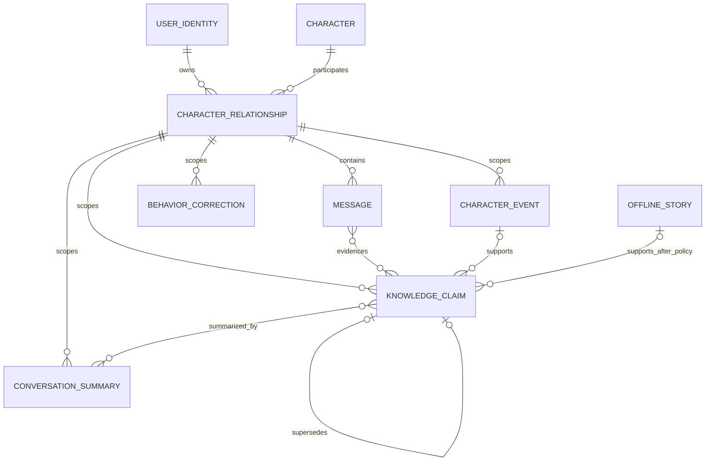
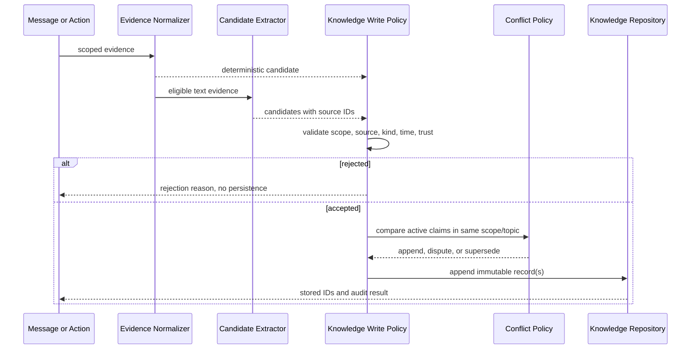
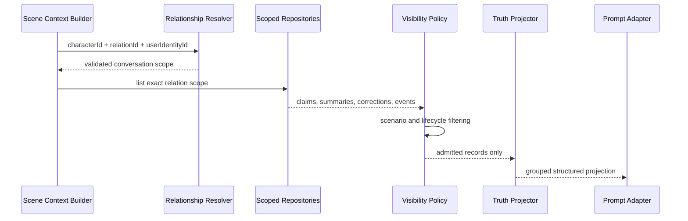

# Character Truth Layer 设计

> 状态：Phase 3 设计基线
> 日期：2026-08-02
> 范围：领域模型、信任与时间语义、写入/读取时序、冲突、撤销、删除与旧数据兼容
> 非目标：本阶段不修改源码、不迁移数据、不改变 UI 或 Prompt 文案

## 1. 目标与边界

Character Truth Layer（下文简称 Truth Layer）用于保存“角色在一段明确关系中可以长期依赖的结构化认知”。它必须回答：

1. 这条认知属于哪个用户身份、角色、关系和会话？
2. 它是事实、偏好、计划、信念还是假设？
3. 谁说的、由什么动作产生、原始证据在哪里？
4. 它是已确认、用户主张、推断、争议、撤回，还是未核验旧数据？
5. 它描述过去、现在、未来、恒常状态还是未知时间？
6. 删除或纠正来源后，为什么仍然有效或为什么不再进入 Prompt？

Truth Layer 不替代以下模型：

- `CharacterEvent`：保存确定发生、可投影关系状态的事件。
- `ConversationSummaryRecord`：保存可重建的压缩摘要，不是权威事实。
- `BehaviorCorrectionRecord`：保存 OOC 行为约束，不参与事实排序。
- `OfflineStory`：保存故事域内容；只有通过现有 Fact/Event Policy 的内容才可出域。
- `Character`：只保存跨身份稳定的人设与角色资料。
- `WorldBookEntry`：保存世界设定及生成规则，不能代替关系私域事实。

## 2. 当前模型校准

| 当前模型 | 已有能力 | 缺口 | Truth Layer 处理 |
|---|---|---|---|
| `MemoryItem` | `id`、`characterId`、可选 `relationId`、文本、时间、重要度、手工标记 | 无 `userIdentityId`、来源、真假、时间语义、撤销链；自由文本混合事实/OOC/摘要 | 保留旧数据只读兼容；新长期认知写入 `KnowledgeClaim` |
| `CharacterEvent` | 强制 `relationId + characterId + userIdentityId`，含发生/记录时间、置信度、状态 | `source` 是字符串，无法统一追踪消息/故事/动作；事件不等于一般知识 | 继续作为事件真相；Claim 可引用 event ID，但不复制事件全文来制造第二真相 |
| `CharacterRelationship.compressedMemory` | 已按 relation 隔离 | 无证据列表、生成版本、时间范围；容易被当事实 | 迁移为 `ConversationSummaryRecord`；字段仅作过渡读取 |
| OOC `MemoryItem` | 已要求 relationId | 仍与事实混存、依赖文本前缀识别 | 迁移到 `BehaviorCorrectionRecord` |
| `CharacterCognitiveKnownFact` | 读取时严格匹配 character/relation | 仍投影任意 `MemoryItem` 为 known fact | 后续改为 Truth Layer 分组投影，legacy 仅低权重单独展示 |

现有 `CharacterRelationship` 已给出权威映射：

```text
relationId -> characterId + userIdentityId + conversationId
```

所有 Truth Layer 私域读取必须同时校验该映射。仅凭 `relationId` 找到一条记录还不够，记录内部的 `characterId` 与 `userIdentityId` 也必须与关系匹配。

## 3. 领域模型

### 3.1 共享作用域

```ts
export interface CharacterTruthScope {
  relationId: string;
  characterId: string;
  userIdentityId: string;
  conversationId?: string;
}
```

规则：

- `relationId` 是 direct 私域主边界。
- `characterId` 必须是 canonical character ID，只作为一致性校验，不能用于跨关系查询。
- `userIdentityId` 必须与关系所有者一致。
- `conversationId` 用于证据和会话回放；缺少它不扩大可见范围。
- 新写入必须四者一致。旧数据只能通过迁移器补齐，不允许 Repository 猜测。

### 3.2 KnowledgeClaim

```ts
export const KNOWLEDGE_CLAIM_SCHEMA_VERSION = 1;

export type KnowledgeKind =
  | "fact"
  | "preference"
  | "plan"
  | "belief"
  | "hypothesis";

export type KnowledgeSubject =
  | "user"
  | "character"
  | "relationship"
  | "other";

export type TruthStatus =
  | "asserted"
  | "confirmed"
  | "inferred"
  | "disputed"
  | "retracted"
  | "legacy_unverified";

export type TemporalStatus =
  | "past"
  | "present"
  | "future"
  | "timeless"
  | "unknown";

export type KnowledgeSourceKind =
  | "user_message"
  | "deterministic_action"
  | "manual"
  | "ooc_correction"
  | "offline_story"
  | "import"
  | "legacy_memory";

export interface KnowledgeSourceRef {
  kind: KnowledgeSourceKind;
  messageIds?: string[];
  eventId?: string;
  storyId?: string;
  sourceRecordId?: string;
  /** Stable producer identifier, for example chat.extractor.v1. */
  producer: string;
  /** Hash or stable key used for idempotent ingestion. */
  evidenceKey: string;
}

export interface KnowledgeClaim extends CharacterTruthScope {
  id: string;
  kind: KnowledgeKind;
  subject: KnowledgeSubject;
  statement: string;
  truthStatus: TruthStatus;
  temporalStatus: TemporalStatus;
  source: KnowledgeSourceRef;
  confidence: number;
  userConfirmed: boolean;
  occurredAt?: number;
  recordedAt: number;
  validFrom?: number;
  validTo?: number;
  supersedesId?: string;
  supersededById?: string;
  retractionReason?: string;
  status: "active" | "retracted";
  visibility: "relation_private";
  schemaVersion: typeof KNOWLEDGE_CLAIM_SCHEMA_VERSION;
}
```

字段约束：

- `statement` 是单一、原子化陈述；不得把多个时间或真假状态拼成一条。
- `confidence` 必须在 `[0, 1]`，它不能把 `inferred` 自动升级为 `confirmed`。
- `truthStatus="confirmed"` 必须有确定性来源或明确用户确认；AI 文本本身不能满足条件。
- `status` 是生命周期状态；`truthStatus` 是认知状态。撤回时二者分别为 `retracted`。
- `supersedesId` 与 `supersededById` 只允许同一作用域、同一主题的有向链，不允许环。
- `occurredAt` 描述事实发生时间；`recordedAt` 描述系统记录时间，两者不可互换。
- `validFrom/validTo` 描述有效期。未来计划的目标日期不写入 `occurredAt`。
- `visibility` 第一版固定为 `relation_private`，不使用 `safe` 暗示公开。

### 3.3 ConversationSummaryRecord

```ts
export interface ConversationSummaryRecord extends CharacterTruthScope {
  id: string;
  summary: string;
  sourceMessageIds: string[];
  sourceClaimIds: string[];
  rangeStartAt?: number;
  rangeEndAt?: number;
  generatedAt: number;
  generator: string;
  projectionVersion: number;
  status: "active" | "stale" | "retracted";
  schemaVersion: number;
}
```

摘要是派生缓存：

- 可删除、可重建，不拥有独立事实权威。
- 只压缩同一 relation 的消息与 Claim。
- 来源消息或 Claim 被删除/撤回时标记 `stale`，重建前不进入 Prompt。
- 摘要不能改变 `plan`、`hypothesis` 等原始类别，也不能补出来源中不存在的人、地点、时间或因果。

### 3.4 BehaviorCorrectionRecord

```ts
export interface BehaviorCorrectionRecord extends CharacterTruthScope {
  id: string;
  instruction: string;
  originalResponse?: string;
  sourceMessageIds: string[];
  createdAt: number;
  updatedAt: number;
  status: "active" | "superseded" | "retracted";
  supersedesId?: string;
  schemaVersion: number;
}
```

OOC 纠正表达“以后应如何扮演”，不是“世界中发生了什么”。它通过独立的 behavior constraints 槽进入私聊 Prompt，不参与事实检索、关系事件投影或公共生成。

### 3.5 CharacterEvent 的衔接

`CharacterEvent` 保持现有模型。Truth Layer 只增加引用规则：

- 确定性动作可以同时产生 Event 和 Claim，但必须共享同一 evidence key，并各自服务不同用途。
- Event 用于关系状态/时间线；Claim 用于可陈述知识。
- 如果事件摘要已经足够，不强制创建重复 Claim。
- Claim 引用 `eventId` 时，事件删除或撤回会触发 Claim 重新审核，而不是静默保留 confirmed。

## 4. 数据关系



`CharacterRelationship` 是所有 direct 数据的所有权根；任何边缺失时都采用 deny-by-default。

## 5. 信任等级与写入准入

信任优先级从高到低：

| 等级 | 来源 | 允许的初始状态 | 说明 |
|---|---|---|---|
| T1 | 用户在 UI 中手工确认/编辑，或明确纠正 | `confirmed` | 必须保存 manual/correction 来源和被替代记录 |
| T2 | 应用中确定发生的动作 | `confirmed` | 如实际完成通话、明确发送支付或用户确认同步故事；事件捕获必须可追踪 |
| T3 | 用户消息中的明确第一人称陈述 | `asserted` | 可供私域上下文使用，但不是系统验证事实 |
| T4 | 有完整来源的 AI 候选提取 | `inferred` 或继承 T3 的 `asserted` | Extractor 只分类和规范化，不拥有确认权 |
| T5 | 旧 `MemoryItem` / `compressedMemory` | `legacy_unverified` | 降权、单独分组，不参与自动冲突胜出 |
| T6 | AI 回复、想象、叙事补全 | 不准写入 | 可保留原消息，但不能成为 Claim 证据 |

硬性拒绝规则：

- 问句、建议、系统指令、括号动作、角色扮演文本不创建事实。
- “如果、假如、也许、可能”默认是条件或假设，不创建 past fact。
- “以后、希望、打算、计划”创建 `plan + future`，不能写作已发生。
- 角色自己的回复不能证明共同经历、用户属性或关系事实。
- 图片生成内容、InnerVoice、公共帖子不能自动写入 relation truth。
- OfflineStory 只有通过现有 Fact Policy 后才能成为候选，通过 Event Policy 后才可成为 Event。
- 缺少可定位 source IDs 的候选不能成为 `confirmed`。

## 6. 写入时序



写入必须为 append-oriented：

- 同一 `relationId + evidenceKey + normalized statement + kind` 重放时幂等。
- 更正不覆盖旧记录；追加新 Claim 并建立 supersession 链。
- Policy 返回结构化结果：`accepted | pending | rejected`、原因码、规范化候选和受影响 Claim IDs。
- Repository 只执行已通过 Policy 的命令，不负责从自由文本猜事实。

## 7. 读取与 Prompt 投影



私聊投影按以下槽输出，禁止重新混成一个无标签的 Memory 文本块：

```text
Confirmed facts
User assertions
Preferences
Future plans (not yet happened)
Open beliefs and hypotheses (do not assume true)
Behavior corrections
Conversation summary (non-authoritative)
Legacy unverified memory
```

读取规则：

- 首先验证 relation、character、identity 三者一致，再读取。
- `retracted` 不进入普通 Prompt；只在诊断 API 中可见。
- `disputed` 只能以“存在冲突”的标记进入允许该信息的私域场景。
- 已过 `validTo` 的 present claim 不再作为当前状态，可作为历史记录读取。
- `plan + future` 永远带未发生标记；时间流逝本身不能把计划升级为 past fact。
- `ConversationSummaryRecord` 只补充上下文，不覆盖高置信的具体 Claim。
- Moment/Public Forum 不读取 relation-private Claim、Summary 或 Correction。
- Group Chat 默认不读取任何成员的 direct Truth Layer。

## 8. 冲突、纠正与撤销

### 8.1 冲突判定

冲突比较只在完全相同的作用域内进行。第一版使用显式 topic key 或规范化的 `subject + predicate`；无法可靠确定同一主题时保留两条，不做自动合并。

### 8.2 决策规则

1. 用户明确纠正优先于用户旧陈述、AI 提取和 legacy。
2. 新的确定性动作可替代描述当前状态的旧 Claim，但不删除历史事实。
3. 两条用户陈述互相矛盾且没有明确纠正语义时，两条均标记 `disputed`，等待确认。
4. AI 候选不得 supersede 用户确认或确定性记录。
5. Legacy 不得 supersede 新 Claim；与新 Claim 冲突时自动降为仅诊断可见。
6. 时间变化应通过 `validTo` 结束旧状态并追加新状态，不把旧状态改写成“从未发生”。

### 8.3 示例

用户先说“我的生日是 3 月 2 日”，形成 `asserted`；之后明确说“我刚才说错了，是 3 月 12 日”：

- 旧 Claim 保留，设置 `status=retracted`、`truthStatus=retracted`、`supersededById=newId`。
- 新 Claim 设置 `supersedesId=oldId`，根据交互确认程度为 `asserted` 或 `confirmed`。
- Prompt 只使用新 Claim；诊断接口可还原完整链。

用户说“以后一起去日本”：

- 写入 `kind=plan`、`temporalStatus=future`。
- 30 天后仍然是计划，除非有确定性完成事件或用户明确确认已经发生。

## 9. 删除与来源失效语义

| 删除对象 | Truth Layer 行为 |
|---|---|
| Message | 查找引用 message ID 的 Claim；若无其他有效来源则 retract/orphan，相关摘要标记 stale |
| CharacterEvent | 引用它的 Claim 重新审核；仅靠该事件确认的 Claim 不再保持 confirmed |
| OfflineStory | story-only 数据直接删除；已出域 Claim 按产品选择保留带历史来源或显式 retract，但不得留下无法解释的 confirmed 孤儿 |
| Moment / Forum 内容 | 删除显式关联的公开候选或派生记录；不得影响无关联的 relation-private Claim |
| Relationship | 删除该 relation 的 Claim、Summary、Correction 及派生索引/缓存；不影响同角色其他身份关系 |
| Character | 先解析其全部 relation，再按关系级联；保留无关 global WorldBook 数据 |
| UserIdentity | 删除该身份所有关系及 identity-owned 数据；其他身份完全不变 |

审计优先采用逻辑撤回，隐私/关系删除采用物理级联：

- 单条证据删除：保留 Claim 壳和撤回原因，便于解释与重算。
- 整段关系或身份删除：物理清除所有私域记录，避免隐私残留。
- 派生摘要和索引可以直接删除并重建。
- 任何删除流程必须是幂等的。

## 10. Repository 与 Policy 契约

建议 Phase 4 的领域目录：

```text
src/domain/characterKnowledge/
  characterKnowledgeTypes.ts
  knowledgeWritePolicy.ts
  knowledgeVisibilityPolicy.ts
  knowledgeConflictPolicy.ts
  knowledgeTemporalPolicy.ts

src/core/storage/repositories/
  characterKnowledgeRepository.ts
  conversationSummaryRepository.ts
  behaviorCorrectionRepository.ts
```

Repository 最低接口：

```ts
interface CharacterKnowledgeRepository {
  load(): StorageResult<KnowledgeClaim[]>;
  listByScope(scope: CharacterTruthScope): KnowledgeClaim[];
  findBySource(scope: CharacterTruthScope, source: Partial<KnowledgeSourceRef>): KnowledgeClaim[];
  append(command: AcceptedKnowledgeWrite): StorageWriteResult;
  appendMany(commands: readonly AcceptedKnowledgeWrite[]): StorageWriteResult;
  supersede(command: AcceptedSupersession): StorageWriteResult;
  retract(command: AcceptedRetraction): StorageWriteResult;
  removeByRelations(relationIds: readonly string[]): StorageWriteResult;
}
```

约束：

- 对产品读取不提供 character-only 查询。
- 跨关系查询只允许显式诊断 API，名称必须体现 `unsafeCrossScopeAudit`，且不得被 Context Builder 导入。
- `listByScope` 同时验证三个所有权字段；conversationId 存在时也要一致。
- `append` 接受 Policy 产出的命令，不直接接受任意 `KnowledgeClaim`。
- 加载器逐条 normalize；无效记录隔离到 diagnostics，不污染正常结果，也不覆盖原始 localStorage。
- 新 storage keys 应独立于 `phone_memory_vault_items`，建议：
  - `phone_character_knowledge_claims`
  - `phone_conversation_summaries`
  - `phone_behavior_corrections`
  - `phone_character_knowledge_migration_state`

## 11. 旧数据兼容与迁移策略

第一阶段采用“新 Truth 写入 + 旧 Memory 受限只读”，不删除 `MemoryItem`：

1. 有有效 `relationId` 的 `MemoryItem`：从关系补齐 identity/conversation，迁移为 `legacy_unverified`；`sourceRecordId=memory.id`。
2. 无 `relationId` 的 `MemoryItem`：仅当默认身份与 canonical character 存在唯一默认关系时迁移；否则进入 orphan diagnostics，不注入任何 Prompt。
3. `isManual=true` 不自动等于 confirmed。若无法证明用户在结构化 UI 中确认，仍为 `legacy_unverified`。
4. OOC 前缀记录迁移为 `BehaviorCorrectionRecord`，不同时生成 Claim。
5. `Relationship.compressedMemory` 迁移为 legacy `ConversationSummaryRecord`，`sourceClaimIds=[]` 时标记 stale/legacy，不能作为权威事实。
6. `Character.compressedMemory` 若存在，只能映射到明确默认关系的 legacy summary；绝不跨身份复制。
7. Offline memory marker 保留 story/source 引用；不因 marker 文本自动升级。
8. 迁移保存版本、输入摘要和计数；重复启动幂等，失败时保留原数据。

备份恢复必须同时包含四类新 key，并在导入时先恢复 relationships，再校验 Truth Layer scope。无法匹配关系的记录进入隔离诊断，不允许丢进默认关系。

## 12. 审计与可诊断性

Phase 4 先提供纯函数或 Repository 诊断 API，不新增用户 UI：

- `explainClaim(claimId)`：返回 scope、来源、状态、时间、确认者、替代/撤回链。
- `explainProjection(scope, scenario)`：列出包含、排除记录及原因码。
- `findOrphanedEvidence(scope?)`：查找缺失消息、事件、故事或关系的记录。
- `validateSupersessionGraph(scope)`：检测跨 scope 引用、断链和环。
- `validateBackupRoundTrip(before, after)`：比较 scope、source、truthStatus、时间和撤销链。

推荐稳定原因码：

```text
scope_mismatch
missing_relation
missing_evidence
ai_response_not_evidence
conditional_statement
future_plan_not_fact
question_or_instruction
fictional_story_boundary
inner_voice_forbidden
public_source_not_private_truth
superseded
retracted
expired
legacy_unverified
```

## 13. Phase 4 验收契约

下一阶段实现基础类型、Policy 与 Repository 时，至少满足：

1. 同角色 identity A/B 的查询和写入完全隔离。
2. 新写入缺少 relation/character/identity 任一字段即拒绝。
3. 相同 evidence key 重放不产生重复 Claim。
4. AI 回复不能产生 confirmed fact。
5. “以后一起旅行”保持 `plan + future`，不会随时间自动变成过去事实。
6. question、conditional、OOC、InnerVoice、未确认故事被明确拒绝或路由到独立模型。
7. supersede/retract 保留完整、无环、同 scope 的审计链。
8. 删除关系清理 Claim、Summary、Correction。
9. legacy 无 scope 只可进入唯一默认关系，否则进入 orphan diagnostics。
10. 备份恢复后 scope、source、truthStatus、temporalStatus 和撤销链不变。

## 14. 已确定与延后决策

本设计已经确定：

- Claim、Event、Summary、Correction 四类模型独立。
- direct Truth 固定 relation-private，deny-by-default。
- append + supersession/retraction，不做原地事实覆盖。
- future plan、hypothesis 与 fact 分槽投影。
- legacy 不自动认证，AI 回复不作为事实来源。

延后到后续 Phase：

- 自然语言 topic/predicate 的高级语义归一化。
- 用户可视化事实审计与纠正 UI。
- 多参与者 OfflineStory 的 `participantRelationIds` 模型。
- relation-private Claim 的显式公开授权流程。
- IndexedDB 或服务器持久化；第一版沿用现有 localStorage Repository 形态。
