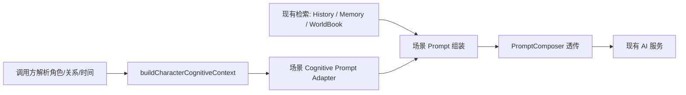

# Character Cognitive Context Prompt Adapter 设计审计

## 目标与边界

`CharacterCognitiveContext` 是一次生成前的、关系隔离的认知快照；它不是 Prompt、数据库、消息历史，也不负责检索或保存。本设计定义一个适配层，将其中允许公开的内容按场景转换为 Prompt 可消费的片段。

本设计不改变现有 Prompt 文本、`PromptComposer`、AI 调用协议、Memory 算法、CharacterEvent、UI 或数据结构。

核心不变量：

- 每次适配必须以 `relationId + characterId + userIdentityId` 为边界。
- Context 只能补充或校验当前场景可见的事实，不能以角色名反查其他关系的数据。
- 适配层不得自行读取 localStorage、Repository、React state 或调用 AI。
- 适配层不得把内部 ID、私有事件、其他身份/关系的记忆或未经证实的共同经历写入 Prompt。
- 当前已有的 Memory 检索、聊天历史、WorldBook 和知识边界仍是现有行为的权威来源；初次接入不能用“整包 Context”替换它们。



`PromptComposer` 当前只接收已经完成的 `message`、`history`、`systemInstruction`，并按 scenario 原样透传。因此适配层应位于各调用方的 Prompt 字符串组装处、`PromptComposer.compose()` 之前，而不是改造 `PromptComposer` 为新的数据检索中心。

## 当前 Prompt 链路

| 场景 | 当前调用链 | 已注入的主要上下文 | 主要缺口 |
| --- | --- | --- | --- |
| 单聊回复 | `AppChat` → `chatReplyController` → `executeDirectReplyPipeline` → `PromptComposer` → `directChatService` | 人设、当前关系、关系压缩记忆、relationId 精确检索的语义记忆、关系消息历史、Offline handoff、WorldBook、音乐/论坛/日记上下文、时间、知识与线上空间边界 | 已构建的 Cognitive Context 尚未转成 Prompt；安全事件未作为可验证的近期经历来源 |
| 群聊回复 | `AppChat` → group reply pipeline → `PromptComposer` → group service | 群成员、群聊历史、角色/WorldBook、群聊知识边界、时间 | 多角色、多关系语义，不能直接复用单关系 Context |
| 角色自动朋友圈 | `AppChat` → `requestCharacterMomentOnce` → `momentGenerator` | 人设、当前关系消息片段、当前关系记忆/历史兼容项、WorldBook、最近角色朋友圈、时间、用户资料 | 未使用 Context/Event；近期经历只能从零散聊天和记忆推断 |
| 朋友圈评论 | `AppChat` → `requestAutomaticMomentComment` → `momentCommentService` | 当前角色/关系消息片段、目标动态、WorldBook、时间、用户资料 | 未读取关系记忆或事件；容易对动态外的用户经历进行猜测 |
| 朋友圈评论回复 | `AppChat` → `requestMomentCommentReply` → `momentReplyService` | 目标动态、评论、当前关系消息片段、WorldBook、时间、用户资料 | 角色匹配仍包含名称回退；Context 必须只使用已经解析出的 canonical relation |
| 主动消息 | `AppChat` → `triggerProactiveFor`（及同类手动入口）→ `PromptComposer` → `proactiveMessageService` | 人设、当前关系压缩记忆、关系消息片段、WorldBook、时间、知识/空间边界、用户资料、计划任务 | 没有 relation-scoped 语义记忆/Event 的安全候选；计划任务容易被误扩写为用户现实经历 |

`chatReplyController` 已能为单聊构建并传递 `CharacterCognitiveContext`，但 `executeDirectReplyPipeline` 当前刻意只接收、不写入 Prompt。朋友圈 Phase 3 也已将 Context 作为可选参数传入三项 AI 服务，但尚未改变其 Prompt。这是符合“只读接入”阶段的状态。

## Context 字段与公开等级

适配不是将 Context 序列化。每个字段必须按下面的公开等级和场景策略投影。

| Context 字段 | 公开等级 | Chat | Moment | Proactive | 规则 |
| --- | --- | --- | --- | --- | --- |
| `scope` 的内部 ID | 禁止文本化 | 仅作断言 | 仅作断言 | 仅作断言 | 用于校验，不进入 Prompt |
| 精简 `persona` | 可公开 | 允许 | 允许 | 允许 | 只用名称、人格、背景等生成必要字段；不复制完整 Character |
| `relationship` | 受关系限制 | 允许 | 允许 | 允许 | 仅当前关系；未来 `RelationshipState` 未实现前不虚构状态 |
| `knownFacts` | 受关系限制 | 允许但以现有相关性检索为准 | 允许少量、与动态主题相关 | 允许少量、近期且明确 | 不整包倾倒；不得越过 relation scope |
| `recentEvents` | 仅 `promptVisibility: safe` | 允许 | 允许 | 允许 | 仅当前角色、当前关系、当前身份；不得把 private 事件格式化进 Prompt |
| `temporal` | 可公开 | 允许 | 允许 | 允许 | 使用现有时间语义，不制造作息或位置模型 |
| `knowledgeBoundary` | 约束 | 允许 | 允许 | 允许 | 以禁止性规则约束生成，不将未知内容改写成事实 |
| `behaviorConstraints` | 预留 | 暂不注入 | 暂不注入 | 暂不注入 | Phase 4-A 只有类型语义，不自动生成新规则 |

以下内容无论场景都禁止进入适配后的 Prompt：

- 其他 `userIdentityId`、其他 `relationId`、其他角色的 Memory、Event、压缩记忆、聊天历史或关系状态。
- `promptVisibility: private` 的事件，以及没有明确 relation scope 的事件。
- 用户未在当前关系中明确说过的地点、身体动作、共同场景、礼物、约定或现实经历。
- Repository/storage 字段、内部主键、去重键、删除状态、调度实现细节、调试信息和未展示的 UI 数据。
- 通过 display name、备注名或角色名猜出的关系数据；必须先由调用方解析到 canonical relation。

## Chat 适配设计

### 现有上下文

单聊已经拥有最完整的输入：当前角色人设、关系范围内消息历史、关系压缩记忆、语义相关 Memory、OfflineStory handoff、WorldBook、当前时间、知识边界、线上空间边界，以及 relation-scoped 的音乐/论坛/日记摘要。`chatReplyController` 构建 Context 时还按当前关系过滤 Memory 和 Event，并仅把明确的 `relationship_created`、`offline_story_completed` 标记为 safe。

### 需要使用的 Cognitive Context 字段

Chat adapter 可以使用：

1. `persona` 作为与现有角色设定块一致的规范来源，但首轮不应重复写入同一人设。
2. `relationship` 的当前关系范围与已存在的阶段/压缩记忆信息。
3. `knownFacts` 作为现有语义检索结果的**可见性校验与候选来源**，而不是替代相关性排序后把全部事实注入。
4. `recentEvents` 中 safe 的、与当前输入有关的事件，作为“可提及的已发生经历”候选。
5. `temporal`、`knowledgeBoundary`，与现有时间及线上空间边界共同约束回答。

### 推荐输出形态

`chatCognitivePromptAdapter(context, input)` 应输出一个可选的结构化片段，而不是修改服务请求：

```ts
type CognitivePromptBlock = {
  facts: string[];
  safeEvents: string[];
  constraints: string[];
};
```

调用方再在现有 system instruction 的固定位置格式化该 block。这样可保持 `PromptComposer` 和 API 协议不变，也便于测试“哪些字段被允许输出”。

首个实际注入版本应只加入：当前关系的 safe event 和已有知识边界的去幻觉约束；Memory 仍继续由当前 `MemoryService.retrieveRelevantMemories()` 的相关性检索提供。否则不仅会增加 token，也会改变当前聊天回复的记忆排序和效果。

群聊不应在本轮适配。群聊的每个发言角色需要独立的人设、知识边界及可能不同的关系范围；一个单一 `ChatRuntimeContext` 不能安全表达它。应在未来设计 `GroupCharacterCognitiveContext` 后再接入。

## Moment 适配设计

### 自动发帖

自动发帖适合使用：精简人设、当前关系少量明确记忆、safe 近期事件、当前时间、知识边界，以及现有的最近角色动态去重材料。其目的不是让角色“知道更多”，而是让可写内容优先来自已验证的本关系事实。

建议规则：

- 事件只可提供主题候选，例如已完成的线下故事；不能自动扩写成未记录的地点、肢体动作或用户的当下状态。
- 已有的最近朋友圈仍是重复检测与主题去重的权威来源；Context 不替代该机制。
- 时间只约束文案和发布时间的语义一致性；没有作息模型前，不能声称角色“此刻本应睡着/在上班”。

### 评论与评论回复

评论/回复的 Context 应更窄：只包含当前评论角色对应的 canonical relation、目标动态中公开的文本、当前关系内的可见事实、安全事件、时间和知识边界。

不得注入：

- 动态作者以外的关系信息，或其他评论者的私有背景。
- 从评论作者 display name/备注名回查得到的任何不确定关系数据。
- 目标动态没有陈述、且当前关系没有证据的共同经历。

评论回复入口当前有名称回退定位。Prompt adapter 应要求调用方在适配前完成 canonical relation 解析；解析失败时只使用公开动态文本和角色基础人设，不能补用模糊名称匹配到的 Memory/Event。

## Proactive Message 适配设计

主动消息需要关系范围、精简人设、当前时间、知识与线上空间边界、关系内的少量明确记忆，以及 safe 近期事件。它尤其需要禁止“为了开场而补写用户正在做什么”。

推荐策略：

- 主动消息的触发任务只是一项生成意图，不是事实证明。任务中提到“跟进”“提醒”“关心”时，adapter 只能引用已有明确事件、明确约定或可见聊天事实。
- 计划发送时间可以决定语气的时间段，但不能推断用户地点、动作、睡眠、陪伴对象或共同线下场景。
- 压缩记忆保持现有行为；新增的 `knownFacts` 必须限量且可追溯到当前 relation。
- safe event 可作为“发生过什么”的依据，但不能转换为私密状态判断或未经记录的后续。

主动消息目前由 AppChat 的两个入口自行拼 Prompt，且未走 `chatReplyController`。后续接入必须将 Context builder 放在两个入口的共同前置步骤，避免一处接入、另一处绕过。

## 推荐目录与接口边界

推荐新增 Feature 层，而不把 Prompt 字符串格式化写入 domain：

```text
src/features/characterCognitive/
  promptAdapters/
    cognitivePromptAdapterTypes.ts
    chatCognitivePromptAdapter.ts
    momentCognitivePromptAdapter.ts
    proactiveCognitivePromptAdapter.ts
```

- `src/domain/characterCognitive/` 继续仅保存类型、筛选政策和纯 Context Builder；不认识具体 Prompt 文案。
- `src/features/characterCognitive/promptAdapters/` 只做场景级公开字段选择和格式化；输入为已构建的 Context 与本场景已存在的公开输入，输出为 `CognitivePromptBlock` 或字符串片段。
- Chat、Moments、Proactive 的调用方负责解析角色与 canonical relation、准备现有 Memory/WorldBook/history，再调用 Builder 与 Adapter。
- `PromptComposer` 保持透传；各 AI service 的 API 参数和协议保持不变。

建议在 adapter 类型中显式表达公开范围，避免场景代码直接遍历 Context：

```ts
type CognitivePromptAdapter<TInput> = (
  context: CharacterCognitiveContext,
  input: TInput,
) => CognitivePromptBlock;
```

适配器必须是纯函数，并应在入口处先断言 `context.scope` 与运行时 relation/character/user identity 一致；不一致时返回空 block，而不是降级为按名称查找。

## 推荐实施顺序

1. **Phase 4-B：Adapter 合同与测试。** 新增纯 adapter 类型、字段 allow-list、scope mismatch 空输出和 private event 排除测试；不接入任何 Prompt。
2. **Phase 4-C：单聊最小实际接入。** 仅在 direct-chat Prompt 的既有边界附近加入 safe events/约束片段；保持原 Memory 检索、WorldBook、历史和 API 请求不变。对比测试应确保 A/B 同角色跨身份完全不可见。
3. **Phase 4-D：自动朋友圈发帖接入。** 先接入自动发帖，再接入评论/回复；继续使用既有最近动态去重与时间验证，Context 只提供经过验证的内容候选。
4. **Phase 4-E：主动消息接入。** 抽出两个 Prompt 入口共享的 Context/adapter 调用，并针对计划任务增加“不得把意图变为事实”的测试。
5. **Phase 4-F：群聊与其他 AI 应用。** 在建立多角色/多关系认知模型前，不接入群聊。Diary、Forum、InnerVoice 应分别完成数据边界审计后采用各自最窄的 adapter。

## 验证与风险控制

每次实际接入前至少新增以下测试：

- 同一 Character 的 identity A/B 产生的 Context、adapter 输出和最终 Prompt 片段互不包含对方的 Memory/Event。
- `private` event、无 relationId 的非默认 legacy 数据、内部 ID、其他角色数据绝不出现在输出。
- safe event 只有在当前 relation、character、identity 均匹配时才出现。
- Context scope 与运行时 scope 不匹配时输出为空，不发生名称回退。
- Chat/Moment/Proactive 原有 Prompt 块、服务参数和调用次数保持兼容。
- Moment 评论/回复不会因 adapter 引入而读取作者以外关系的私有事实。
- Proactive 任务文本不能单独成为用户地点、动作或共同场景的证据。

主要风险不是“字段缺少”，而是重复注入和错误授权：把 Context 全量串行化会与现有 Memory/历史块重复，增加 OOC 与幻觉概率；按角色名或显示名补全 scope 则会重新引入跨身份污染。因此，适配层必须是最小投影、严格 scope 断言、逐个场景灰度接入的边界层。
