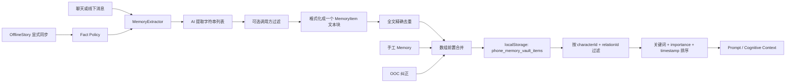

# Memory System Integrity Audit

## 1. 审计结论

当前 Memory 系统已经具备可用的 `characterId + relationId` 读取隔离，并对 OOC 纠正、OfflineStory 同步和关系删除建立了部分专用边界。但它仍然是一个“由 AI 把一段对话压成一段自由文本，再整体保存”的系统，而不是可验证、可追溯的事实仓库。

最重要的结论如下：

- **关系读取隔离总体可靠**：提供 `relationId` 时只读取完全匹配的 Memory；省略时只读取旧版无作用域数据，不会把省略参数当作全关系通配符。
- **事实真实性是当前最高风险**：用户消息和 AI 回复被等价送入提取模型，系统没有记录证据消息、主张者、事实状态，也没有区分“已发生”“计划”“假设”“愿望”。AI 自己编造的共同经历，以及对未来的约定，都可能被固化成历史事实。
- **来源追溯不足**：除旧 Moment 的 `sourceMomentId` 和 OfflineStory 文本 marker 外，普通 Memory 无法回答“来自哪条消息、哪次提取、哪个场景、由谁确认”。
- **压缩不是事实保持型压缩**：当前没有结构化合并算法；提取结果通常被格式化为一个多条事实混合的文本块。关系上的 `compressedMemory` 又是一套独立、弱来源的摘要通道。
- **OfflineStory 已有较强防线**：只有用户显式同步、当前 relation、单角色、continue 模式且存在用户贡献时才允许写入；IF、director、多角色无作用域和纯 AI 续写被拒绝。但其 AI 摘要和正则派生事实仍可能改变语义。
- **InnerVoice 当前不会自动进入 Memory**：心声记录与 Message/Memory 分开存储，未发现自动写入路径。手工复制或把心声内容重新发进聊天不属于系统可识别的来源。
- **持久化存在并发丢写风险**：Repository 保存整个数组，没有版本、事务或 compare-and-swap；部分异步提取使用闭包中的旧 `memories` 合并，可能覆盖并发写入。

综合判断：**关系隔离完整性为中高，事实完整性与来源完整性为低，整体风险等级为高**。在 Character Life 继续依赖 Memory 前，应先建立“证据—主张—事实状态—关系作用域”的最小结构化链路。

## 2. 当前数据模型与可追溯性

`MemoryItem` 当前字段：

| 字段 | 作用 | 完整性评价 |
|---|---|---|
| `id` | Memory 唯一 ID | 有唯一标识，但没有稳定的来源幂等键 |
| `characterId` | 所属角色 | 必填，读取时有效隔离角色 |
| `relationId?` | 所属关系 | 新链路多数会传入，但类型和 Repository 仍允许缺失 |
| `sourceMomentId?` | 旧 Moment 来源 | 仅覆盖 Moment；当前生产链路已不再自动保存 Moment Memory |
| `content` | 自由文本记忆 | 同时承载事实、摘要、纠正、marker，无法按主张粒度验证 |
| `timestamp` | 记录时间/排序时间 | 语义混合；手工编辑会重写，不能稳定表示事实发生时间 |
| `importance?` | 检索排序微权重 | 没有统一定义或校准 |
| `isManual?` | 是否手工创建 | 不能表达“手工确认 AI 提取”与“用户直接录入”的差异 |

缺失的关键来源字段：

- 来源类型：chat、manual、OOC、offline-story、legacy migration 等。
- 来源实体：message IDs、conversation ID、story ID、提取批次 ID。
- 来源角色：用户陈述、角色陈述、系统派生、人工确认。
- 时间语义：发生时间、记录时间、最后编辑时间。
- 主张类型：已发生事实、计划、偏好、情绪、规则、纠正。
- 事实状态：confirmed、reported、planned、hypothetical、disputed、superseded。
- 置信度、验证方式、撤销或替代关系。

因此，当前普通 Memory 不能可靠追溯到来源事件、来源对话和来源时间；`relationId` 是唯一较完整的来源边界。

## 3. 生命周期全链路



核心实现位置：

- 类型：`src/types.ts`
- 提取：`src/domain/memory/MemoryExtractor.ts`
- 服务入口：`src/domain/memory/MemoryService.ts`
- 去重：`src/domain/memory/MemoryDeduplicator.ts`
- 检索：`src/domain/memory/MemoryRetriever.ts`
- 持久化：`src/core/storage/repositories/memoryRepository.ts`
- OOC：`src/domain/memory/oocMemory.ts`
- OfflineStory 边界：`src/domain/offlineStory/offlineStoryFactPolicy.ts`
- OfflineStory handoff：`src/domain/memory/offlineMemorySync.ts`

## 4. Memory 创建来源审计

| 来源 | 作用域 | 证据与确认 | 主要风险 |
|---|---|---|---|
| Chat 自动即时总结 | 通常绑定当前 relation | 用户消息与 AI 回复一起提取；无逐条确认 | AI 幻觉、计划误判、旧闭包覆盖并发写入 |
| Chat 手动归档 | 通常绑定当前 relation | 用户主动触发，但提取结果未逐项确认 | “主动触发”不等于“确认每条事实” |
| App 级即时总结 | 强制 relationId，并按 relation 过滤消息 | 自动提取 | 真实性风险仍与 Chat 相同，但保存方式更安全 |
| Memory 页面手工创建 | 用户选择角色和关系 | 用户直接输入 | Repository 不验证 relation 与 character 的一致性 |
| Memory 页面编辑 | 保留原 ID 和作用域 | 用户编辑 | `timestamp` 被改成编辑时间，原发生/创建时间丢失 |
| OOC 纠正 | 强制 relationId | 用户明确反馈 | 与事实 Memory 混存；原错误事实不会自动废止 |
| OfflineStory 同步 | 强制当前 relation，显式点击、单角色、continue、有用户贡献 | 当前最严格 | AI 摘要和正则派生仍可能改变事实含义 |
| Moment | 当前生产链路不保存 | 不适用 | Service 仍可返回带 `sourceMomentId` 的旧式 Memory，存在未来误接风险 |
| Legacy migration | 映射到历史默认 relation | 系统推断 | 可隔离，但来源身份是兼容性推断而非原始证据 |

### 4.1 AI 编造共同经历

风险等级：**严重**。

`MemoryExtractor` 将 `sender === user` 映射为 user，其余聊天发送者映射为 model；两者都作为提取证据。系统没有规定“角色自己的陈述不能独立证明共同经历”，也没有回查消息、CharacterEvent 或 OfflineStory 的事实策略。因此角色回复中一句“我们上次一起去了海边”，即使历史中从未发生，也可能被提取成长期 Memory。

OOC 纠正只能新增一条高 importance 的纠正文本，不会标记或删除已经保存的错误 Memory。检索时错误事实与纠正可能同时进入上下文。

### 4.2 计划、假设与已发生事实混淆

风险等级：**严重**。

提取协议返回自由文本字符串，没有 `claimType`。当前提取提示会关注约定、承诺、关系进展，却没有结构化区分：

- “以后一起旅游”是计划；
- “如果一起旅游就去海边”是假设；
- “我们去过海边”才是已发生事件。

格式化后这些内容都进入同一种 `MemoryItem`。后续 Prompt 只能看到文本，无法稳定阻止模型把计划改写成过去事实。

### 4.3 解析鲁棒性

风险等级：**中高**。

提取 API 只要求 `items` 是数组，客户端只做字符串、trim 和空值过滤。没有 JSON schema、事实字段校验或证据引用。模型的解释性前言只要被解析为数组元素，也能进入 Memory。

Server 和客户端 fallback 的模板语义也不一致：Server 路径没有按 `templateType` 区分精炼/细腻模式，而客户端 fallback 的 delicate 模式会偏向第一人称感受和未来意图。同一操作可能因后端可用性改变 Memory 的内容性质。

## 5. 更新、合并与压缩审计

### 5.1 更新

- 没有统一的 `updateMemory` 领域操作；UI 直接替换数组项。
- 编辑不保留修订历史、原内容、更新时间与修改者。
- 来源消息被编辑、删除或重新生成后，已提取 Memory 不会自动失效。
- OOC 纠正不会把被纠正记录标为 disputed/superseded。

### 5.2 合并

`mergeMemories` 只是把 additions 逐条放到数组头部，不执行：

- 幂等键检查；
- 语义重复检测；
- 冲突检测；
- 同事实不同表达合并；
- 计划到完成的状态迁移。

提取前只有全文规范化精确去重。规范化范围有限，并且一个 Memory 常包含多条事实，所以只要顺序、措辞或其中一条事实变化，整块就会被视为新记录。重复与近似重复会持续累积。

### 5.3 压缩

系统存在两个容易混淆的“压缩”概念：

1. `MemoryService.summarizeConversation()` 实际调用与 `extractMemories()` 完全相同，没有独立的摘要保持或合并策略。
2. `CharacterRelationship.compressedMemory` 是另一条关系摘要通道，并非由 MemoryItem 可追溯投影生成。

风险：

- 多条事实被压入一个自由文本块，无法单独修正、删除或降权。
- 摘要模型可能省略限定词、否定、时间和主语，从而改变原意。
- 关系迁移去重时使用 `current.compressedMemory || duplicate.compressedMemory`，两个不同摘要不会结构化合并，可能丢内容。
- Group Chat 仍存在直接读取角色级 `compressedMemory` 的旧路径，作用域弱于 relation-scoped MemoryItem。
- 没有压缩前后事实等价测试，也没有冲突保留规则。

结论：当前“压缩”不能保证事实保持性，宜视为 Prompt 辅助摘要，而非权威记忆。

## 6. 删除与清理审计

已覆盖的清理：

- Memory 页面按 ID 删除。
- 删除关系时清理该 relation 的 Memory。
- 删除角色时清理角色及其关系的 Memory。
- 删除 Moment 时清理带 `sourceMomentId` 或旧式稳定 ID 的关联 Memory。
- OfflineStory 重新同步时按 story marker 替换旧 handoff，避免同一故事无限追加。

缺口：

- 删除或重生成来源聊天消息不会删除其派生 Memory，因为没有 `sourceMessageIds`。
- 删除 OfflineStory 本身是否应撤销已确认 handoff 没有统一来源级策略；当前 marker 只支持识别和替换。
- OOC 纠正不清理原错误 Memory。
- 手工编辑没有审计历史，误改不可追溯。
- 无 relationId 的异常新数据只能依靠迁移或全角色删除清理。

## 7. OfflineStory 与 InnerVoice 边界

### 7.1 OfflineStory

当前 Fact Policy 要求同时满足：

- 用户显式确认同步；
- `mode === continue`；
- story 有明确 relationId；
- 单角色；
- 同步区间内存在非导入的用户消息。

所以 IF、director、纯 AI 续写、未建立 participant relation scope 的多人故事不会进入 Memory。这是有效的高价值防线。

残余风险：

- 用户确认的是“执行同步”，不是对每条 AI 提取结果逐项确认。
- 角色生成内容仍被送入提取器，Fact Policy 只保证故事类别和用户参与，不保证每个主张由用户证实。
- `collectOfflineHandoffContent` 使用关键词/正则推导吃饭、维修、糖果、电影等事实，容易混淆否定、提议、转述和实际完成。
- 空抽取时当前同步会失败并允许重试，这是安全行为；但代码中仍保留可生成 deterministic fallback Memory 的 helper，未来接入时必须继续经过 Fact Policy。

### 7.2 InnerVoice

未发现 InnerVoiceRecord 自动转换为 Message 或 MemoryItem 的路径，Chat、Moment、Public Forum 和 Proactive 的认知契约也明确排除 InnerVoice。当前风险较低。

边界限制：系统无法识别用户手工复制的心声文本；一旦被粘贴进普通聊天或手工 Memory，它会失去来源标签。这再次说明 Memory 需要来源类型，而不能只保存文本。

## 8. 检索完整性审计

### 8.1 Scope 过滤

`MemoryRetriever` 的过滤规则正确且明确：

- `characterId` 必须匹配；
- 传入 `relationId` 时必须精确匹配；
- 不传时只看无 relationId 的 legacy 记录，不会聚合全部关系。

这是当前 Memory 系统最可靠的部分。OOC 隔离和 legacy 默认关系迁移均有测试覆盖。

写入侧仍有弱点：`MemoryExtractionContext.relationId` 和 `MemoryItem.relationId` 均为 optional，Repository 不校验 relation 是否属于 character/user identity。读隔离无法修复写入时已经标错 scope 的数据。

### 8.2 相关性排序

当前分数：

```text
关键词命中长度之和
+ importance * 0.01
+ timestamp * 1e-11
```

问题：

- 不是语义检索，同义表达、代词和中文分词表现不稳定。
- 时间项在当前 epoch 毫秒下约为十几分，并非注释所称“仅打破平局”；它可能压过 importance 和多个短关键词。
- importance 的典型差异只有 0.01～0.04，影响非常弱。
- 无查询文本时直接返回数组前 `topK`，依赖数组保存顺序，不显式按时间或重要性排序。
- 没有事实状态、来源可靠度和冲突状态参与排序。
- 同一多事实文本块只要命中一个词，整个块都会进入 Prompt，带入不相关事实。

### 8.3 Prompt 注入

- Direct Chat 既有 legacy Memory 拼接路径，也有 CharacterCognitiveContext/Adapter 路径，存在同一 Memory 重复注入的可能。
- 最新 Offline handoff 可在语义检索未命中时被强制加入，这是连续性优化，但放大错误 handoff 的影响。
- Proactive、Music 等私域场景按 relation 使用相关数据，作用域总体合理。
- Diary 和 Moments 已刻意不读取私有 Memory。
- Public Forum 的新 Public Context 不允许 Memory；但旧公开安全上下文仍可能从 relation Memory 派生 topic seed，应继续视为公开边界绕行风险。
- `compressedMemory` 在多个 Prompt Adapter 中作为关系安全摘要使用，但其来源与验证弱于结构化 Timeline/Event。

## 9. 持久化完整性

Repository 对 `phone_memory_vault_items` 做整数组读写，没有：

- schema version 或逐项运行时校验；
- 唯一 ID/relation/character 一致性校验；
- 原子追加；
- revision、乐观锁或冲突合并；
- 写入来源日志。

App 级即时总结使用函数式 state 合并，相对安全；AppChat 部分异步归档使用闭包捕获的 `memories` 执行“旧数组 + additions”后整体保存。若期间发生手工编辑、删除或其他自动提取，后完成的旧快照可能覆盖先完成的更新。

这类问题会表现为 Memory 无故消失、删除后复现，或新提取覆盖其他来源写入，且当前没有日志可定位。

## 10. 测试覆盖评价

已有测试覆盖：

- 基本提取、精确去重、API 失败与 retry。
- character 隔离、relation A/B 隔离、无 relation legacy 读取。
- OOC relationId 强制和 legacy 默认关系迁移。
- OfflineStory Fact Policy、Event Policy、摘要替换、handoff 与 scope。
- Moment 删除时清理历史关联 Memory。
- Relationship migration 和删除完整性。

关键缺失测试：

- AI 回复虚构经历不得成为事实。
- 未来计划、假设、愿望不得标记为已发生。
- 否定句、撤回、纠正、冲突事实的处理。
- 来源消息删除/重生成后的派生 Memory 失效。
- 并发提取、编辑、删除不会丢写。
- 压缩前后主语、否定、时间和事实状态保持。
- 检索时间权重不会压过明显相关事实。
- Public Forum 不得从 relation Memory 间接派生公开内容。
- Repository 拒绝 relation/character 不一致及新建无 relation Memory。

## 11. 风险优先级

| 优先级 | 风险 | 影响 |
|---|---|---|
| P0 | AI 回复可作为自身历史事实证据 | 虚构共同经历被永久固化，持续污染所有后续生成 |
| P0 | 计划/假设/愿望与已发生事实无结构区分 | 时间线错误、承诺被误判为完成 |
| P0 | Memory 无证据消息与来源状态 | 无法验证、撤销、重新生成或准确删除派生事实 |
| P1 | 写入 relationId 仍为 optional，Repository 无 scope 校验 | 错标数据可绕过正确的读取隔离设计 |
| P1 | 整数组异步持久化 | 并发写入丢失、删除复现 |
| P1 | 文本块级精确去重，无冲突/语义合并 | 重复、矛盾和过期事实共同进入 Prompt |
| P1 | timestamp 权重远大于设计注释表达 | 新但不相关的 Memory 可能压过旧的重要事实 |
| P1 | `compressedMemory` 作为独立弱来源摘要 | 摘要漂移、迁移丢失、旧角色级 scope 风险 |
| P2 | Server/fallback 提取模板不一致 | 环境变化导致 Memory 风格与事实粒度变化 |
| P2 | Offline 正则派生事实 | 否定、提议和角色方向误判 |

## 12. 建议修复顺序

### 必须先做

1. **引入结构化 MemoryClaim**：至少包含 `sourceKind`、`sourceMessageIds`、`relationId`、`claimType`、`truthStatus`、`assertedBy`、`occurredAt?`、`recordedAt`、`confidence`、`userConfirmed`。可以继续兼容旧 `content` 展示，但不能只保存内容。
2. **建立证据策略**：角色/assistant 单方面陈述不能证明共同经历；计划、假设、愿望默认不能成为 completed fact。已发生关系事实优先来自用户明确陈述、显式确认的 Offline Policy 或确定性 CharacterEvent。
3. **强制新私域 Memory 的 relationId**：在 Repository/Service 写入口校验 relation、character、identity 一致性。无 relationId 仅保留 legacy 读取和迁移，不允许新建。
4. **实现来源失效与纠正**：消息删除、重生成、OOC 纠正时按 source ID 标记 disputed/superseded，而不是追加一段互相矛盾的文本。

### 建议随后做

5. 将一个多事实文本块拆为逐主张记录，按主张做去重、冲突检测和状态迁移。
6. 统一 Server 与 fallback 的结构化提取协议，使用 schema 校验；模板只影响表达，不应改变事实类型。
7. 将 OOC coaching 与 factual Memory 分层存储或至少使用不同 `sourceKind/claimType`。
8. 将整数组写入改为串行事务式 Repository 操作，或至少使用基于最新 state 的原子追加/删除和 revision 检查。
9. 重新校准检索：先 scope/visibility/truthStatus 过滤，再做语义或关键词相关度；归一化 recency，避免 epoch 数值主导；空 query 明确排序。
10. 将 `compressedMemory` 定位为可重建的派生摘要，保留来源 claim IDs 和摘要版本，不作为独立权威事实。

### 可以延后

11. 为 legacy Memory 增加迁移来源 `legacy-unverified`，逐步让用户确认或自然淘汰。
12. 将 Offline 正则 handoff 改为结构化、证据绑定的确定性规则，并补充否定/提议/转述测试。
13. 增加 Memory 审计视图或诊断日志，但不必在事实模型之前做 UI。

## 13. 最终完整性矩阵

| 维度 | 当前评价 | 说明 |
|---|---|---|
| 角色隔离 | 良好 | `characterId` 过滤明确 |
| 关系隔离 | 良好（读取）/一般（写入） | 检索精确；创建类型和 Repository 仍允许无 scope 或错 scope |
| 来源可追溯 | 较差 | 普通 Memory 无 source message、conversation、scenario |
| 事实真实性 | 较差 | assistant 陈述、计划和假设可被固化 |
| 时间完整性 | 较差 | timestamp 混合记录/编辑时间，无 occurredAt |
| 去重与冲突 | 较差 | 仅全文精确去重，无语义和冲突状态 |
| 压缩保持性 | 较差 | 自由文本摘要，无事实等价保证 |
| 删除一致性 | 一般 | 关系/角色清理较全，来源级失效缺失 |
| OfflineStory 边界 | 良好但有残余风险 | Fact Policy 有效，内容级证据仍弱 |
| InnerVoice 边界 | 良好 | 当前无自动写入路径 |
| 持久化并发安全 | 较差 | 整数组 last-write-wins，无事务/版本 |

当前 Memory 适合被视为“关系隔离的生成提示素材”，尚不适合被视为“角色长期认知中的权威事实层”。CharacterEvent、RelationshipTimeline 等确定性数据应保持更高可信级别；在结构化来源和事实状态完成前，不应让自由文本 Memory 自动推动关系阶段、共同经历或不可逆的角色成长。
