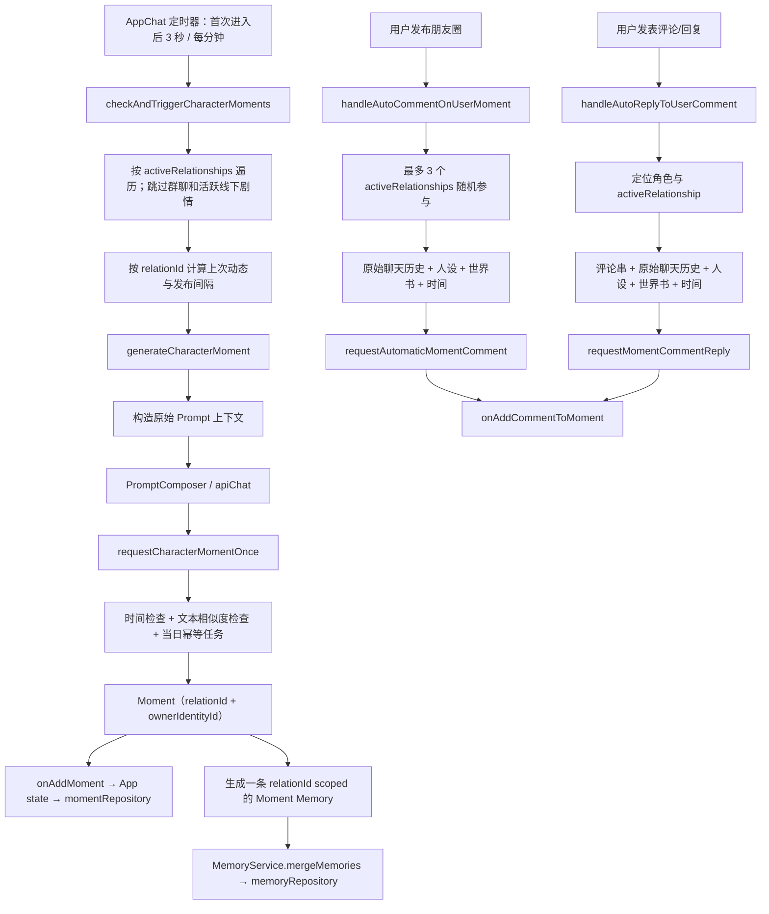

# Moment Generation Cognitive Audit

> 审计范围：角色自动朋友圈、用户发朋友圈后的角色自动评论、用户评论后的角色自动回复。
>
> 本文只记录当前实现和推荐演进路径；不修改 Prompt、AI 调用、Memory、CharacterEvent、UI 或 `Moment` 数据结构。

## 结论摘要

朋友圈已有一部分正确的关系隔离和防重复基础：角色自动动态保存 `relationId`、属于 `ownerIdentityId`，生成时读取同一关系的聊天记录与 Memory，并有按关系/日期的生成幂等控制、文本相似度检查和基础时间冲突拦截。

但它还不是统一的角色认知生成链路：`CharacterCognitiveContext` 目前只被聊天回复以只读方式构建，朋友圈三个 AI 入口均未构建或接收它；`CharacterEvent` 也未进入朋友圈上下文。因此，角色动态仍主要依赖原始聊天片段、Memory 文本、世界书和短期的历史动态，无法区分「证实发生的经历」与「模型根据人设自行补全的场景」。

最小且安全的下一步不是修改 `Moment` 模型，而是在朋友圈生成适配层先以只读方式构建、传递 `CharacterCognitiveContext`，仍不拼入 Prompt；随后再单独评审如何把其中经过许可的字段转换为 Prompt 片段。

## 当前流程图



## 生成入口与调用链

| 场景 | UI/触发入口 | Prompt 组装 | AI 服务与落库 | 当前归属 |
| --- | --- | --- | --- | --- |
| 角色自动动态 | `src/components/AppChat.tsx`：`checkAndTriggerCharacterMoments`、`generateCharacterMoment` | `generateCharacterMoment` 中的 `PromptComposer.compose({ scenario: "moment-post" })` | `src/features/moments/services/momentGenerator.ts`：`requestCharacterMomentOnce` → `requestCharacterMoment`；生成 `Moment` 和一条 Memory | Moment 含 `relationId`、`ownerIdentityId`；Memory 含 `relationId` |
| 用户动态后的角色自动评论 | `AppChat.tsx`：`handleAutoCommentOnUserMoment`；由两个用户发布路径调用 | 同函数中 `scenario: "moment-comment"` | `src/features/moments/services/momentCommentService.ts`：`requestAutomaticMomentComment` | `MomentComment` 没有 `relationId` 或作者角色 ID |
| 用户评论后的角色自动回复 | `AppChat.tsx`：`handleAutoReplyToUserComment`；由评论提交路径调用 | 同函数中 `scenario: "moment-reply"` | `src/features/moments/services/momentReplyService.ts`：`requestMomentCommentReply` | `MomentComment` 没有 `relationId` 或作者角色 ID |
| 用户手动发动态/评论 | `MomentsApp` 表单 → `AppChat` 的 `publishMomentFromFeature` / `publishMomentCommentFromFeature` | 无 AI 生成 | `App.tsx` 中的状态更新与 `momentRepository` 持久化 | 用户动态有 `ownerIdentityId`；用户评论仅有展示姓名 |

`src/features/moments/MomentsApp.tsx` 是显示和手动发布界面，不直接调用 AI。它的好友筛选目前按 `characterId` 显示；这不等同于生成/归属边界，后者已优先使用 `relationId`。

## 当前 Prompt 上下文

### 角色自动动态

`generateCharacterMoment` 已注入：

- **Character**：`name`、`personality`、`backstory`；完整角色世界书由 `getFullCharacterWorldBook` 按 `characterId` 取出。
- **Relationship / relationId**：生成前和消息读取均使用当前 `relationship.id`；关系的创建时间、最近活跃时间、定时主动消息时间用于选择发生时间，但关系阶段、`compressedMemory` 没有显式注入。
- **聊天历史**：当前关系的近期消息（由角色的 `contextMemoryLimit` 决定）和历史回退消息。
- **Memory**：只取 `memory.relationId === relationship.id` 的最近归档 Memory，数量由 `recallSettings.recallCount` 控制。
- **时间**：`calculateCharacterMomentOccurredAt` 选择该条动态的发生时间；`MomentTemporalContext` 注入日期、时分、季节、节气和生日限制。
- **历史动态**：同一 `ownerIdentityId` 下最多 12 条角色动态，被文本化给模型；服务层另外对最多 120 条同身份角色动态做文本相似度判断。

没有注入：

- `CharacterCognitiveContext`；
- `CharacterEvent`；
- 结构化的 Knowledge Boundary；
- 已完成线下剧情的、可公开的事件投影；
- 角色作息/可用时间；
- 关系阶段或显式关系状态；
- 经结构化分类的“已使用主题/已叙述事件”。

### 自动评论与自动回复

两个入口均注入：角色人设和背景、机主资料、当前动态/评论、当前关系的最近消息、按 `characterId` 查询的相关世界书、`MomentTemporalContext`。

自动回复还注入当前动态已有评论串。两者都没有注入 relation-scoped Memory、CharacterEvent、结构化 Knowledge Boundary、历史评论去重上下文或角色当前作息。

评论/回复服务只负责调用 AI、清理文字和调用基础时间冲突检测；服务输入本身不带 `relationId`、`ownerIdentityId` 或认知上下文。

## 已有保护能力

1. **动态归属隔离**：新角色动态保存 `relationId` 和 `ownerIdentityId`；生成时的消息、Memory 读取以 `relationId` 过滤。`getRelationshipLastMomentTimestamp` 对旧无 `relationId` 数据采用同角色且同身份的兼容回退。
2. **生成幂等**：`momentGenerationGuard.ts` 以 `relationId + 本地日期` 建立新任务键；旧数据兼容 `characterId + 日期`。生成、跳过和删除都会持久化任务状态。
3. **删除闭环**：删除角色动态会记录删除任务，并通过 `momentMemory.ts` 删除其 `sourceMomentId` 关联的 Memory；避免刷新或旧 Memory 重新带回已删动态。
4. **文本重复防护**：`momentUniqueness.ts` 对同一用户身份的角色动态做标准化、包含度和 n-gram 相似度比较；Prompt 也要求必要时输出 `SKIP`。
5. **基础时间一致性**：`momentTemporalContext.ts` 禁止发生时间之前的“今晚/下午/中午”表述，并拦截明显错误的季节、节气、节日和生日。
6. **线下进行中保护**：活动线下剧情期间跳过该关系的自动动态生成。

## 已知问题与根因

### A. 重复或相似动态

现有相似度算法只能发现相同或高文本相似的结果，不能识别语义上相同而措辞不同的主题（例如连续多次“月亮/夜色/失眠”）。Prompt 提供的是最近 12 条所有好友动态，不是当前角色按事件、主题和时间聚合后的个人发布履历。

此外，自动评论与自动回复没有评论历史去重或“近期已经回应过该主题”的控制。生成任务幂等仅限制“此关系此日期是否尝试过自动发动态”，不代表主题新鲜度。

**风险：中。** 有文本相似拦截，但缺少语义主题、事件来源和角色个人发布历史三层约束。

### B. 虚构不存在的经历

角色动态 Prompt 虽写明不得编造，但向模型提供的是非结构化人设、聊天、Memory 和世界书原文。没有一个可验证的“当前可写事实集合”，也没有把 `characterKnowledgeBoundary` 的禁止项传入。因此模型容易把人设、历史片段或世界书氛围补写成刚刚发生的共同地点、动作或经历。

`CharacterEvent` 已能按关系保存确定事件，但朋友圈没有读取它；已完成 OfflineStory 也没有转换成经许可、可用于朋友圈的事实投影。自动评论/回复的问题更明显：它们甚至不读 relation-scoped Memory，只靠原始消息窗口推断共同经历。

**风险：高。** 这是“私自补写共同场景/地点/动作”的主要架构缺口，不应仅靠更严格的单句 Prompt 解决。

### C. 时间异常

当前时间模块能处理日期、季节、节气和部分日间词，但没有角色作息、工作/课程日程、时区策略、可发布时段或“事件发生时间与发布时间”规则。`calculateCharacterMomentOccurredAt` 会在当前时段内为已满足间隔的动态选择一个较早的发生时间；这符合补发的设计，但若文字带有未被正则覆盖的夜间语义，仍可能造成直觉冲突。

评论/回复使用调用时刻，而角色动态使用计算出的 `occurredAt`；两条路径的时间来源不同，也没有统一的“行动是否允许”策略。

**风险：中高。** 基础语义检查已经存在，但它是词面过滤，无法替代可解释的时间行为政策。

### D. 与线下剧情或其他经历冲突

进行中的线下剧情会阻止自动动态，这是正确保护；但已完成线下剧情不会作为结构化、关系隔离且带可见性等级的事件输入。此时模型只能从聊天或 Memory 文本碰巧读到它，或自行补全。

WorldBook 读取以 `characterId` 为主，`getFullCharacterWorldBook` 不接收 `relationId`；如果未来世界书出现关系专属知识，需要由世界书作用域适配层先决定可见条目，不能让朋友圈绕过这一决策。当前 `MomentsApp` 的按角色筛选也不应用于推断关系归属。

**风险：高。** OfflineStory 的存储 scope 已修复，但其可公开认知仍未形成统一输入。

### E. 评论作者定位和身份边界

`MomentComment` 只保存 `authorName`、头像、内容和时间。自动回复优先通过评论展示名/备注反查角色，再回退至动态的 `characterId`。同名角色、备注变化或跨身份展示名相同会使定位模糊；虽然随后会从当前 `activeRelationships` 找关系，但评论自身没有可验证的关系归属。

这不是本次应修改的数据模型结论，而是后续接入认知上下文时必须保留的边界：不能仅凭名称决定角色知道哪一段关系历史。

**风险：中。** 现有 UI 数据模型限制了评论链的精确归因。

## CharacterCognitiveContext 接入设计

### 可直接复用的通用字段

每次由某一角色代表当前关系生成动态、评论或回复时，均可复用现有 `CharacterCognitiveContext`：

- `scope`：`characterId`、`relationId`、`userIdentityId`、`conversationId`；作为所有输入和输出归属的断言条件。
- `persona`：紧凑人设投影，替换各处手写的人设读取来源，但不改变实际 Prompt 内容的阶段可仅传递。
- `relationship`：当前阶段、压缩关系记忆和活跃时间的只读投影。
- `knownFacts`：只含当前 `characterId + relationId` 的 Memory。
- `recentEvents`：只含当前关系、当前身份且 `promptVisibility = safe` 的事件。
- `temporalContext`：可由现有 Moment 发生时间生成，而不是只使用 `Date.now()`。
- `knowledgeBoundary`：特别使用 `forbidden` 来禁止把未验证的共同地点、动作、用户经历写成事实。

当前 Builder 已经确保 Memory、Event 的关系/身份隔离。Moments 接入时必须继续从 `listByRelation(relationId)` 获取 Event 并显式标记可见性；不得传入全局事件列表后由调用方猜测。

### Moment 专用的只读适配信息

不建议把以下内容塞入通用 `CharacterCognitiveContext`，因为它们属于一次朋友圈行为的输入，而非角色在任何场景下都应知道的认知事实：

```ts
interface MomentGenerationContext {
  cognitive: CharacterCognitiveContext;
  occurrenceTime: MomentTemporalContext;
  recentOwnMoments: readonly MomentSummary[];
  recentFeedThemes: readonly MomentThemeSummary[];
  trigger: "scheduled" | "user_moment_comment" | "user_comment_reply";
  subjectMoment?: MomentSnapshot;
  subjectComment?: MomentCommentSnapshot;
}
```

- `recentOwnMoments`：当前角色、当前 `relationId` 的发布摘要，供角色避免重复自己的主题。
- `recentFeedThemes`：当前 `ownerIdentityId` 动态流的主题摘要，供全局动态流避免多角色模板化；应是派生数据，不需要立刻新增持久化模型。
- `subjectMoment` / `subjectComment`：评论、回复场景中的被回应内容；它们是当次任务输入，不是长期角色知识。
- `trigger`：让策略区分“定时发动态”和“回应用户内容”，避免把两者按同一频率/新鲜度标准处理。

### 推荐接入阶段

1. **Phase 1 — 只读构建和传递（低风险）**
   - 新建 Moments 的 context adapter/factory；对自动动态、自动评论、自动回复都构建 `CharacterCognitiveContext`。
   - 调用方提供 exact relation 的 Memory、safe Event 和现有时间上下文。
   - 仅把 context 作为 service/controller 参数传递，不加入 Prompt，不改现有结果。
   - 测试双身份同角色、不同 `relationId`、private Event 不可见。

2. **Phase 2 — 受审查的 Prompt adapter（中风险）**
   - 单独设计 `formatMomentCognitiveContext`，只格式化 persona、safe facts、safe events、时间和知识边界。
   - 先接入角色自动动态；不改变原 `PromptComposer` 协议，只新增有版本测试的系统片段。
   - 以“可证实事实优先、无证实新内容则 SKIP”为政策，不把原始世界书/聊天内容视为当前共同事件。

3. **Phase 3 — 主题新鲜度策略（中风险）**
   - 在生成前形成当前角色近期主题摘要，在生成后先以结构化主题/来源检查，再保留现有文本相似度兜底。
   - 不强制每天发布；当没有 supported event 或人格化新角度时允许 `SKIP`。

4. **Phase 4 — 时间行为策略（中风险）**
   - 将已有 `proactiveStartTime`/`proactiveEndTime` 的可复用部分与 Moment 发生时间政策分开评审。
   - 只在明确的角色作息模型被设计后，再增加发布时段与补发规则；不能由当前 Prompt 猜测作息。

5. **Phase 5 — 评论数据归因（高迁移成本，可延后）**
   - 只有在需要跨身份/同名角色评论精确归因时，才评审为 `MomentComment` 增加作者实体或 scope 引用的迁移方案。
   - 这会触及数据模型和旧数据兼容，不能与 Context Phase 1 混做。

## 是否需要新增领域模型

现在**不需要**为此审计立即新增持久化领域模型。已有 `CharacterEvent` 是确定经历的候选来源，已有 `Moment` 和生成任务仓库存储发布历史。第一步需要的是一个只读的 Moments context adapter 和派生摘要，而不是复制 Memory、Event 或创建第二套角色状态。

后续若文本相似度不足以表达“主题已用过/某事件已被公开叙述”，才应单独评审轻量的 `MomentPublicationRecord` 或主题摘要模型。该模型必须：绑定 `relationId + userIdentityId + characterId`、区分私有经历与已公开内容、具有迁移/删除策略；不应在本阶段预先创建。

## 验收与回归建议

- 同一角色在身份 A、B 下生成的认知输入互不出现对方的 Memory/Event/关系信息。
- private 或未审查的 CharacterEvent 不进入任何朋友圈上下文。
- 角色动态仍使用现有 `relationId`、`ownerIdentityId`、当日幂等和删除后 tombstone 行为。
- 自动评论与回复的 Context 与其实际选定 relationship 一致；名称反查只能作为旧数据/UI 兼容路径，不得成为 scope 的唯一依据。
- 现有 `momentUniqueness`、`momentTemporalConsistency`、`momentGenerationIdempotency`、`momentDeletionMemory` 测试继续通过；新增 Context adapter 后补充 relation isolation 与事件可见性测试。

## 涉及文件索引

- `src/components/AppChat.tsx`：三个 AI 入口、定时触发、原始 Prompt 组装、关系范围选择。
- `src/features/moments/services/momentGenerator.ts`：动态请求、Moment/Memory 创建、幂等调用入口。
- `src/features/moments/services/momentCommentService.ts`：自动评论请求和结果清理。
- `src/features/moments/services/momentReplyService.ts`：评论回复请求和结果清理。
- `src/features/moments/services/momentUniqueness.ts`：文本去重。
- `src/features/moments/services/momentTemporalContext.ts`：发生时间上下文及词面冲突拦截。
- `src/features/moments/services/momentGenerationGuard.ts`：按关系/日期的生成任务状态。
- `src/features/moments/services/momentMemory.ts`：删除动态时清理关联 Memory。
- `src/domain/characterCognitive/`：已有通用认知上下文 Builder/Policy，尚未被 Moments 使用。
- `src/core/storage/repositories/characterEventRepository.ts`：已有按 `relationId` 读取 CharacterEvent 的 Repository。
