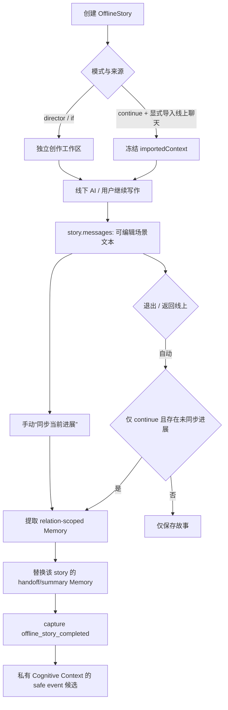

# OfflineStory 与 Character Life / Cognitive Context 边界审计

日期：2026-08-01
范围：仅审计现有实现；不修改 OfflineStory、Memory、CharacterEvent、Relationship、Prompt、AI 调用或 UI。

## 结论

OfflineStory 目前是一个**可编辑的线下创作工作区**，而不是天然的角色事实库。单角色、显式从线上聊天续写的故事已经具有较好的 `relationId` 隔离和回写链路；但“手动同步当前进展”可绕过 `continue` 限制，令导演剧本或 IF 假想线写入长期记忆，并触发可见于 Chat、Diary、Moment、Proactive、Forum DM 的 `offline_story_completed` 事件。这是 Character Life 前必须收紧的最高风险边界。

## 1. 当前数据与流程

### 1.1 数据模型与存储

`OfflineStory` 定义在 `src/types.ts`，持久化于 `phone_offline_stories`：

- `id`：故事工作区 ID。
- `characterId`：主角色/群容器的显示与路由引用。
- `relationId?`、`conversationId?`：单角色 direct story 的归属边界。
- `characterIds?`：参与角色集合；它不是多关系授权模型。
- `mode`：`director`、`continue`、`if`。
- `importedContext?`：显式导入时冻结的消息、记忆文本与世界书文本快照。
- `messages`：线下工作区内可编辑的消息/旁白；不是线上消息记录。
- `lastSyncedMessageCount`、`memorySyncStatus`、`archivedAt` 等：故事到长期记忆的同步元数据。

`App.tsx` 使用 `offlineRepository` 将整个故事数组保存到 localStorage。保存故事只是更新工作区快照；不会自动写 Memory 或 CharacterEvent。

### 1.2 创建、打开与关系隔离

`AppOffline.tsx` 创建 direct story 时要求当前身份下的 relationship，并写入：

- `story.relationId = relationship.id`
- `story.conversationId = relationship.conversationId`
- 从线上导入时，消息与 Memory 均按当前 `selectedRelationId` 过滤。

打开 direct story 时，`canAccessStoryFromCurrentRelation` 要求故事 relation 与当前身份/当前角色选中的 relation 完全一致。活动故事 localStorage key 也按 `relationId` 保存。`offlineChatNavigation` 返回线上聊天时再次校验 owner identity、relation、canonical character 与 conversation。

legacy direct story 可通过 `offlineStoryScope` 在历史默认身份下迁移；未完成迁移的 direct story 在当前访问链路上 fail-closed。删除关系会清理其 direct story、消息、Memory 和 relation-scoped session key；群故事保留容器但移除已删除成员的 `characterIds` 引用。

### 1.3 线下生成与 Prompt

`AppOffline.tsx` 自行组装线下创作 Prompt 并调用 `apiChat`。输入包含角色人设、关系摘要、世界书、模式规则、可选导入快照及可选时间意识。

- `continue` 且显式导入聊天：使用冻结的线上消息/Memory/WorldBook 快照；不在生成时读取实时线上聊天。
- `director`：用户是编剧/导演，场景文本可包含用户指令、叙事和动作。
- `if`：明确的平行假想线。
- 群容器：以 `characterIds` 参与，但没有 `participantRelationIds` 或成员—关系映射。

当前 `CharacterCognitiveContext` 没有被 OfflineStory 的生成 Prompt 直接使用；这是合理的隔离：线下创作使用自己冻结的创作上下文，不应把工作区文本自动作为线上认知事实。

### 1.4 线下到长期记忆 / 线上 handoff

`offlineMemorySync.ts` 与 `AppOffline.handleSyncMemoryToBrain`：

1. 读取 story 自身、尚未同步的消息；排除 `isImportedContext`、`offline-import-*`、旁白和空内容。
2. `MemoryService.extractMemories` 使用 `scenario: "offline"`，并携带 story 的 `characterId` 与 `relationId`。
3. 过滤含未解析人称或可能反转主体/客体的事实；再追加确定性第三人称 handoff facts。
4. 使用 story marker 替换该故事既有 handoff/summary Memory，而非累积多个摘要。
5. Memory 持久化成功后，更新 story sync metadata。

自动出口同步仅由 `shouldAutoSyncOnlineContinuation` 触发：故事必须是 `mode === "continue"`、有来源聊天证据且有未同步进展。导演剧本和 IF 故事即使导入过聊天，也不会在退出或“返回线上”时自动同步。

不过，设置面板的“同步当前进展记忆至角色大脑”按钮直接调用 `handleSyncMemoryToBrain`，该函数只拒绝群故事，不检查是否为显式线上续写。因此它可手动同步 `director` 与 `if` 故事。

### 1.5 CharacterEvent 与 Cognitive Context

成功同步后（包括 source message 为空时）`AppOffline` 调用 `captureOfflineStoryCompletedEvent`。它仅要求：

- `story.relationId` 存在；
- 能从关系表找到 `userIdentityId`；
- Story 不是群故事（群故事在 Memory sync 入口已拒绝）。

事件内容为 `offline_story_completed`，summary 仅为 `Offline story completed: ${story.title}`。事件 repository 以 `(relationId, source, kind)` 幂等，因此每条关系最多保留一个该 kind 的事件。

Chat、Diary、Moment、Proactive 与 Forum DM 的现有 visibility mapper 都将 active 的 `relationship_created` 和 `offline_story_completed` 标记为 `safe`。因此这个事件可进入各自的私有 Cognitive Context / Prompt Adapter；事件本身不含场景正文，但 story title 是用户可编辑标题，仍应被视为可能的虚构或敏感信息。

InnerVoice 没有被 OfflineStory 读取、写入或同步。它也没有进入离线 Memory source；当前这条边界正确。

## 2. 数据边界判定

| 内容 | 当前归属 | 是否可进入 Memory | 是否可进入 CharacterEvent | 说明 |
| --- | --- | --- | --- | --- |
| Story ID、模式、样式、阅读设置、同步游标 | 剧情工作区状态 | 否 | 否 | 纯工作区/展示元数据。 |
| `importedContext` | 冻结的线上参考快照 | 不应回写 | 否 | 已有线上事实的读取副本，不是新的线下事实。 |
| 用户/AI 写出的场景正文、动作、旁白、对话 | 剧情场景状态 | 默认否 | 默认否 | 可编辑、可重写，且 director/IF 本质上可以虚构。 |
| continue 模式中、明确新增且可归属的第三人称事实 | 候选长期事实 | 可以，需确认/过滤 | 可选，需更窄事件语义 | 仅在 relation-scoped、线上续写、确认规则通过后。 |
| AI 推测、计划、暧昧动作、未确认地点/承诺 | 只能留在故事空间 | 否 | 否 | 不得因“写进剧本”而升级为现实。 |
| `offline_story_completed` | 生命周期事件 | 不适用 | 可进入，但应代表已确认同步而非任意故事完成 | 当前过宽且 title 可泄露假想内容。 |
| 群/多角色故事中的共同内容 | 群容器故事状态 | 当前不进入 direct Memory | 当前不进入 direct Event | 在 participant scope 模型完成前，保持不外溢是正确选择。 |
| InnerVoice | 角色内心记录 | 否 | 否 | 不构成已经发生的线下事实。 |

## 3. 风险清单

### P0：手动同步可把导演/IF 剧情写成线上事实

自动路径已限制为显式线上续写，手动按钮却直接同步任意单角色 story。`director` 和 `if` 的设计允许用户控制、假想和改写场景；其文本不应直接进入长期 Memory，更不应产生 safe CharacterEvent。

**影响：** 线上聊天、日记、朋友圈、主动消息和论坛私信可从 Memory 或 `offline_story_completed` 感知到并不存在的经历。

### P0：完成事件的触发语义与幂等粒度不匹配

事件在每次成功同步后调用，甚至“没有可提取消息”的同步也会产生；但 repository 幂等键是 relation/source/kind，使同一 relation 之后的其他故事完成事件被静默去重。它既可能把一个非现实故事标记为完成，也无法表达多个独立、已确认的线下经历。

### P1：完成事件 summary 直接使用可编辑 story title

虽然不包含场景正文，标题可被用户写成假设、私密内容或剧透；现有 visibility mapper 又将其视为 safe。该 event 不能作为事实摘要的替代品。

### P1：多角色 direct 参与者没有 relationship provenance

`characterIds` 只表示角色集合，不能说明每位角色对应哪条 relation、哪位身份、哪些 story message 属于谁。当前 `relationId` 只能表达一个 owner，因而不能安全地产生多角色 Memory 或 CharacterEvent。群容器不外溢是安全的，但未来不能用 `characterIds` 代替 participant relation scope。

### P1：导入快照的 Memory 缺失 provenance

`importedContext.memories` 仅保存字符串；目前仅供 story 内 Prompt 读取，尚未回写，所以未形成泄露。但若以后将快照再次提取或合并，无法可靠恢复原 memory 的 relation、来源与确认状态。

### P2：长期事实提取仍依赖 AI 摘要加规则过滤

现有 `filterOfflineExtractedFacts` 与确定性 handoff facts 已降低人称反转和场景细节外溢风险，但没有显式的“事实确认状态/来源类型”字段，不能区分用户确认、角色明确陈述、AI 叙事与导演指令。

### P2：Offline Prompt 未使用统一 Cognitive Context

这不是立即缺陷。OfflineStory 需要的是冻结来源和创作模式边界，而非直接复用线上角色认知快照。若未来接入，应只提供 relation-scoped、已确认的背景事实，并绝不能把当前 story 草稿回灌到该 Context。

## 4. CharacterEvent 生成建议

当前不建议把“故事完成”自动等同于“角色经历发生”。建议在收紧同步资格后再改造：

1. 仅由明确线上续写、relation-scoped、成功写入确认 Memory 的流程产生事件。
2. 使用与事实有关的事件种类，例如 `offline_handoff_confirmed`；不要将 UI/工作区状态称作现实完成。
3. Event summary 必须来自已确认的、脱敏后的事实摘要，不能使用 story title 或原始剧本文本。
4. Event source 至少应带 story ID 或 source key，以支持“每个 story 一次”幂等；不能继续用每 relation/每 kind 一次的全局键。
5. group、legacy relationless、IF、director 与未确认多参与者故事一律不产生 direct CharacterEvent。
6. Prompt visibility 默认 private；仅经来源策略显式批准的确认事件才可标为 safe。

## 5. Memory 同步建议

1. **先收紧资格：** `handleSyncMemoryToBrain` 与手动入口复用 `isOnlineContinuationStory` 或更严格的 `isEligibleForOnlineFactSync`；不合格故事仍可保留/导出，但不能写角色长期 Memory。
2. **显式确认：** 若产品确实需要将 director/IF 的部分内容变为现实，应单独提供“确认写入线上事实”的用户行为，并对候选事实逐条确认；不能复用“同步当前进展”。
3. **保持现有 relation 过滤：** Memory 必须继续同时匹配 `characterId + relationId + story marker`；无 `relationId` 的 legacy direct story 在迁移前不参与同步。
4. **增加 provenance：** 对同步输出保存 story ID、story mode、source relation/conversation、确认方式和源消息 IDs。`importedContext.memories` 未来应保存结构化引用而非裸字符串。
5. **限制正文：** 只同步新增、确认、第三人称、可解释的事实；继续排除旁白、导入内容、AI 猜测、计划、地点/动作细节与未确认承诺。

## 6. 推荐实施顺序

### 必须先做

1. 统一自动与手动 Memory 同步资格：仅显式线上续写可自动/普通同步；IF 与 director 默认永久留在线下空间。
2. 将 CharacterEvent 触发移到“已确认 Memory 持久化成功且故事符合资格”之后，并阻断零消息/修复型同步产生新的现实事件。
3. 修正 event 幂等键，使其至少按 relation + source story 区分；将 summary 改为确认事实的脱敏摘要。
4. 为上述规则补覆盖：A/B identity 隔离、IF/director 拒绝同步、未完成 story 不产生事件、失败同步可重试、删除 relation 清理 Memory/Event/story。

### 建议后做

1. 定义 `OfflineFactCandidate`/确认状态，不改动 Message 或 Memory 算法本体，只为线下→线上桥接建立可审计的来源记录。
2. 为群故事设计独立 group scope；为多 direct 参与者设计 `ownerRelationId`、`participantRelationIds`、参与者映射和每条事实的归属规则。
3. 将 `importedContext` 改为结构化、带 provenance 的快照。
4. 对 OfflineStory 创建和继续 Prompt 增加只读的“确认背景事实”输入；不将故事草稿纳入 CharacterCognitiveContext。

### 可以延后

1. OfflineStory repository 的物理分区或 UI 重构。
2. 将故事生成完整迁移到统一 Prompt Adapter；这不是当前泄露防护的前提。
3. RelationshipState、情感成长、时间线可视化等 Character Life 高层能力。

## 7. 现有安全能力

- direct story 创建、列表、打开、返回线上和活动 key 已优先使用 `relationId`。
- 线上导入线下的消息/Memory 以 relation 为边界；生成时读取的是冻结快照而非实时线上数据。
- `getOfflineStoriesContextString` 在 AppChat 中返回空字符串，原始线下剧本文字不会直接注入线上聊天 Prompt。
- OfflineMemorySync 排除导入消息、旁白和空文本，并使用 story marker 替换旧 handoff，避免无边界累积。
- 群故事不写入 direct Memory/Event；InnerVoice 不被当作线下事实源。
- relationship cleanup 会清理 relation-scoped story、Memory、Event 和会话 key；群容器只保留不再有效的参与者以外的引用。

## 审计结论

OfflineStory 应继续被定义为“创作/场景空间”，不是角色现实记忆的上游数据库。唯一可以跨越边界的通道，应是**显式线上续写 → relation-scoped、确认事实 → 持久化成功的 Memory → 可审查的 CharacterEvent**。在该资格与 provenance 收紧前，不应继续扩大 OfflineStory 对 Character Life、Cognitive Context 或主动行为的影响。
